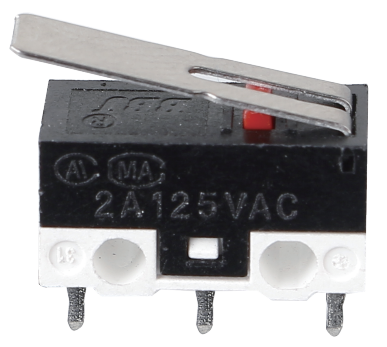

.. note::

    Ciao, benvenuto nella community di SunFounder Raspberry Pi & Arduino & ESP32 Enthusiasts su Facebook! Approfondisci Raspberry Pi, Arduino ed ESP32 insieme ad altri appassionati.

    **Perché unirsi?**

    - **Supporto esperto**: Risolvi problemi post-vendita e sfide tecniche con l'aiuto della nostra community e del nostro team.
    - **Impara e Condividi**: Scambia consigli e tutorial per migliorare le tue competenze.
    - **Anteprime esclusive**: Accedi in anteprima a nuovi annunci di prodotti e anticipazioni.
    - **Sconti speciali**: Godi di sconti esclusivi sui nostri prodotti più recenti.
    - **Promozioni festive e omaggi**: Partecipa a omaggi e promozioni durante le festività.

    👉 Pronto a esplorare e creare con noi? Clicca su [|link_sf_facebook|] e unisciti oggi stesso!

.. _cpn_micro_switch:

Micro Switch
=====================

La costruzione di un microinterruttore è davvero semplice. Le parti principali dell'interruttore sono:

.. image:: img/micro_switch2.png
    :align: center

* 1.Pistone (Attuatore)
* 2.Coperchio
* 3.Pezzo mobile
* 4.Supporto
* 5.Cassa
* 6.Terminale NO: normalmente aperto
* 7.Terminale NC: normalmente chiuso
* 8.Contatto
* 9.Braccio mobile

Dopo che un microinterruttore entra in contatto fisico con un oggetto, i suoi contatti cambiano posizione. Il principio di funzionamento di base è il seguente.

Quando il pistone è in posizione di riposo o rilascio:

* Il circuito normalmente chiuso può trasportare corrente.
* Il circuito normalmente aperto è elettricamente isolato.

Quando il pistone è premuto o attivato:

* Il circuito normalmente chiuso si apre.
* Il circuito normalmente aperto si chiude.

.. image:: img/micro_switch1.png

**Esempi**

* :ref:`2.1.2_c` (C Project)
* :ref:`2.1.2_py` (Python Project)
* :ref:`1.8_scratch` (Scratch Project)