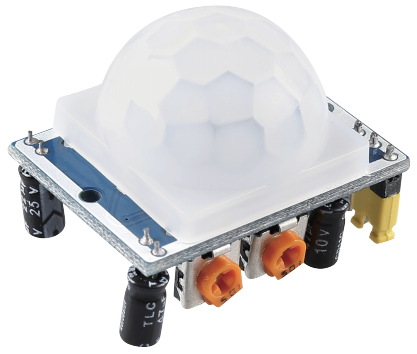

.. note::

    Bonjour et bienvenue dans la Communauté Facebook des passionnés de Raspberry Pi, Arduino et ESP32 de SunFounder ! Plongez plus profondément dans l'univers des Raspberry Pi, Arduino et ESP32 avec d'autres passionnés.

    **Pourquoi rejoindre ?**

    - **Support d'experts** : Résolvez les problèmes après-vente et les défis techniques avec l'aide de notre communauté et de notre équipe.
    - **Apprendre et partager** : Échangez des astuces et des tutoriels pour améliorer vos compétences.
    - **Aperçus exclusifs** : Accédez en avant-première aux annonces de nouveaux produits et aux aperçus.
    - **Réductions spéciales** : Profitez de réductions exclusives sur nos produits les plus récents.
    - **Promotions festives et cadeaux** : Participez à des cadeaux et des promotions de vacances.

    👉 Prêt à explorer et à créer avec nous ? Cliquez [|link_sf_facebook|] et rejoignez-nous aujourd'hui !

.. _cpn_pir:

Module de Capteur de Mouvement PIR
========================================

Le capteur PIR détecte les radiations infrarouges thermiques, ce qui permet de détecter la présence d'organismes qui émettent ces radiations.

Le capteur PIR est divisé en deux zones connectées à un amplificateur différentiel. Lorsqu'un objet stationnaire se trouve devant le capteur, les deux zones reçoivent la même quantité de radiation et la sortie est nulle. Lorsqu'un objet en mouvement se trouve devant le capteur, l'une des zones reçoit plus de radiations que l'autre, ce qui fait fluctuer la sortie vers le haut ou vers le bas. Ce changement de tension de sortie est le résultat de la détection de mouvement.

.. image:: img/PIR_working_principle.jpg
    :width: 800

Après le câblage du module de détection, il y a une période d'initialisation d'une minute. Pendant cette initialisation, le module émettra entre 0 et 3 fois à intervalles réguliers. Ensuite, le module passera en mode veille. Veuillez éloigner les sources de lumière et autres interférences de la surface du module afin d'éviter les fausses opérations causées par les signaux d'interférence. Il est même préférable d'utiliser le module sans trop de vent, car le vent peut également interférer avec le capteur.

.. image:: img/pir_back.png
    :width: 600
    :align: center

**Réglage de la Distance**

En tournant le bouton du potentiomètre de réglage de la distance dans le sens horaire, la portée de détection augmente, et la portée maximale est d'environ 0 à 7 mètres. Si vous le tournez dans le sens antihoraire, la portée de détection diminue, et la portée minimale est d'environ 0 à 3 mètres.

**Réglage du Délai**

En tournant le bouton du potentiomètre de réglage du délai dans le sens horaire, vous pouvez également augmenter le délai de détection. Le délai maximal peut atteindre 300 secondes. À l'inverse, si vous le tournez dans le sens antihoraire, vous pouvez réduire le délai avec un minimum de 5 secondes.

**Deux Modes de Déclenchement**

Choisir différents modes en utilisant le cavalier.

* **H** : Mode de déclenchement répétable, après avoir détecté un corps humain, le module émet un niveau haut. Pendant la période de délai suivante, si quelqu'un entre dans la zone de détection, la sortie restera au niveau haut.

* **L** : Mode de déclenchement non répétable, émet un niveau haut lorsqu'il détecte un corps humain. Après le délai, la sortie passera automatiquement du niveau haut au niveau bas.

**Exemple**

* :ref:`2.2.7_c` (Projet C)
* :ref:`2.2.7_py` (Projet Python)
* :ref:`4.1.4_py` (Projet Python)
* :ref:`1.5_scratch` (Projet Scratch)
