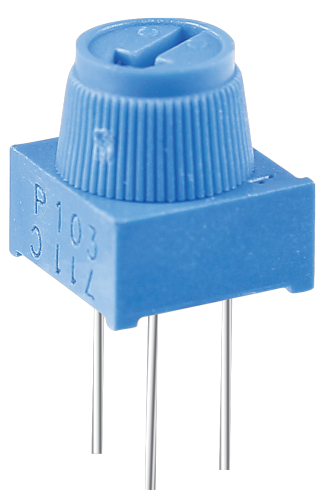

.. note::

    Bonjour et bienvenue dans la Communauté Facebook des passionnés de Raspberry Pi, Arduino et ESP32 de SunFounder ! Plongez plus profondément dans l'univers des Raspberry Pi, Arduino et ESP32 avec d'autres passionnés.

    **Pourquoi rejoindre ?**

    - **Support d'experts** : Résolvez les problèmes après-vente et les défis techniques avec l'aide de notre communauté et de notre équipe.
    - **Apprendre et partager** : Échangez des astuces et des tutoriels pour améliorer vos compétences.
    - **Aperçus exclusifs** : Accédez en avant-première aux annonces de nouveaux produits et aux aperçus.
    - **Réductions spéciales** : Profitez de réductions exclusives sur nos produits les plus récents.
    - **Promotions festives et cadeaux** : Participez à des cadeaux et des promotions de vacances.

    👉 Prêt à explorer et à créer avec nous ? Cliquez [|link_sf_facebook|] et rejoignez-nous aujourd'hui !

.. _cpn_potentiometer:

Potentiomètre
==================

Un potentiomètre est un composant résistant à 3 terminaux dont la valeur de résistance peut être ajustée selon une variation régulière.

Les potentiomètres existent en différentes formes, tailles et valeurs, mais ils ont tous les points communs suivants :

* Ils ont trois terminaux (ou points de connexion).
* Ils possèdent un bouton, une vis ou un curseur qui peut être déplacé pour faire varier la résistance entre le terminal central et l'un des terminaux extérieurs.
* La résistance entre le terminal central et l'un des terminaux extérieurs varie de 0 Ω à la résistance maximale du potentiomètre lorsque le bouton, la vis ou le curseur est déplacé.

Voici le symbole de circuit du potentiomètre.

.. image:: img/potentiometer_symbol.png
    :align: center
    :width: 400

Les fonctions du potentiomètre dans le circuit sont les suivantes :

#. Fonction de diviseur de tension

    Le potentiomètre est une résistance ajustable en continu. Lorsque vous ajustez l'axe ou la poignée coulissante du potentiomètre, le contact mobile glisse sur la résistance. À ce moment, une tension peut être sortie en fonction de la tension appliquée au potentiomètre et de l'angle de rotation du bras mobile ou de son déplacement.

#. Fonction de rhéostat

    Lorsque le potentiomètre est utilisé comme rhéostat, connectez le pin central et l'un des deux autres pins dans le circuit. Vous pouvez ainsi obtenir une valeur de résistance lisse et continuellement variable en fonction du déplacement du contact mobile.

#. Fonction de contrôleur de courant

    Lorsque le potentiomètre agit comme contrôleur de courant, le terminal de contact coulissant doit être connecté en tant que l'un des terminaux de sortie.

Si vous souhaitez en savoir plus sur le potentiomètre, consultez : `Potentiomètre - Wikipédia <https://fr.wikipedia.org/wiki/Potentiom%C3%A8tre>`_

**Exemple**

* :ref:`2.1.7_c` (Projet C)
* :ref:`2.1.7_py` (Projet Python)
