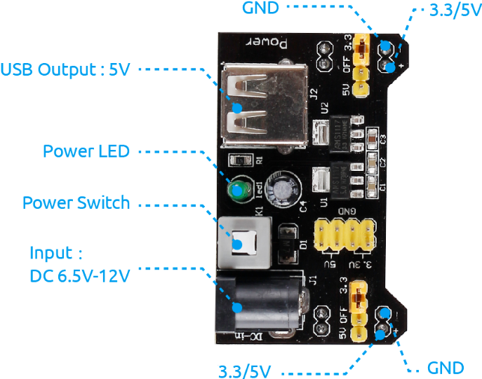

.. note::

    Ciao, benvenuto nella community di SunFounder Raspberry Pi & Arduino & ESP32 Enthusiasts su Facebook! Approfondisci Raspberry Pi, Arduino ed ESP32 insieme ad altri appassionati.

    **Perché unirsi?**

    - **Supporto esperto**: Risolvi problemi post-vendita e sfide tecniche con l'aiuto della nostra community e del nostro team.
    - **Impara e Condividi**: Scambia consigli e tutorial per migliorare le tue competenze.
    - **Anteprime esclusive**: Accedi in anteprima a nuovi annunci di prodotti e anticipazioni.
    - **Sconti speciali**: Godi di sconti esclusivi sui nostri prodotti più recenti.
    - **Promozioni festive e omaggi**: Partecipa a omaggi e promozioni durante le festività.

    👉 Pronto a esplorare e creare con noi? Clicca su [|link_sf_facebook|] e unisciti oggi stesso!

.. _cpn_power_module:

Modulo di Alimentazione
=========================

Quando abbiamo bisogno di una corrente elevata per pilotare un componente, questo può interferire gravemente con il normale funzionamento del Raspberry Pi. Pertanto, alimentiamo separatamente il componente con questo modulo per farlo funzionare in modo sicuro e stabile.

Puoi semplicemente collegarlo alla breadboard per fornire alimentazione. Fornisce una tensione di 3.3V e 5V, e puoi connetterti tramite un cappuccio a ponticello incluso.

**Caratteristiche e specifiche**

* Tensione di ingresso: 6.5 - 12V
* Due canali indipendenti
* Tensione di uscita: 5V, 3.3V (regolabile tramite ponticelli. Configurazioni 0V, 3.3V e 5V)
* Corrente di uscita: Corrente massima di uscita 700mA
* Header maschio berg integrato per uscite GND, 5V, 3.3V
* Interruttore ON-OFF disponibile.
* Ingresso USB (Tipo-A) disponibile.
* Ingresso DC Barrel Jack disponibile.
* LED di alimentazione integrato
* Dimensioni: 53mm x 33mm (L x P)

**Esempi**

* :ref:`1.3.1_c` (C Project)
* :ref:`3.1.4_c` (C Project)
* :ref:`1.3.1_py` (Python Project)
* :ref:`4.1.10_py` (Python Project)
* :ref:`1.17_scratch` (Scratch Project)
