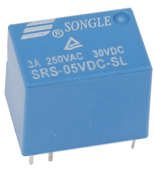

.. note::

    Ciao, benvenuto nella community di SunFounder Raspberry Pi & Arduino & ESP32 Enthusiasts su Facebook! Approfondisci Raspberry Pi, Arduino ed ESP32 insieme ad altri appassionati.

    **Perché unirsi?**

    - **Supporto esperto**: Risolvi problemi post-vendita e sfide tecniche con l'aiuto della nostra community e del nostro team.
    - **Impara e Condividi**: Scambia consigli e tutorial per migliorare le tue competenze.
    - **Anteprime esclusive**: Accedi in anteprima a nuovi annunci di prodotti e anticipazioni.
    - **Sconti speciali**: Godi di sconti esclusivi sui nostri prodotti più recenti.
    - **Promozioni festive e omaggi**: Partecipa a omaggi e promozioni durante le festività.

    👉 Pronto a esplorare e creare con noi? Clicca su [|link_sf_facebook|] e unisciti oggi stesso!

.. _cpn_relay:

Relè
==========================================

Come sappiamo, il relè è un dispositivo utilizzato per fornire una connessione
tra due o più punti o dispositivi in risposta al segnale di ingresso
applicato. In altre parole, i relè forniscono isolamento tra il controller
e il dispositivo poiché i dispositivi possono funzionare sia in corrente alternata (AC) che in corrente continua (DC). Tuttavia, ricevono segnali da un microcontrollore che funziona in DC, richiedendo quindi
un relè per colmare il divario. Il relè è estremamente utile quando si deve
controllare una grande quantità di corrente o tensione con un piccolo segnale
elettrico.

Ci sono 5 parti in ogni relè:

.. image:: img/relay142.jpeg

**Elettromagnete** - È costituito da un nucleo di ferro avvolto da una bobina di
fili. Quando passa elettricità, diventa magnetico.
Pertanto, è chiamato elettromagnete.

**Armatura** - La striscia magnetica mobile è nota come armatura. Quando
la corrente scorre attraverso di essa, la bobina viene energizzata, producendo così un
campo magnetico che serve a chiudere o aprire i punti normalmente aperti (N/O) o
normalmente chiusi (N/C). L'armatura può essere azionata con corrente
continua (DC) o alternata (AC).

**Molla** - Quando non c'è corrente che scorre attraverso la bobina dell'
elettromagnete, la molla tira via l'armatura in modo che il circuito non possa
essere completato.

Set di **contatti elettrici** - Ci sono due punti di contatto:

-  Normalmente aperto - collegato quando il relè è attivato e scollegato quando è inattivo.

-  Normalmente chiuso - scollegato quando il relè è attivato e collegato quando è inattivo.

**Telaio stampato** - I relè sono coperti da una protezione in plastica.

Il principio di funzionamento del relè è semplice. Quando viene alimentato il
relè, la corrente inizia a fluire attraverso la bobina di controllo; di conseguenza, l'
elettromagnete inizia a energizzarsi. Quindi l'armatura viene attratta verso la
bobina, tirando giù il contatto mobile e collegandolo con i contatti normalmente aperti. Così il circuito con il carico viene alimentato. Poi
interrompendo il circuito si verifica un caso simile, poiché il contatto mobile sarà
tirato verso l'alto verso i contatti normalmente chiusi sotto la forza della molla.
In questo modo, l'accensione e lo spegnimento del relè possono controllare lo stato
di un circuito di carico.

**Esempi**

* :ref:`1.3.3_c` (C Project)
* :ref:`1.3.3_py` (Python Project)