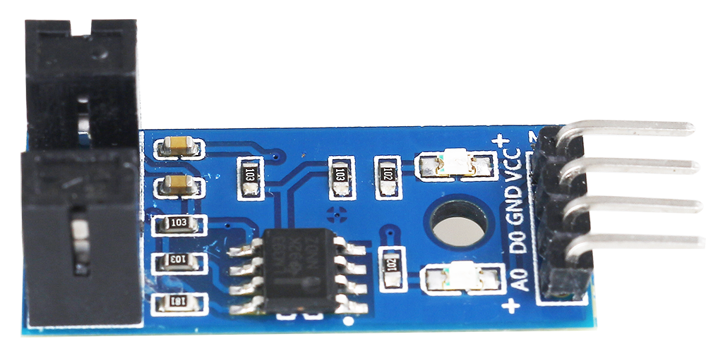

.. note::

    Hello, welcome to the SunFounder Raspberry Pi & Arduino & ESP32 Enthusiasts Community on Facebook! Dive deeper into Raspberry Pi, Arduino, and ESP32 with fellow enthusiasts.

    **Why Join?**

    - **Expert Support**: Solve post-sale issues and technical challenges with help from our community and team.
    - **Learn & Share**: Exchange tips and tutorials to enhance your skills.
    - **Exclusive Previews**: Get early access to new product announcements and sneak peeks.
    - **Special Discounts**: Enjoy exclusive discounts on our newest products.
    - **Festive Promotions and Giveaways**: Take part in giveaways and holiday promotions.

    👉 Ready to explore and create with us? Click [|link_sf_facebook|] and join today!

.. _cpn_speed_sensor:

Speed Sensor Module
========================

The speed sensor consists of two parts: a transmitter and a receiver. The transmitter emits light, which then enters the receiver.

If the light beam between the emitter and receiver is interrupted by an obstacle, the receiver will not detect the incident light, then the D0 pin will output low level.

.. note::
    The A0 pin on this module is empty and there is no circuit.

.. image:: img/speed_sensor2.png

**Example**

* :ref:`2.2.6_c` (C Project)
* :ref:`2.2.6_py` (Python Project)
* :ref:`1.7_scratch` (Scratch Project)