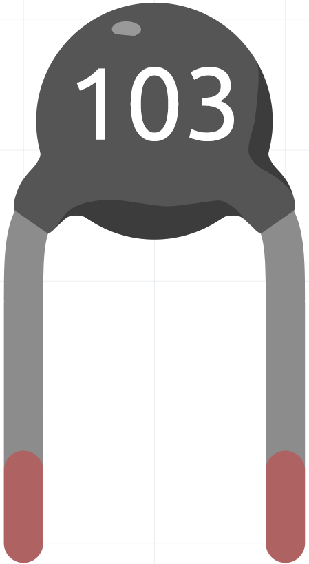

.. note::

    こんにちは、SunFounderのRaspberry Pi & Arduino & ESP32愛好家コミュニティへようこそ！Facebook上でRaspberry Pi、Arduino、ESP32についてもっと深く掘り下げ、他の愛好家と交流しましょう。

    **参加する理由は？**

    - **エキスパートサポート**：コミュニティやチームの助けを借りて、販売後の問題や技術的な課題を解決します。
    - **学び＆共有**：ヒントやチュートリアルを交換してスキルを向上させましょう。
    - **独占的なプレビュー**：新製品の発表や先行プレビューに早期アクセスしましょう。
    - **特別割引**：最新製品の独占割引をお楽しみください。
    - **祭りのプロモーションとギフト**：ギフトや祝日のプロモーションに参加しましょう。

    👉 私たちと一緒に探索し、創造する準備はできていますか？[|link_sf_facebook|]をクリックして今すぐ参加しましょう！

.. _cpn_thermistor:

サーミスター
===============

サーミスタは抵抗器の一種で、その抵抗値は温度に強く依存し、標準的な抵抗器よりも高い。サーミスターとは、サーマル（熱）とレジスター（抵抗器）を組み合わせた造語である。サーミスタは、突入電流リミッタ、温度センサ（一般に負の温度係数またはNTCタイプ）、自己復帰型過電流プロテクタ、および自己調整型発熱体（一般に正の温度係数またはPTCタイプ）として広く使用されています。

* `サーミスター - Wikipedia <https://en.wikipedia.org/wiki/Thermistor>`_

以下はサーミスターの電子記号です。

.. image:: img/thermistor_symbol.png
    :width: 300
    :align: center

サーミスターには2つの基本的な種類があります：

* NTCサーミスターでは、温度が上がると抵抗が下がります。これは温度によって伝導電子が価電子帯から励起されるためです。NTCは温度センサーとして、またはインラッシュ電流制限器として一般に用いられます。
* PTCサーミスターでは、温度が上がると抵抗が上がります。これは熱格子振動が特に不純物や欠陥によって増加するためです。PTCサーミスターは過電流保護として、リセッタブルヒューズとして一般に用いられます。

このキットでは、NTCタイプのサーミスターを使用しています。各サーミスターは25℃で測定された10kΩの基準抵抗値を持っています。

抵抗と温度の関係は以下の式で示されます：

    RT = RN * expB(1/TK – 1/TN)

* **RT** は温度がTKのときのNTCサーミスターの抵抗。
* **RN** は評価温度TNでのNTCサーミスターの抵抗。ここで、RNの数値は10k。
* **TK** はケルビン温度で、単位はK。TKの数値は273.15 + 摂氏温度。
* **TN** も評価ケルビン温度で、単位はK。TNの数値は273.15 + 25。
* **B（ベータ）** はNTCサーミスターの材料定数で、熱感度指数とも呼ばれ、数値は3950。
* **exp** は指数関数の略で、底数eは自然数で約2.7。

この式を変換してTK=1/(ln(RT/RN)/B+1/TN)となり、ケルビン温度から273.15を引くと摂氏温度になります。

この関係は経験式であり、温度と抵抗が有効範囲内でのみ正確です。

**例**

* :ref:`2.2.2_c` （Cプロジェクト）
* :ref:`3.1.4_c` （Cプロジェクト）
* :ref:`3.1.7_c` （Cプロジェクト）
* :ref:`2.2.2_py` （Pythonプロジェクト）
* :ref:`4.1.10_py` （Pythonプロジェクト）
* :ref:`4.1.13_py` （Pythonプロジェクト）