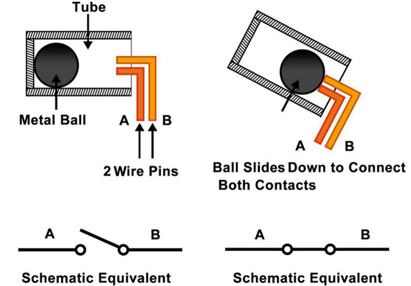

.. note::

    Hello, welcome to the SunFounder Raspberry Pi & Arduino & ESP32 Enthusiasts Community on Facebook! Dive deeper into Raspberry Pi, Arduino, and ESP32 with fellow enthusiasts.

    **Why Join?**

    - **Expert Support**: Solve post-sale issues and technical challenges with help from our community and team.
    - **Learn & Share**: Exchange tips and tutorials to enhance your skills.
    - **Exclusive Previews**: Get early access to new product announcements and sneak peeks.
    - **Special Discounts**: Enjoy exclusive discounts on our newest products.
    - **Festive Promotions and Giveaways**: Take part in giveaways and holiday promotions.

    👉 Ready to explore and create with us? Click [|link_sf_facebook|] and join today!

.. _cpn_tilt_switch:

Tilt Switch
=============================

.. image:: img/tilt_switch.png
    :width: 80
    :align: center

The tilt switch used here is a ball one with a metal ball inside. It is used to detect inclinations of a small angle.

The principle is very simple. When the switch is tilted in a certain angle, the ball inside rolls down and touches the two contacts connected to the pins outside, thus triggering circuits. Otherwise the ball will stay away from the contacts, thus breaking the circuits.

* `SW520D Tilt Switch Datasheet <https://www.tme.com/Document/f1e6cedd8cb7feeb250b353b6213ec6c/SW-520D.pdf>`_

**Example**

* :ref:`2.1.5_c` (C Project)
* :ref:`3.1.12_c` (C Project)
* :ref:`2.1.5_py` (Python Project)
* :ref:`4.1.18_py` (Python Project)
* :ref:`1.3_scratch` (Scratch Project)