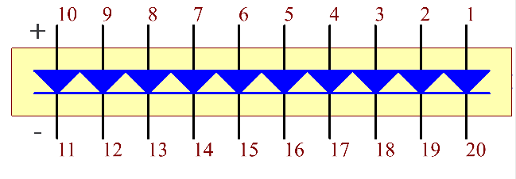

.. _bar_graph:

LED-Balkendiagramm
======================

.. image:: img/bar_graph.png
    :width: 300
    :align: center

Das LED-Balkendiagramm ist ein LED-Array, das dazu verwendet wird, sich mit elektronischen Schaltungen oder Mikrocontrollern zu verbinden. Es ist einfach, das LED-Balkendiagramm mit der Schaltung zu verbinden, genau wie das Anschließen von 10 einzelnen LEDs an 10 Ausgangspins. In der Regel verwenden wir das LED-Balkendiagramm als Batteriestandsanzeige, Audioausrüstungen und industrielle Steuerungstafeln. Es gibt viele weitere Anwendungen für LED-Balkendiagramme.

Nachfolgend ist das interne Schaltbild des LED-Balkendiagramms. Allgemein gesagt, ist die Seite mit dem Etikett die Anode und die andere Seite ist die Kathode.

**Beispiel**

* :ref:`1.1.3_c` (C-Projekt)
* :ref:`3.1.5_c` (C-Projekt)
* :ref:`1.1.3_py` (Python-Projekt)
* :ref:`4.1.11_py` (Python-Projekt)
* :ref:`1.12_scratch` (Scratch-Projekt)
