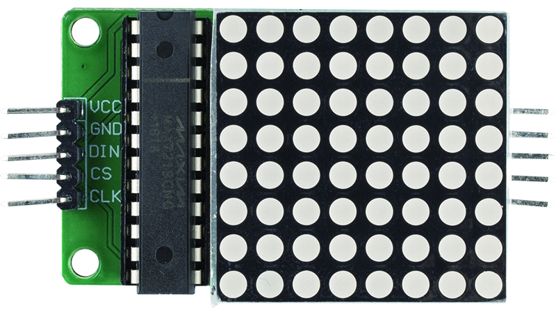
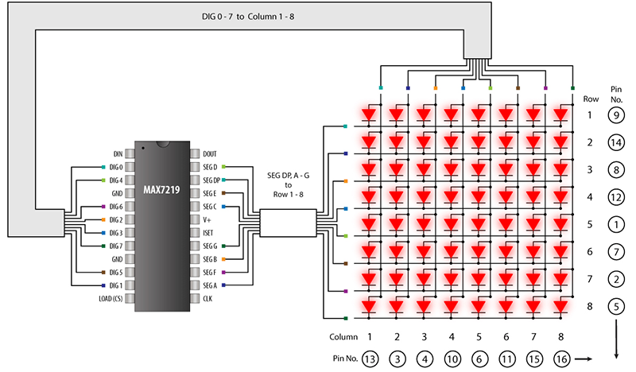

LEDマトリクスモジュール
========================

これは、MAX7219によって駆動される共通カソードの8x8ドットマトリクスモジュールです。動作電圧は5Vで、寸法は50mmx32mmx15mmです。左側が入力ポートで、右側が出力ポートです。複数のモジュールのカスケード接続に対応しています。

* **VCC**: 電源電圧の正極。+5Vに接続。
* **GND**: グラウンド（両方のGNDピンを接続する必要があります）
* **DIN**: シリアルデータ入力。CLKの立ち上がりエッジで内部の16ビットシフトレジスタにデータがロードされる。
* **CS**: チップ選択入力。CSがローの間、シリアルデータがシフトレジスタにロードされます。最後の16ビットのシリアルデータは、CSの立ち上がりエッジでラッチされる。
* **CLK**: シリアルクロック入力。最大10MHz。CLKの立ち上がりエッジで、データが内部シフトレジスタにシフトされます。CLKの立ち下がりエッジで、DOUTからデータがクロックアウトされます。

**MAX7219**

MAX7219は、マイクロプロセッサ（μPs）を最大8桁の7セグメント数値LEDディスプレイ、バーグラフディスプレイ、または64個の個々のLEDに接続する、コンパクトなシリアル入出力共通カソードディスプレイドライバです。内蔵されているのは、BCDコードBデコーダ、多重スキャン回路、セグメントおよびディジットドライバ、そして各ディジットを保存する8x8静的RAMです。

すべてのLEDのセグメント電流を設定するために必要な外部抵抗は1つだけです。MAX7221はSPI™、QSPI™、MICROWIRE™と互換性があり、EMIを減らすためのスルーレート制限されたセグメントドライバを持っています。

便利な4線式シリアルインターフェースは、すべての一般的なμPsに接続します。個々のディジットを指定して更新することができ、全体のディスプレイを書き換えることなく行えます。MAX7219/MAX7221は、各ディジットでcodeBデコードまたは非デコードを選択することも可能です。

* `MAX7219データシート <https://datasheets.maximintegrated.com/en/ds/MAX7219-MAX7221.pdf>`_

**例**

* :ref:`1.1.6_c` (Cプロジェクト)
* :ref:`3.1.12_c` (Cプロジェクト)
* :ref:`1.1.6_py` (Pythonプロジェクト)
* :ref:`4.1.19_py` (Pythonプロジェクト)

