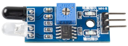

Obstacle Avoidance Module
===========================================

The IR obstacle avoidance module has strong adaptability to environmental light, it has a pair of infrared transmitting and receiving tubes.

The transmitting tube emits infrared frequency, when the detection direction encounters an obstacle, the infrared radiation is received by the receiving tube, 
after the comparator circuit processing, the green indicator will light up and output low level signal.

The detection distance can be adjusted by potentiometer, the effective distance range 2-30cm.

.. image:: img/IR_module.png
    :width: 600
    :align: center

**Example**

* :ref:`2.2.5 IR Obstacle Avoidance Module` (C Project)
* :ref:`2.2.5 IR Obstacle Avoidance Sensor` (Python Project)
* :ref:`1.11 Repelling locusts` (Scratch Project)

