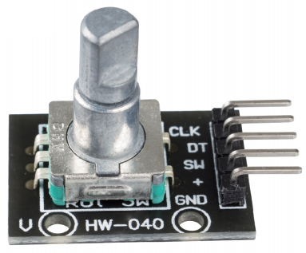

Rotary Encoder Module
=============================

The rotary encoder module counts the number of pulses output in the forward and reverse directions during rotation. unlike a potentiometer, this rotation count is unlimited and the number of pulses per cycle is 20. Press the key (SW) on the rotary encoder to start counting from zero.

There are mainly two types of rotary encoders: absolute and incremental (relative) encoders. An incremental one is used in this kit.

Incremental encoders give two-phase square waves, their phase difference is 90, usually called A channel and B channel.

As shown on the right, when channel A changes from high level to low
level, if channel B is high level, it indicates the rotary encoder spins
clockwise (CW); if at that moment channel B is low level, it means spins
counterclockwise (CCW). So if we read the value of channel B when
channel A is low level, we can know in which direction the rotary
encoder rotates.

.. image:: img/image206.png
    :width: 600
    :align: center