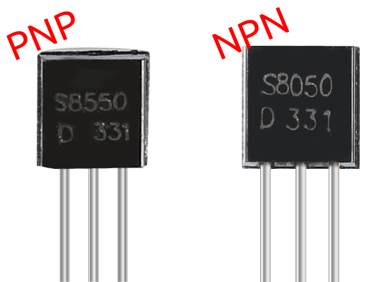
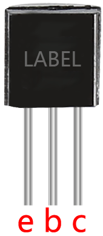

Transistor
============

Transistor is a semiconductor device that controls current by current. It functions by amplifying weak signal to larger amplitude signal and is also used for non-contact switch. 

A transistor is a three-layer structure composed of P-type and N-type semiconductors. They form the three regions internally. The thinner in the middle is the base region; the other two are both N-type or P-type ones – the smaller region with intense majority carriers is the emitter region, when the other one is the collector region. This composition enables the transistor to be an amplifier. 
From these three regions, three poles are generated respectively, which are base (b), emitter (e), and collector (c). They form two P-N junctions, namely, the emitter junction and collection junction. The direction of the arrow in the transistor circuit symbol indicates that of the emitter junction. 

* `P–N junction - Wikipedia <https://en.wikipedia.org/wiki/P-n_junction>`_

Based on the semiconductor type, transistors can be divided into two groups, the NPN and PNP ones. From the abbreviation, we can tell that the former is made of two N-type semiconductors and one P-type and that the latter is the opposite. See the figure below. 

.. note::
    s8550 is PNP transistor and the s8050 is the NPN one, They look very similar, and we need to check carefully to see their labels.

.. image:: img/transistor_symbol.png
    :width: 600

When a High level signal goes through an NPN transistor, it is energized. But a PNP one needs a Low level signal to manage it. Both types of transistor are frequently used for contactless switches, just like in this experiment.

Put the label side facing us and the pins facing down. The pins from left to right are emitter(e), base(b), and collector(c).

* `S8050 Transistor Datasheet <https://datasheet4u.com/datasheet-pdf/WeitronTechnology/S8050/pdf.php?id=576670>`_
* `S8550 Transistor Datasheet <https://www.mouser.com/datasheet/2/149/SS8550-118608.pdf>`_

**Example**

* :ref:`**1.2.1 Active Buzzer**` (C Project S8550)
* :ref:`**1.3.3 Relay**` (C Project S8050)
* :ref:`1.2.2 Passive Buzzer` (Python Project S8550)
* :ref:`1.3.3 Relay` (Python Project S8050)
* :ref:`1.14 123 Wooden Man` (Scratch Project S8550)
