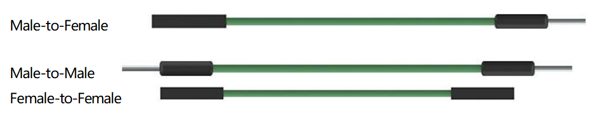

.. _wires:

ジャンパーワイヤー
=====================

二つの端子を繋ぐ電線をジャンパーワイヤーと呼びます。いくつかの種類のジャンパーワイヤーが存在しますが、ここではブレッドボードで使用されるものに焦点を当てます。特に、ブレッドボード上の任意の位置からマイクロコントローラの入出力ピンに電気信号を転送するために使われます。

ジャンパーワイヤーは、その「端子コネクタ」をブレッドボードに用意されたスロットに挿入することで取り付けられます。ブレッドボードの表面の下には、スロットを行または列でグループ化して接続する平行なプレートがいくつかセットになっています。これらの「端子コネクタ」は、特定のプロトタイプで接続が必要な特定のスロットに、はんだ付けせずに挿入されます。

ジャンパーワイヤーには三つのタイプがあります：メス-メス、オス-オス、オス-メスです。オス-メスと呼ぶ理由は、一方が突出したオス端子であり、もう一方が凹んだメス端子だからです。オス-オスは両端がオスで、メス-メスは両端がメスです。

プロジェクトによっては複数のタイプが使用される場合もあります。ジャンパーワイヤーの色が異なることがありますが、それはそれぞれの機能が異なるわけではありません。単に各回路間の接続をより容易に識別するために設計されています。
