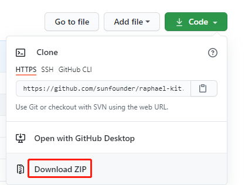

.. _download_the_code:

コードのダウンロード
======================

コードをダウンロードする前に、このサンプルコードは **Raspberry Pi OSでのみ** テストされていることに注意してください。ダウンロード方法は2つ提供します。

**方法1: git cloneを使用する（推奨）**

Raspberry Piにログインした後、ディレクトリを ``~`` に変更します。

.. raw:: html

   <run></run>

.. code-block:: 

   cd ~/

.. note::

   cdを使用して現在のパスから目的のディレクトリに移動します。非公式には、パス ``~/`` に移動するということです。

GitHubからリポジトリをクローンします。

.. raw:: html

   <run></run>

.. code-block:: 

   git clone https://github.com/sunfounder/raphael-kit.git

**方法2: コードをダウンロードする**

GitHubからソースコードをダウンロードします：https://github.com/sunfounder/raphael-kit

