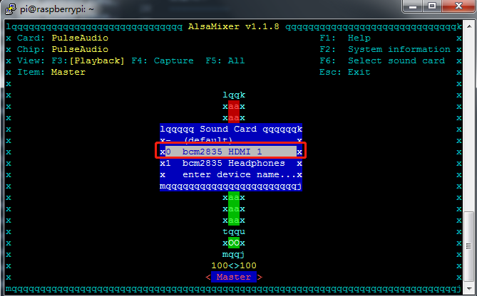

FAQ
=========

Audio Source Switch
----------------------------

如果你的树莓派连接了一个屏幕，音源信号默认会通过HMDI线传输到屏幕的喇叭上，这样你的扬声器就不能发声了。如果你的屏幕没有喇叭，你需要修改音源信号的传输方式。输入以下命令来编辑树莓派配置文件。

.. code-block::

    sudo nano /usr/share/alsa/alsa.conf

查找到以下两行代码

.. code-block::

    defaults.ctl.card 0 
    defaults.pcm.card 0

将"0"都更改成"1"，然后按 ``Ctrl`` + ``C`` 退出并保存代码，这样音频信号就会传输到扬声器上，并发出声音了。

.. code-block::

    defaults.ctl.card 1
    defaults.pcm.card 1

Volume Adjust
---------------

命令行输入 ``alsamixer`` 可以调节树莓派音量

.. image:: media/faq1.png

进去之后默认页面如下图所示

.. image:: media/faq2.png

你需要按F6更改模式，如果你有连接屏幕可以选择HDMI

若没有连接屏幕，则选择Headphones

.. image:: media/faq3.png

然后按方向键上下调节音量大小，按ESC键退出

.. image:: media/faq4.png