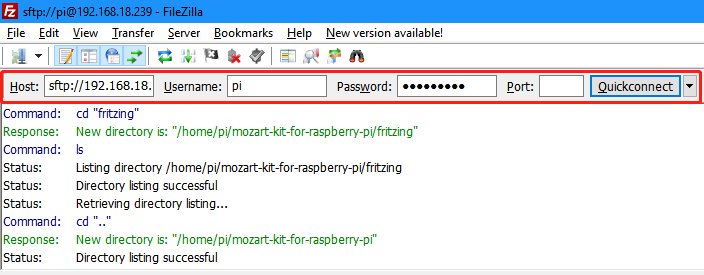
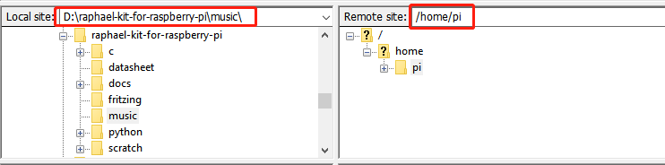
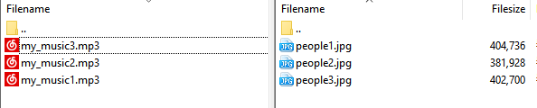

Use Filezilla Software
========================

The File Transfer Protocol (FTP) is a standard communication protocol used for the transfer of computer files from a server to a client on a computer network.

Filezilla是一款不仅支持FTP，同时支持FTP over TLS (FTPS) and SFTP的开源软件，我们可以使用Filezilla来将本地的图片和音频等文件上传到树莓派，或者将树莓派的图片和音频等文件下载到本地。

**step1:** 从Filezilla的官网下载 `https://filezilla-project.org/ <https://filezilla-project.org/>`_ 客户端。

**step2:** Start FileZilla then enter Host: 192.168.18.152, Usename: pi, Password: raspberry, Port: 22 and click Quickconnect.这时计算机和树莓派就通过Filezilla建立了通讯。

**step3:** 选择需要传输的文件的目录，左边是本地目录，右边是树莓派的目录。

**step4:** 右键点击要传输的文件，然后选择Upload/Download，文件开始上传和下载。

