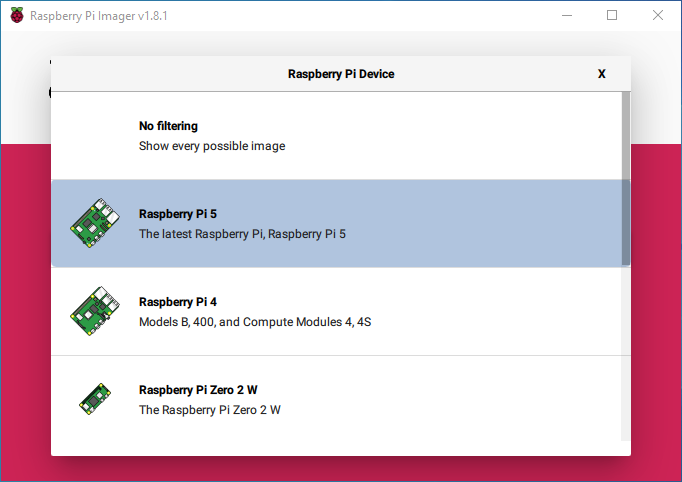
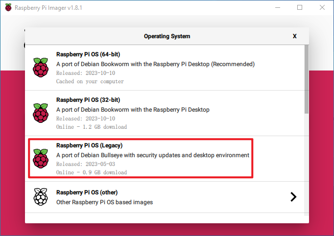

.. _install_os:

Installing the OS (Common)
========================================

**Step 1**

The Raspberry Pi team offers a user-friendly graphical SD card writing tool compatible with Mac OS, Ubuntu 18.04, and Windows. This is the most convenient option for most users, as it automatically downloads and installs the OS image to the SD card.

Visit the download page: https://www.raspberrypi.org/software/. Choose the **Raspberry Pi Imager** for your operating system. Once downloaded, open it to begin the installation.

.. image:: img/image2.png
    :align: center

.. raw:: html

     

**Step 2**

Upon launching the installer, your OS might prompt a security warning. For instance, Windows may show this message:

If you encounter this, select **More info** and then **Run anyway**. Follow the on-screen instructions to install the Raspberry Pi Imager.

.. image:: img/image3.png
    :align: center

.. raw:: html

     

**Step 3**

After installing the Imager, open the application by clicking the **Raspberry Pi Imager** icon or executing `rpi-imager`.

.. image:: img/image4.png
    :align: center

.. raw:: html

     

**Step 4**

Click **Choose device** and select your Raspberry Pi model from the list.

.. raw:: html

     

**Step 5**

Next, click **Choose OS** and pick an operating system to install. 

.. raw:: html

     

**Step 6**

Connect your preferred storage medium, like a microSD card, using an external or built-in SD card reader. Then, click Choose storage and select your storage device.

.. note:: 

    * Ensure to select the correct storage device if multiple are connected. Devices can often be identified by their size. Disconnect others if uncertain.

.. image:: img/image7.png
    :align: center

.. raw:: html

     

**Step 7**

Press the **NEXT** button and choose **EDIT SETTINGS** to access the OS Customization page.

.. image:: img/image8.png
    :align: center

.. raw:: html

     

**Step 8**

Set the **hostname**.

.. note::
        * The hostname option defines the hostname your Raspberry Pi broadcasts to the network using mDNS. When you connect your Raspberry Pi to your network, other devices on the network can communicate with your computer using ``<hostname>.local`` or ``<hostname>.lan``.

.. image:: img/image9.png
    :align: center

.. raw:: html

     

Set the **username** and **password** for the Raspberry Pi's administrator account.

.. note::
        * With no default password on the Raspberry Pi, it's essential to create your own. The username is also customizable.

.. image:: img/image10.png
    :align: center

.. raw:: html

     

Configure wireless LAN by entering your network's **SSID** and **password**.

.. note::

    Set the ``Wireless LAN country`` to your country's two-letter `ISO/IEC alpha2 code <https://en.wikipedia.org/wiki/ISO_3166-1_alpha-2#Officially_assigned_code_elements>`_.

.. image:: img/image11.png
    :align: center

.. raw:: html

     

**Step 9**

Click **SERVICES** to enable SSH and opt for password-based login. Then click **Save**.

.. image:: img/image12.png
    :align: center

.. raw:: html

     

**Step 10**

Click the **Yes** button.

.. image:: img/image13.png
    :align: center

.. raw:: html

     

**Step 11**

If your SD card contains files, consider backing them up to avoid permanent loss. If no backup is needed, click **Yes**.

.. image:: img/image14.png
    :align: center

.. raw:: html

     

**Step 12**

The completion of the writing process will be indicated by the following window after a wait.

.. image:: img/image15.png
    :align: center

.. raw:: html

     

