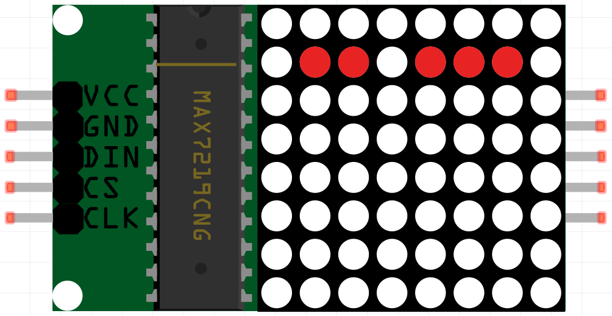

1.1.6 LED Dot Matrix Module
==================================

Introduction
--------------------

In this project, you will learn about LED Matrix Module. LED Matrix Module uses the MAX7219 driver to drive the 8 x 8 LED Matrix.

Components
------------------

.. image:: ../media/list_dot.png

* :ref:`GPIO Extension Board`
* :ref:`Breadboard`
* :ref:`LED Matrix Module`

Schematic Diagram
-----------------------

============ ======== ======== ====
T-Board Name physical wiringPi BCM
SPIMOSI      Pin 19   12       MOSI
SPICE0       pin 24   10       CE0
SPISCLK      Pin 23   14       SCLK
============ ======== ======== ====

.. image:: ../media/schematic_dot.png

Experimental Procedures
----------------------------

**Step 1:** Build the circuit. 

.. image:: ../media/1.1.6fritzing.png

.. note::

    Turn on the SPI before starting the experiment, refer to :ref:`SPI Configuration` for details. 

**Step 2:** Go to the folder of the code.

.. raw:: html

   <run></run>

.. code-block:: 

    cd /home/pi/raphael-kit/nodejs/

**Step 3:** Install dependencies.

.. raw:: html

   <run></run>

.. code-block:: 

    sudo npm install spi-device

**Step 4:** Run the code.

.. raw:: html

   <run></run>

.. code-block:: 

    sudo node max7219_led_matrix.js 

After running the code, the LED Dot Matrix displays from 0 to 9 and A to Z in sequence.

**Code**

.. code-block:: js

    const Gpio = require('pigpio').Gpio;
    const spi = require('spi-device');

    class MAX7219_LED_MATRIX {
        constructor(bus, device) {
            this.bus = bus;
            this.device = device;
        }
        delay(ms) {
            return new Promise((resolve, reject) => {setTimeout(resolve, ms)});
        }

        async write(addr, data) {
            return new Promise((resolve, reject)=>{
                const max7219 = spi.open(this.bus, this.device, (err)=>{
                    if (err) reject(err);
            
                    const message = [{
                        sendBuffer: Buffer.from([addr, data]),
                        receiveBuffer: Buffer.alloc(2),
                        byteLength: 2,
                        speedHz: 20000
                    }];
        
                    max7219.transfer(message, (err, message)=>{
                        if (err) reject(err);
                        else resolve();
                    })
                })
            })
        }
        async init() {
            await this.write(0x09, 0x00);
            await this.write(0x0a, 0x03);
            await this.write(0x0b, 0x07);
            await this.write(0x0c, 0x01);
            await this.write(0x0f, 0x00);
        }
    }

    const DISP=[
        [0x3C,0x42,0x42,0x42,0x42,0x42,0x42,0x3C],//0
        [0x08,0x18,0x28,0x08,0x08,0x08,0x08,0x08],//1
        [0x7E,0x2,0x2,0x7E,0x40,0x40,0x40,0x7E],//2
        [0x3E,0x2,0x2,0x3E,0x2,0x2,0x3E,0x0],//3
        [0x8,0x18,0x28,0x48,0xFE,0x8,0x8,0x8],//4
        [0x3C,0x20,0x20,0x3C,0x4,0x4,0x3C,0x0],//5
        [0x3C,0x20,0x20,0x3C,0x24,0x24,0x3C,0x0],//6
        [0x3E,0x22,0x4,0x8,0x8,0x8,0x8,0x8],//7
        [0x0,0x3E,0x22,0x22,0x3E,0x22,0x22,0x3E],//8
        [0x3E,0x22,0x22,0x3E,0x2,0x2,0x2,0x3E],//9
        [0x8,0x14,0x22,0x3E,0x22,0x22,0x22,0x22],//A
        [0x3C,0x22,0x22,0x3E,0x22,0x22,0x3C,0x0],//B
        [0x3C,0x40,0x40,0x40,0x40,0x40,0x3C,0x0],//C
        [0x7C,0x42,0x42,0x42,0x42,0x42,0x7C,0x0],//D
        [0x7C,0x40,0x40,0x7C,0x40,0x40,0x40,0x7C],//E
        [0x7C,0x40,0x40,0x7C,0x40,0x40,0x40,0x40],//F
        [0x3C,0x40,0x40,0x40,0x40,0x44,0x44,0x3C],//G
        [0x44,0x44,0x44,0x7C,0x44,0x44,0x44,0x44],//H
        [0x7C,0x10,0x10,0x10,0x10,0x10,0x10,0x7C],//I
        [0x3C,0x8,0x8,0x8,0x8,0x8,0x48,0x30],//J
        [0x0,0x24,0x28,0x30,0x20,0x30,0x28,0x24],//K
        [0x40,0x40,0x40,0x40,0x40,0x40,0x40,0x7C],//L
        [0x81,0xC3,0xA5,0x99,0x81,0x81,0x81,0x81],//M
        [0x0,0x42,0x62,0x52,0x4A,0x46,0x42,0x0],//N
        [0x3C,0x42,0x42,0x42,0x42,0x42,0x42,0x3C],//O
        [0x3C,0x22,0x22,0x22,0x3C,0x20,0x20,0x20],//P
        [0x1C,0x22,0x22,0x22,0x22,0x26,0x22,0x1D],//Q
        [0x3C,0x22,0x22,0x22,0x3C,0x24,0x22,0x21],//R
        [0x0,0x1E,0x20,0x20,0x3E,0x2,0x2,0x3C],//S
        [0x0,0x3E,0x8,0x8,0x8,0x8,0x8,0x8],//T
        [0x42,0x42,0x42,0x42,0x42,0x42,0x22,0x1C],//U
        [0x42,0x42,0x42,0x42,0x42,0x42,0x24,0x18],//V
        [0x0,0x49,0x49,0x49,0x49,0x2A,0x1C,0x0],//W
        [0x0,0x41,0x22,0x14,0x8,0x14,0x22,0x41],//X
        [0x41,0x22,0x14,0x8,0x8,0x8,0x8,0x8],//Y
        [0x0,0x7F,0x2,0x4,0x8,0x10,0x20,0x7F],//Z
    ];

    lm = new MAX7219_LED_MATRIX(0, 0);

    async function main(){
        lm.init();
        while(1){
            for(let j=0;j<36;j++){
                for(let i=1;i<9;i++){
                    lm.write(i, DISP[j][i-1]);
                }
                await lm.delay(1000);
            }
        }
    }
    main(); 

**Code Explanation**

.. code-block:: js

    const spi = require('spi-device');

Import the modules needed for spi communication.

.. note::
    When you have multiple devices that need spi communication, just connect the cs pins to different pins.

.. code-block:: js

    class MAX7219_LED_MATRIX {
        constructor(bus, device) {
            this.bus = bus;
            this.device = device;
        }
        delay(ms) {
            return new Promise((resolve, reject) => {setTimeout(resolve, ms)});
        }

        async write(addr, data) {
            return new Promise((resolve, reject)=>{
                const max7219 = spi.open(this.bus, this.device, (err)=>{
                    if (err) reject(err);

                    const message = [{
                        sendBuffer: Buffer.from([addr, data]),
                        receiveBuffer: Buffer.alloc(2),
                        byteLength: 2,
                        speedHz: 20000
                    }];

                    max7219.transfer(message, (err, message)=>{
                        if (err) reject(err);
                        else resolve();
                    })
                })
            })
        }

Implement a ``MAX7219_LED_MATRIX`` class, and the ``write()`` function encapsulated in it can light up the matrix.

.. note::
    The ``async`` keyword is used to modify the function and is usually matched with the ``await`` keyword. The statement modified by the ``await`` keyword needs to wait for the previous code to finish running before executing, achieving the effect of synchronous blocking.

* `Async Function <https://developer.mozilla.org/en-US/docs/Web/JavaScript/Reference/Statements/async_function>`_

.. code-block:: js

    lm = new MAX7219_LED_MATRIX(0, 0);

Instantiate an object lm of the ``MAX7219_LED_MATRIX`` class, so that we can call the encapsulated ``write()`` function inside.

.. code-block:: js

    while(1){
        for(let j=0;j<36;j++){
            for(let i=0;i<8;i++){
                lm.write(i, DISP[j][i]);
            }
            await lm.delay(1000);
        }
    }

The ``write(row,date)`` function allows you to display specified characters on the LED dot matrix,
The first parameter selects the row of the LED Matrix (8 rows in total),
The second parameter enters an 8-bit binary number to control the 8 LEDs of the row (0 means off, 1 means on).

The variable ``j`` is used to select the glyph, which is ``DISP[]`` . There are a total of 35 glyphs, 0~9 and A~Z.

For example, when j=1, the LED Maxtrix should display the image **1** .

The variable ``i`` is used to write the 8 data in the ``DISP[]`` glyph into the LED Matrix in turn. After the loop is completed, an 8x8 graphic can be generated.

For example, when j=1, i=1, the data of ``DISP[1][1]`` will be written here, that is, ``0x18``,
This will cause the second row of the LED Maxtrix to display the image ``00011000``.

Phenomenon Picture
-----------------------

.. image:: ../media/1.1.6led_dot_matrix.JPG