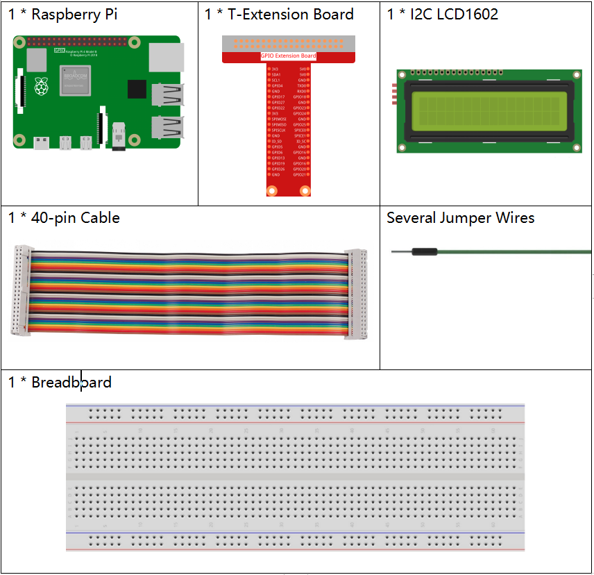
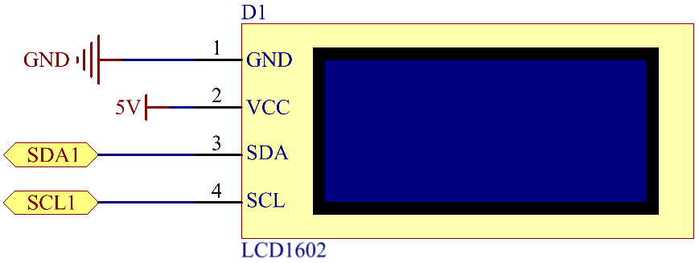
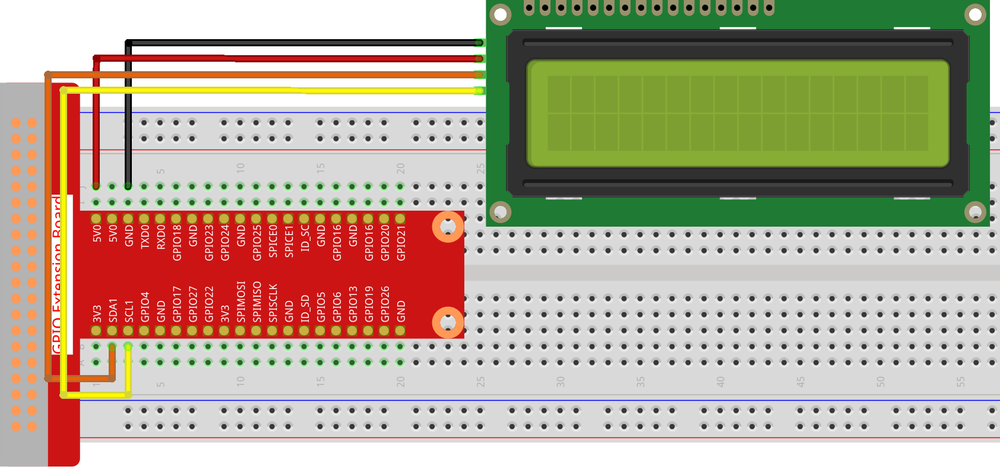
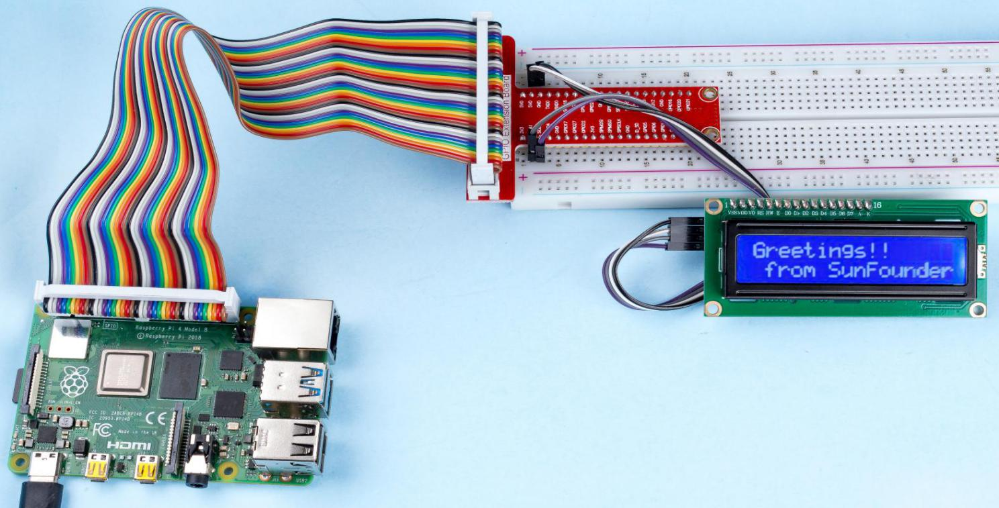

.. note::

    Hallo und willkommen in der SunFounder Raspberry Pi & Arduino & ESP32 Enthusiasten-Gemeinschaft auf Facebook! Tauchen Sie tiefer ein in die Welt von Raspberry Pi, Arduino und ESP32 mit anderen Enthusiasten.

    **Warum beitreten?**

    - **Expertenunterstützung**: Lösen Sie Nachverkaufsprobleme und technische Herausforderungen mit Hilfe unserer Gemeinschaft und unseres Teams.
    - **Lernen & Teilen**: Tauschen Sie Tipps und Anleitungen aus, um Ihre Fähigkeiten zu verbessern.
    - **Exklusive Vorschauen**: Erhalten Sie frühzeitigen Zugang zu neuen Produktankündigungen und exklusiven Einblicken.
    - **Spezialrabatte**: Genießen Sie exklusive Rabatte auf unsere neuesten Produkte.
    - **Festliche Aktionen und Gewinnspiele**: Nehmen Sie an Gewinnspielen und Feiertagsaktionen teil.

    👉 Sind Sie bereit, mit uns zu erkunden und zu erschaffen? Klicken Sie auf [|link_sf_facebook|] und treten Sie heute bei!

.. _1.1.7_js:

1.1.7 I2C LCD1602
=======================

Einführung
------------------

LCD1602 ist ein Zeichentyp-Liquid-Crystal-Display, das gleichzeitig 32 
(16*2) Zeichen anzeigen kann.

Benötigte Komponenten
------------------------------

Für dieses Projekt benötigen wir die folgenden Komponenten.

Es ist definitiv praktisch, ein ganzes Kit zu kaufen, hier ist der Link:

.. list-table::
    :widths: 20 20 20
    :header-rows: 1

    *   - Name	
        - ARTIKEL IN DIESEM KIT
        - LINK
    *   - Raphael Kit
        - 337
        - |link_Raphael_kit|

Sie können diese auch einzeln über die untenstehenden Links kaufen.

.. list-table::
    :widths: 30 20
    :header-rows: 1

    *   - KOMPONENTENBESCHREIBUNG
        - KAUF-LINK

    *   - :ref:`cpn_gpio_board`
        - |link_gpio_board_buy|
    *   - :ref:`cpn_breadboard`
        - |link_breadboard_buy|
    *   - :ref:`cpn_wires`
        - |link_wires_buy|
    *   - :ref:`cpn_i2c_lcd`
        - |link_i2clcd1602_buy|

Schaltplan
---------------------

============ ========
T-Board Name physical
SDA1         Pin 3
SCL1         Pin 5
============ ========

Experimentelle Verfahren
-----------------------------

**Schritt 1:** Bauen Sie den Schaltkreis.

**Schritt 2**: Richten Sie I2C ein (siehe :ref:`i2c_config`. Wenn Sie I2C bereits eingerichtet haben, überspringen Sie diesen Schritt.)

**Schritt 3:** Navigieren Sie zum Ordner mit dem Code.

.. raw:: html

   <run></run>

.. code-block::

    cd ~/raphael-kit/nodejs/

**Schritt 4:** Installieren Sie die Abhängigkeiten.

.. raw:: html

   <run></run>

.. code-block:: 

    sudo npm install @oawu/lcd1602

**Schritt 5:** Führen Sie den Code aus.

.. raw:: html

   <run></run>

.. code-block::

    sudo node i2c_lcd1602.js

Nachdem der Code ausgeführt wurde, können Sie ``Greetings!!, From SunFounder`` auf dem LCD sehen.

**Code**

.. code-block:: js

    const LCD = require('@oawu/lcd1602');
    const lcd = new LCD();

    lcd.text(0, 0, 'Greetings!!');
    lcd.text(1, 1, 'from SunFounder');

    setTimeout(() => {
        lcd.clear();
    }, 2000);

**Code-Erklärung**

.. code-block:: js

    const LCD = require('@oawu/lcd1602');
    const lcd = new LCD();

Importieren Sie das ``lcd1602`` Modul und repräsentieren Sie es mit ``lcd``.

.. note::
    Für das lcd1602 Modul, bitte schauen Sie unter: https://www.npmjs.com/package/@oawu/lcd1602

   
.. code-block:: js

    lcd.text(0, 0, 'Greetings!!');
    lcd.text(1, 1, 'from SunFounder');

Das Aufrufen der gekapselten ``text()`` Funktion in der ``LCD`` Klasse ermöglicht es dem lcd1602, den gewünschten Text anzuzeigen.

Die ``text()`` Funktion erhält drei Parameter, 
das erste Parameter ist die Zeile des lcd1602, 
das zweite Parameter gibt die Position des angezeigten Textes an, 
und das dritte Parameter repräsentiert den Text, den wir anzeigen möchten.

Die Zahl **1602** im LCD-Modell bedeutet, dass es 2 Reihen von jeweils 16 Zellen hat.

Phänomen-Bild
--------------------------

