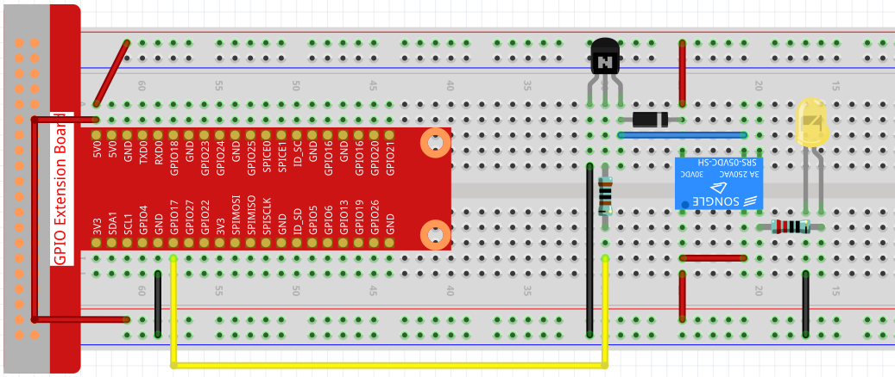

.. note::

    ¡Hola, bienvenido a la comunidad de entusiastas de SunFounder Raspberry Pi, Arduino y ESP32 en Facebook! Profundiza en Raspberry Pi, Arduino y ESP32 con otros entusiastas.

    **¿Por qué unirse?**

    - **Soporte experto**: Resuelve problemas postventa y desafíos técnicos con la ayuda de nuestra comunidad y equipo.
    - **Aprende y comparte**: Intercambia consejos y tutoriales para mejorar tus habilidades.
    - **Previews exclusivos**: Obtén acceso anticipado a nuevos anuncios de productos y adelantos.
    - **Descuentos especiales**: Disfruta de descuentos exclusivos en nuestros productos más recientes.
    - **Promociones y sorteos festivos**: Participa en sorteos y promociones de temporada.

    👉 ¿Listo para explorar y crear con nosotros? Haz clic en [|link_sf_facebook|] y únete hoy mismo!

.. _1.3.3_js:

1.3.3 Relé
===============

Introducción
---------------

En este proyecto, aprenderemos a utilizar un relé. Es uno de los componentes más 
utilizados en sistemas de control automático. Cuando el voltaje, corriente, temperatura, 
presión, etc., alcanza, supera o está por debajo del valor predeterminado, el relé conectará 
o interrumpirá el circuito, para controlar y proteger el equipo.

Componentes necesarios
------------------------------

En este proyecto, necesitamos los siguientes componentes. 

.. image:: ../img/list_1.3.4.png

Es definitivamente conveniente comprar un kit completo, aquí está el enlace: 

.. list-table::
    :widths: 20 20 20
    :header-rows: 1

    *   - Nombre	
        - ELEMENTOS EN ESTE KIT
        - ENLACE
    *   - Kit Raphael
        - 337
        - |link_Raphael_kit|

También puedes comprarlos por separado en los siguientes enlaces.

.. list-table::
    :widths: 30 20
    :header-rows: 1

    *   - INTRODUCCIÓN DEL COMPONENTE
        - ENLACE DE COMPRA

    *   - :ref:`cpn_gpio_board`
        - |link_gpio_board_buy|
    *   - :ref:`cpn_breadboard`
        - |link_breadboard_buy|
    *   - :ref:`cpn_wires`
        - |link_wires_buy|
    *   - :ref:`cpn_resistor`
        - |link_resistor_buy|
    *   - :ref:`cpn_led`
        - |link_led_buy|
    *   - :ref:`cpn_transistor`
        - |link_transistor_buy|
    *   - :ref:`cpn_relay`
        - |link_relay_buy|
    *   - :ref:`cpn_diode`
        - |link_diode_buy|

Diagrama Esquemático
---------------------------

.. image:: ../img/image345.png

Procedimientos Experimentales
---------------------------------

**Paso 1:** Construir el circuito.

**Paso 2:** Ir a la carpeta del código.

.. raw:: html

   <run></run>

.. code-block::

    cd ~/raphael-kit/nodejs/

**Paso 3:** Ejecutar el código.

.. raw:: html

   <run></run>

.. code-block::

    sudo node relay.js

Mientras el código se está ejecutando, el LED se enciende. Además, 
se puede escuchar un tic-tac causado por la ruptura del contacto 
normalmente cerrado y el cierre del contacto normalmente abierto.

**Código**

.. code-block:: js

    const Gpio = require('pigpio').Gpio;
    const relay = new Gpio(17,{mode: Gpio.OUTPUT});

    setInterval(() => {
        relay.digitalWrite(!relay.digitalRead());
    }, 500);

    process.on('SIGINT',function(){
        relay.digitalWrite(0);
        process.exit();
    });

**Explicación del Código**

.. code-block:: js

    const Gpio = require('pigpio').Gpio;
    const relay = new Gpio(17,{mode: Gpio.OUTPUT});

Importa el módulo ``pigpio`` y crea una instancia de un objeto relay de Gpio para controlar el puerto IO Gpio17, y configúralo en modo de salida.

.. code-block:: js

    setInterval(() => {
        relay.digitalWrite(!relay.digitalRead());
    }, 500);

El relé se abre y cierra continuamente, y los LEDs también se encenderán y apagarán continuamente a intervalos de 500ms.

.. code-block:: js

    process.on('SIGINT',function(){
        relay.digitalWrite(0);
        process.exit();
    });

Cuando se detecta ctrl+c, el relé se abre.

Imagen del Fenómeno
------------------------

.. image:: ../img/image145.jpeg
