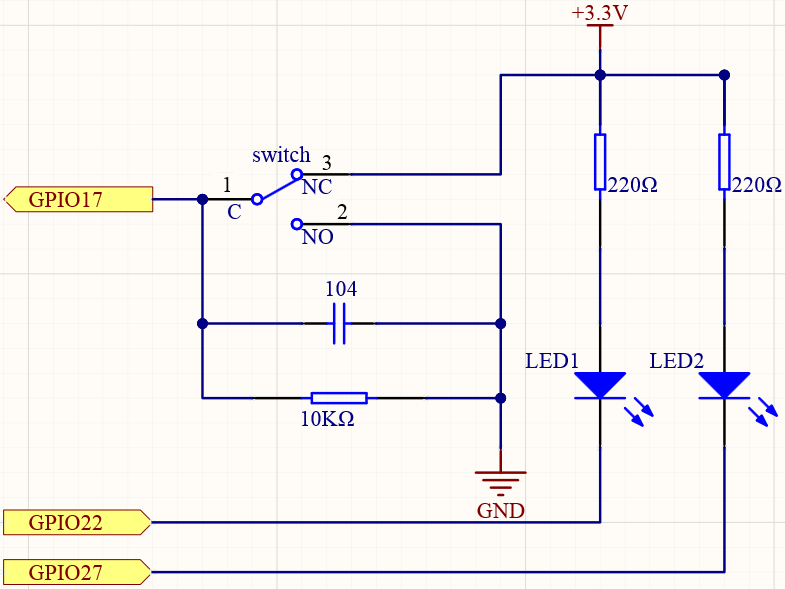
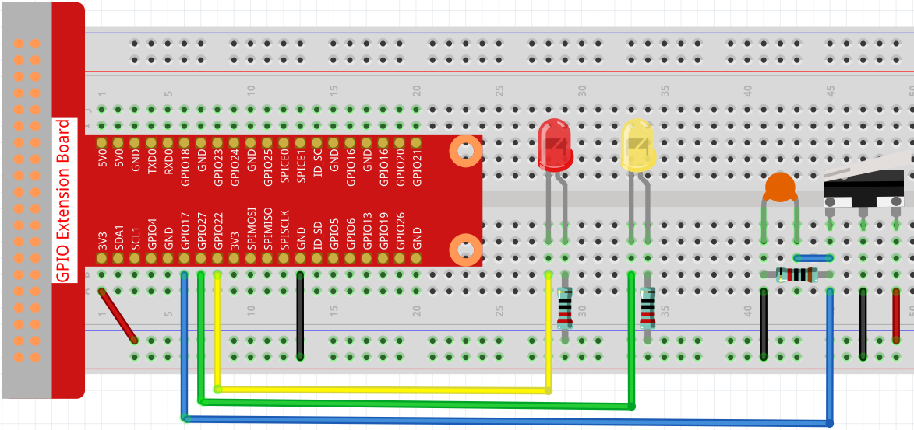
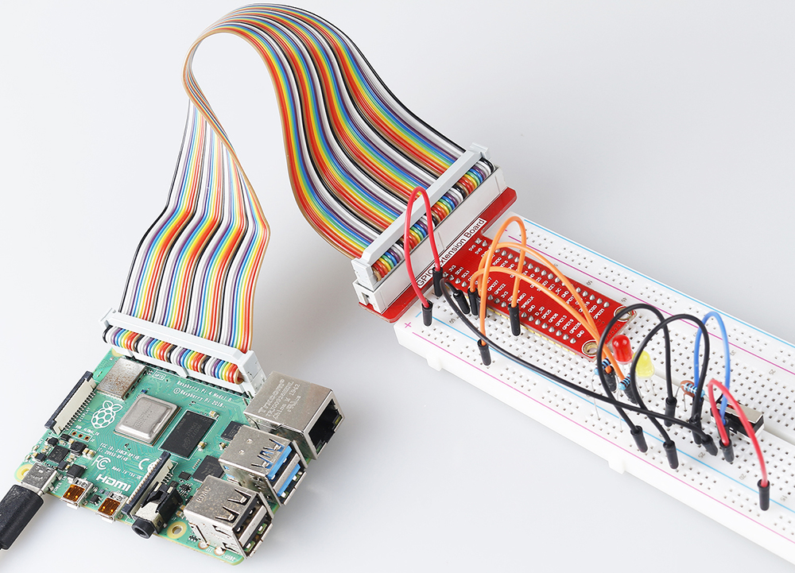

 
.. note::

    Bonjour et bienvenue dans la Communauté Facebook des passionnés de Raspberry Pi, Arduino et ESP32 de SunFounder ! Plongez plus profondément dans l'univers des Raspberry Pi, Arduino et ESP32 avec d'autres passionnés.

    **Pourquoi rejoindre ?**

    - **Support d'experts** : Résolvez les problèmes après-vente et les défis techniques avec l'aide de notre communauté et de notre équipe.
    - **Apprendre et partager** : Échangez des astuces et des tutoriels pour améliorer vos compétences.
    - **Aperçus exclusifs** : Accédez en avant-première aux annonces de nouveaux produits et aux aperçus.
    - **Réductions spéciales** : Profitez de réductions exclusives sur nos produits les plus récents.
    - **Promotions festives et cadeaux** : Participez à des cadeaux et des promotions de vacances.

    👉 Prêt à explorer et à créer avec nous ? Cliquez [|link_sf_facebook|] et rejoignez-nous aujourd'hui !

.. _2.1.2_js:

2.1.2 Micro-interrupteur
===========================

Introduction
----------------------

Dans ce projet, nous allons apprendre à utiliser un micro-interrupteur. Un micro-interrupteur est un petit interrupteur très sensible qui nécessite une compression minimale pour s'activer. Parce qu'ils sont fiables et sensibles, les micro-interrupteurs sont souvent utilisés comme dispositif de sécurité.

Ils sont utilisés pour empêcher les portes de se fermer si quelque chose ou quelqu'un est dans le passage, ainsi que dans d'autres applications similaires.

Composants requis
--------------------------------

Dans ce projet, nous avons besoin des composants suivants. 

.. image:: ../img/2.1.2component.png

Il est définitivement pratique d'acheter un kit complet, voici le lien :

.. list-table::
    :widths: 20 20 20
    :header-rows: 1

    *   - Nom	
        - ÉLÉMENTS DANS CE KIT
        - LIEN
    *   - Kit Raphael
        - 337
        - |link_Raphael_kit|

Vous pouvez également les acheter séparément via les liens ci-dessous.

.. list-table::
    :widths: 30 20
    :header-rows: 1

    *   - INTRODUCTION DU COMPOSANT
        - LIEN D'ACHAT

    *   - :ref:`cpn_gpio_extension_board`
        - |link_gpio_board_buy|
    *   - :ref:`cpn_breadboard`
        - |link_breadboard_buy|
    *   - :ref:`cpn_wires`
        - |link_wires_buy|
    *   - :ref:`cpn_resistor`
        - |link_resistor_buy|
    *   - :ref:`cpn_led`
        - |link_led_buy|
    *   - :ref:`cpn_micro_switch`
        - \-
    *   - :ref:`cpn_capacitor`
        - |link_capacitor_buy|

Schéma de câblage
---------------------

Connectez la broche gauche du micro-interrupteur à GPIO17 et deux LED aux broches GPIO22 et GPIO27 respectivement. Ensuite, lorsque vous appuyez et relâchez le bras du micro-interrupteur, vous pouvez voir les deux LED s'allumer alternativement.

.. image:: ../img/image305.png

Procédures expérimentales
----------------------------

**Étape 1:** Construisez le circuit.

**Étape 2** : Accédez au dossier du code.

.. raw:: html

   <run></run>

.. code-block::

    cd ~/raphael-kit/nodejs/

**Étape 3** : Exécutez le code.

.. raw:: html

   <run></run>

.. code-block::

    sudo node micro_switch.js

Lorsque le code est en cours d'exécution, appuyez sur le micro-interrupteur,
la LED jaune s'allume ;
relâchez le bras mobile, la LED rouge s'allume.

**Code**

.. code-block:: js

    const Gpio = require('pigpio').Gpio; 

    const led1 = new Gpio(22, {mode: Gpio.OUTPUT});
    const led2 = new Gpio(27, {mode: Gpio.OUTPUT});

    const microSwitch = new Gpio(17, {
        mode: Gpio.INPUT,
        pullUpDown: Gpio.PUD_DOWN,     
        edge: Gpio.EITHER_EDGE       
    });

    microSwitch.on('interrupt', (level) => {  
        led1.digitalWrite(level);   
        led2.digitalWrite(!level);       
    });

**Explication du code**

.. code-block:: js

    const Gpio = require('pigpio').Gpio; 

    const led1 = new Gpio(22, {mode: Gpio.OUTPUT});
    const led2 = new Gpio(27, {mode: Gpio.OUTPUT});

    const microSwitch = new Gpio(17, {
        mode: Gpio.INPUT,
        pullUpDown: Gpio.PUD_DOWN,     
        edge: Gpio.EITHER_EDGE       
    });

Importer le module ``pigpio`` et créer trois objets led1, led2, microSwitch,
En lisant le niveau du port IO du micro-interrupteur, on contrôle l'allumage et l'extinction des LED led1 et led2.

.. code-block:: js

    microSwitch.on('interrupt', (level) => {  
        led1.digitalWrite(level);   
        led2.digitalWrite(!level);       
    });

Lorsque le niveau du port IO du micro-interrupteur change,
Écrire le même niveau sur led1 et le niveau opposé sur led2.

Image du phénomène
---------------------

