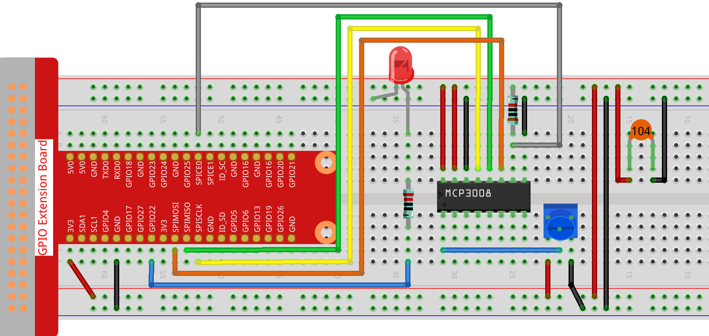

.. note::

    ¡Hola, bienvenido a la comunidad de entusiastas de SunFounder Raspberry Pi & Arduino & ESP32 en Facebook!  
    Sumérgete más en Raspberry Pi, Arduino y ESP32 con otros entusiastas.

    **¿Por qué unirse?**

    - **Soporte experto**: Resuelve problemas postventa y desafíos técnicos con la ayuda de nuestra comunidad y equipo.  
    - **Aprende y comparte**: Intercambia consejos y tutoriales para mejorar tus habilidades.  
    - **Avances exclusivos**: Obtén acceso anticipado a nuevos anuncios de productos y adelantos.  
    - **Descuentos especiales**: Disfruta de descuentos exclusivos en nuestros productos más recientes.  
    - **Promociones festivas y sorteos**: Participa en sorteos y promociones de temporada.

    👉 ¿Listo para explorar y crear con nosotros? Haz clic en [|link_sf_facebook|] y únete hoy mismo.

.. _2.1.7_js_pi5_mcp3008:

2.1.7 Potenciómetro (MCP3008)
================================

.. note::

   .. image:: ../img/mcp3008_and_adc0834.jpg
      :width: 25%
      :align: left
    

   Dependiendo de la versión de tu kit, identifica si tienes **ADC0834** o **MCP3008** y procede con la sección correspondiente.

Introducción
------------

La función del ADC se utiliza para convertir señales analógicas en valores digitales.  
En este experimento, usamos el chip ADC MCP3008 para realizar esta conversión.  
Se utiliza un potenciómetro para generar un voltaje variable, que cambia la magnitud física.  
El MCP3008 convierte este voltaje analógico en un valor digital que puede ser leído y procesado por la Raspberry Pi.

Componentes requeridos
----------------------

En este proyecto, necesitamos los siguientes componentes. 

.. image:: ../img/list2_2.1.4_potentiometer.png

Es definitivamente conveniente comprar un kit completo, aquí está el enlace: 

.. list-table::
    :widths: 20 20 20
    :header-rows: 1

    *   - Nombre	
        - ARTÍCULOS EN ESTE KIT
        - ENLACE
    *   - Kit Raphael
        - 337
        - |link_Raphael_kit|

También puedes comprarlos por separado desde los siguientes enlaces.

.. list-table::
    :widths: 30 20
    :header-rows: 1

    *   - INTRODUCCIÓN DEL COMPONENTE
        - ENLACE DE COMPRA

    *   - :ref:`cpn_gpio_extension_board`
        - |link_gpio_board_buy|
    *   - :ref:`cpn_breadboard`
        - |link_breadboard_buy|
    *   - :ref:`cpn_wires`
        - |link_wires_buy|
    *   - :ref:`cpn_resistor`
        - |link_resistor_buy|
    *   - :ref:`cpn_led`
        - |link_led_buy|
    *   - :ref:`cpn_potentiometer`
        - |link_potentiometer_buy|
    *   - :ref:`cpn_mcp3008`
        - \-

Diagrama esquemático
--------------------

.. list-table::
    :widths: 30 30 30 30
    :header-rows: 1

    *   - Nombre T-Board
        - physical
        - WiringPi
        - BCM

    *   - SPICE0
        - pin24
        - 10
        - 8
    *   - SPIMOSI
        - pin19
        - 12
        - 10
    *   - SPIMISO
        - pin21
        - 13
        - 9
    *   - SPISCLK
        - pin23
        - 14
        - 11
    *   - GPIO22
        - pin15
        - 3
        - 22

.. image:: ../img/schematic_2.1.7_potentiometer_mcp3008.png

Procedimientos experimentales
-----------------------------

**Paso 1:** Construye el circuito.

.. note::
    Coloca el chip siguiendo la posición correspondiente indicada en la imagen.  
    Ten en cuenta que la ranura del chip debe estar a la izquierda cuando se coloca.

**Paso 2:** Abre el archivo de código.

.. raw:: html

   <run></run>

.. code-block::

    cd ~/raphael-kit/nodejs/

**Paso 3:** Ejecuta el código.

.. raw:: html

   <run></run>

.. code-block::

    sudo node potentionmeter-2.js

Después de ejecutar el código, gira la perilla del potenciómetro, la intensidad del LED cambiará en consecuencia.

Código
------

.. code-block:: js

    const Gpio = require('pigpio').Gpio;
    const mcpadc = require('mcp-spi-adc');

    // Abrir el canal 0 de MCP3008 (entrada analógica CH0)
    const adc = mcpadc.openMcp3008(0, { speedHz: 1000000 }, (err) => {
    if (err) {
        console.error("No se pudo abrir el canal ADC:", err);
        process.exit(1);
    }

    console.log("Canal MCP3008 0 abierto correctamente.");

    // Inicializar LED en GPIO22 con modo de salida PWM
    const led = new Gpio(22, { mode: Gpio.OUTPUT });

    // Leer valor ADC cada 100ms y actualizar el brillo del LED
    setInterval(() => {
        adc.read((err, reading) => {
        if (err) {
            console.error("Error al leer ADC:", err);
            return;
        }

        // Convertir valor flotante (0.0–1.0) a rango PWM (0–255)
        const pwmVal = Math.round(reading.value * 255);

        console.log(`Valor actual analogVal: ${pwmVal}`);

        // Actualizar brillo del LED usando PWM
        led.pwmWrite(pwmVal);
        });
    }, 100);
    });

Explicación del código
----------------------

.. code-block:: js

    const Gpio = require('pigpio').Gpio;

Esta línea importa el módulo ``pigpio``, que permite un control preciso de PWM y GPIO en la Raspberry Pi.

.. code-block:: js

    const mcpadc = require('mcp-spi-adc');

Esta línea importa la librería ``mcp-spi-adc``, que habilita la comunicación con el MCP3008 a través de la interfaz SPI.

.. code-block:: js

    const adc = mcpadc.openMcp3008(0, { speedHz: 1000000 }, (err) => {
        if (err) {
            console.error("No se pudo abrir el canal ADC:", err);
            process.exit(1);
        }
    });

Inicializa el canal de entrada analógica 0 del MCP3008.  
Configura la velocidad de comunicación SPI a 1 MHz. Si la inicialización falla, muestra un error y cierra el programa.

.. code-block:: js

    const led = new Gpio(22, { mode: Gpio.OUTPUT });

Crea un objeto GPIO para el pin 22 de la Raspberry Pi.  
Este pin se configura como salida y se utiliza para controlar el brillo de un LED mediante PWM.

.. code-block:: js

    setInterval(() => {
        adc.read((err, reading) => {
            if (err) {
                console.error("Error al leer ADC:", err);
                return;
            }

            const pwmVal = Math.round(reading.value * 255);
            console.log(`Valor actual analogVal: ${pwmVal}`);
            led.pwmWrite(pwmVal);
        });
    }, 100);

Cada 100 milisegundos, esta función lee el valor analógico del canal 0 del MCP3008.  
El ADC devuelve un número de punto flotante normalizado entre 0.0 y 1.0.  
Este valor se escala al rango 0–255 y se escribe en GPIO22 usando ``pwmWrite()`` para controlar el brillo del LED.  
El valor PWM también se imprime en la consola.

.. **Imagen del fenómeno**
.. ------------------------

.. .. image:: ../img/image181.jpeg
