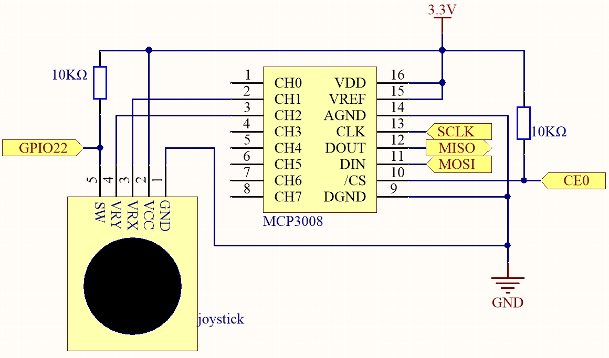

.. note::

    ¡Hola, bienvenido a la comunidad de entusiastas de SunFounder Raspberry Pi & Arduino & ESP32 en Facebook!  
    Sumérgete más en Raspberry Pi, Arduino y ESP32 con otros entusiastas.

    **¿Por qué unirse?**

    - **Soporte experto**: Resuelve problemas postventa y desafíos técnicos con la ayuda de nuestra comunidad y equipo.  
    - **Aprende y comparte**: Intercambia consejos y tutoriales para mejorar tus habilidades.  
    - **Avances exclusivos**: Obtén acceso anticipado a nuevos anuncios de productos y adelantos.  
    - **Descuentos especiales**: Disfruta de descuentos exclusivos en nuestros productos más recientes.  
    - **Promociones festivas y sorteos**: Participa en sorteos y promociones de temporada.

    👉 ¿Listo para explorar y crear con nosotros? Haz clic en [|link_sf_facebook|] y únete hoy mismo.

.. _2.1.9_js_pi5_mcp3008:

2.1.9 Joystick (MCP3008)
==========================

Introducción
--------------

En este proyecto, vamos a aprender cómo funciona el joystick. Manipulamos el joystick y mostramos los resultados en la pantalla.

Componentes requeridos
-------------------------------

En este proyecto, necesitamos los siguientes componentes. 

.. image:: ../img/image317 - Copy.png

Es definitivamente conveniente comprar un kit completo, aquí está el enlace: 

.. list-table::
    :widths: 20 20 20
    :header-rows: 1

    *   - Nombre	
        - ARTÍCULOS EN ESTE KIT
        - ENLACE
    *   - Kit Raphael
        - 337
        - |link_Raphael_kit|

También puedes comprarlos por separado desde los siguientes enlaces.

.. list-table::
    :widths: 30 20
    :header-rows: 1

    *   - INTRODUCCIÓN DEL COMPONENTE
        - ENLACE DE COMPRA

    *   - :ref:`cpn_gpio_board`
        - |link_gpio_board_buy|
    *   - :ref:`cpn_breadboard`
        - |link_breadboard_buy|
    *   - :ref:`cpn_wires`
        - |link_wires_buy|
    *   - :ref:`cpn_resistor`
        - |link_resistor_buy|
    *   - :ref:`cpn_joystick`
        - \-
    *   - :ref:`cpn_mcp3008`
        - \-

Diagrama esquemático
--------------------

Cuando se leen los datos del joystick, hay algunas diferencias entre los ejes: los datos de los ejes X e Y son analógicos, por lo que se necesita usar MCP3008 para convertir el valor analógico a valor digital. Los datos del eje Z son digitales, por lo que se pueden leer directamente usando el GPIO, o también puedes usar el ADC para leerlos.

.. .. image:: ../img/image319.png

    *   - Nombre T-Board
        - physical
        - WiringPi
        - BCM

    *   - SPICE0
        - pin24
        - 10
        - 8
    *   - SPIMOSI
        - pin19
        - 12
        - 10
    *   - SPIMISO
        - pin21
        - 13
        - 9
    *   - SPISCLK
        - pin23
        - 14
        - 11
    *   - GPIO22
        - pin15
        - 3
        - 22

Procedimientos experimentales
-----------------------------

**Paso 1:** Construye el circuito.

.. image:: ../img/2.1.9_Joystick_js.png

**Paso 2:** Ve a la carpeta del código.

.. raw:: html

   <run></run>

.. code-block::

    cd ~/raphael-kit/nodejs/

**Paso 3:** Ejecuta el código.

.. raw:: html

   <run></run>

.. code-block::

    sudo node joystick-2.js

Después de ejecutar el código, mueve el joystick y los valores correspondientes de x, y, Btn se mostrarán en la pantalla.

Código
------

.. code-block:: js

    const Gpio = require('pigpio').Gpio;
    const mcpadc = require('mcp-spi-adc');

    // Abrir canal 1 (eje X)
    const xChannel = mcpadc.openMcp3008(1, { speedHz: 1350000 }, (err) => {
    if (err) {
        console.error('Error al abrir el canal X:', err);
        process.exit(1);
    }
    });

    // Abrir canal 2 (eje Y)
    const yChannel = mcpadc.openMcp3008(2, { speedHz: 1350000 }, (err) => {
    if (err) {
        console.error('Error al abrir el canal Y:', err);
        process.exit(1);
    }
    });

    // Entrada del botón en GPIO22 con resistencia pull-up
    const btn = new Gpio(22, {
    mode: Gpio.INPUT,
    pullUpDown: Gpio.PUD_UP,
    });

    // Bucle de lectura
    setInterval(() => {
    xChannel.read((errX, xReading) => {
        if (errX) {
        console.error('Error al leer canal X:', errX);
        return;
        }

        yChannel.read((errY, yReading) => {
        if (errY) {
            console.error('Error al leer canal Y:', errY);
            return;
        }

        const x_val = Math.round(xReading.value * 1023);
        const y_val = Math.round(yReading.value * 1023);
        const btn_val = btn.digitalRead();

        console.log(`x = ${x_val}, y = ${y_val}, btn = ${btn_val}\n`);
        });
    });
    }, 100);

Explicación del código
----------------------

.. code-block:: js

    const mcpadc = require('mcp-spi-adc');

Esta línea importa el módulo ``mcp-spi-adc``, que permite la comunicación con el MCP3008 utilizando la interfaz SPI de hardware de la Raspberry Pi.

.. code-block:: js

    const xChannel = mcpadc.openMcp3008(1, { speedHz: 1350000 }, ...);
    const yChannel = mcpadc.openMcp3008(2, { speedHz: 1350000 }, ...);

Estas líneas abren los canales de entrada analógica 1 y 2 del MCP3008 para leer las señales de los ejes X e Y del joystick, respectivamente. La velocidad de comunicación SPI se establece en 1,35 MHz.

.. code-block:: js

    const btn = new Gpio(22, {
      mode: Gpio.INPUT,
      pullUpDown: Gpio.PUD_UP,
    });

Inicializa el pin GPIO 22 como entrada digital con una resistencia pull-up interna habilitada. Este pin se utiliza para leer el estado de un botón pulsador.

.. code-block:: js

    setInterval(() => {
      xChannel.read(...);
      yChannel.read(...);
    }, 100);

Esta función se ejecuta cada 100 milisegundos. Lee los valores de los ejes X e Y del joystick a través de los canales 1 y 2 del MCP3008 utilizando SPI.  
Los valores de punto flotante (rango 0.0–1.0) se convierten en enteros de 10 bits (0–1023). También lee el estado del botón usando ``digitalRead()`` en GPIO22, devolviendo 0 cuando está presionado y 1 cuando está liberado. Todos los valores se imprimen en la consola.

.. **Imagen del fenómeno**
.. ------------------------

.. .. image:: ../img/image194.jpeg
