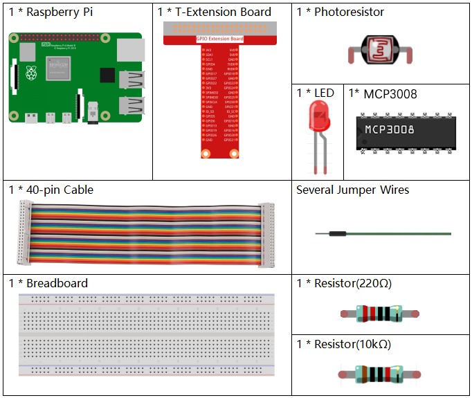
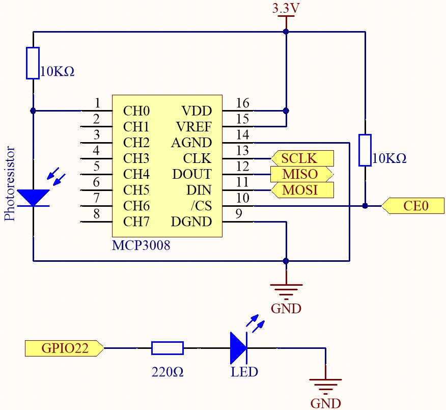
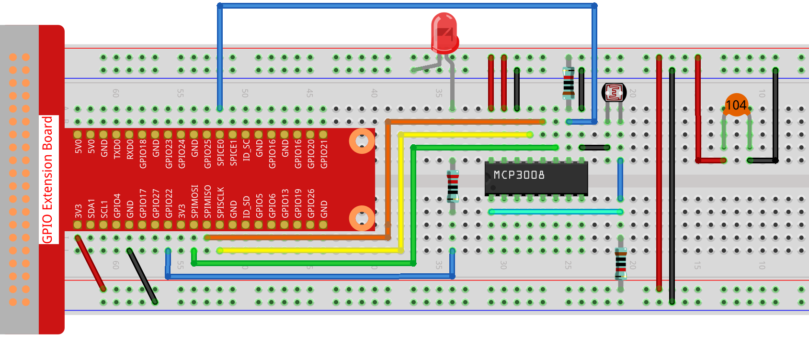

.. note::

    ¡Hola, bienvenido a la Comunidad de Entusiastas de SunFounder Raspberry Pi & Arduino & ESP32 en Facebook! Sumérgete en el mundo de Raspberry Pi, Arduino y ESP32 junto a otros entusiastas.

    **¿Por qué unirse?**

    - **Soporte experto**: Resuelve problemas postventa y desafíos técnicos con la ayuda de nuestra comunidad y equipo.
    - **Aprender y compartir**: Intercambia consejos y tutoriales para mejorar tus habilidades.
    - **Preestrenos exclusivos**: Obtén acceso anticipado a nuevos anuncios de productos y avances.
    - **Descuentos especiales**: Disfruta de descuentos exclusivos en nuestros productos más recientes.
    - **Promociones y sorteos festivos**: Participa en sorteos y promociones especiales de temporada.

    👉 ¿Listo para explorar y crear con nosotros? Haz clic en [|link_sf_facebook|] y únete hoy mismo.

.. _2.2.1_js_pi5_mcp3008:

2.2.1 Fotoresistor (MCP3008)
===============================

.. note::

   .. image:: ../img/mcp3008_and_adc0834.jpg
      :width: 25%
      :align: left
    

   Dependiendo de la versión de tu kit, identifica si tienes **ADC0834** o **MCP3008** y procede con la sección correspondiente.

Introducción
------------

El fotoresistor es un componente comúnmente usado para detectar la intensidad de la luz ambiental. Ayuda al controlador a reconocer el día y la noche y realizar funciones de control de luz, como lámparas nocturnas. Este proyecto es muy similar al potenciómetro, y podrías pensar que cambia el voltaje para detectar la luz.

Componentes requeridos
----------------------

En este proyecto, necesitamos los siguientes componentes. 

Es definitivamente conveniente comprar un kit completo, aquí tienes el enlace: 

.. list-table::
    :widths: 20 20 20
    :header-rows: 1

    *   - Nombre	
        - ELEMENTOS EN ESTE KIT
        - ENLACE
    *   - Kit Raphael
        - 337
        - |link_Raphael_kit|

También puedes comprarlos por separado en los siguientes enlaces.

.. list-table::
    :widths: 30 20
    :header-rows: 1

    *   - INTRODUCCIÓN DEL COMPONENTE
        - ENLACE DE COMPRA

    *   - :ref:`cpn_gpio_extension_board`
        - |link_gpio_board_buy|
    *   - :ref:`cpn_breadboard`
        - |link_breadboard_buy|
    *   - :ref:`cpn_wires`
        - |link_wires_buy|
    *   - :ref:`cpn_resistor`
        - |link_resistor_buy|
    *   - :ref:`cpn_led`
        - |link_led_buy|
    *   - :ref:`cpn_mcp3008`
        - \-
    *   - :ref:`cpn_photoresistor`
        - |link_photoresistor_buy|

Diagrama esquemático
--------------------

.. list-table::
    :widths: 30 30 30 30
    :header-rows: 1

    *   - Nombre T-Board
        - físico
        - WiringPi
        - BCM

    *   - SPICE0
        - pin24
        - 10
        - 8
    *   - SPIMOSI
        - pin19
        - 12
        - 10
    *   - SPIMISO
        - pin21
        - 13
        - 9
    *   - SPISCLK
        - pin23
        - 14
        - 11
    *   - GPIO22
        - pin15
        - 3
        - 22

Procedimientos experimentales
-----------------------------

**Paso 1:** Construir el circuito.

**Paso 2:** Ir a la carpeta del código.

.. raw:: html

   <run></run>

.. code-block::

    cd ~/raphael-kit/nodejs/

**Paso 3:** Ejecutar el código.

.. raw:: html

   <run></run>

.. code-block::

    sudo node photoresistor-2.js

**Código**

.. code-block:: js

    const Gpio = require('pigpio').Gpio;
    const mcpadc = require('mcp-spi-adc');

    // Abrir canal 0 del MCP3008 (entrada analógica CH0)
    const adc = mcpadc.openMcp3008(0, { speedHz: 1350000 }, (err) => {
    if (err) {
        console.error("No se pudo abrir MCP3008:", err);
        process.exit(1);
    }

    console.log("MCP3008 inicializado en SPI0/CE0.");

    // Inicializar LED en GPIO22 (compatible con PWM)
    const led = new Gpio(22, { mode: Gpio.OUTPUT });

    // Configurar intervalo para leer ADC y actualizar brillo del LED cada 100ms
    const interval = setInterval(() => {
        adc.read((err, reading) => {
        if (err) {
            console.error("Error de lectura del ADC:", err);
            return;
        }

        const adcValue = reading.value;          // Flotante entre 0.0 y 1.0
        const pwmValue = Math.round(adcValue * 255); // Escalar a 0–255

        console.log(`ADC = ${adcValue.toFixed(4)}, PWM = ${pwmValue}`);

        led.pwmWrite(pwmValue); // Actualizar brillo del LED
        });
    }, 100);

    // Manejar Ctrl+C (SIGINT) para limpieza
    process.on('SIGINT', () => {
        console.log('\nCerrando correctamente...');
        clearInterval(interval);  // Detener el bucle del intervalo
        led.digitalWrite(0);      // Apagar LED
        process.exit(0);
    });
    });

Explicación del código
----------------------

.. code-block:: js

    const Gpio = require('pigpio').Gpio;

Esta línea importa el módulo ``pigpio``, que se utiliza para controlar los pines GPIO de la Raspberry Pi. Soporta salida PWM necesaria para atenuar un LED.

.. code-block:: js

    const mcpadc = require('mcp-spi-adc');

Esta línea importa la librería ``mcp-spi-adc``, que permite la comunicación con el convertidor analógico-digital MCP3008 utilizando la interfaz SPI de la Raspberry Pi.

.. code-block:: js

    const adc = mcpadc.openMcp3008(0, { speedHz: 1350000 }, (err) => { ... });

Abre el canal de entrada analógica 0 del chip MCP3008 usando SPI por hardware. La velocidad de reloj SPI está configurada en 1,35 MHz. Si ocurre un error al abrir el canal, el programa lo registra y finaliza.

.. code-block:: js

    const led = new Gpio(22, { mode: Gpio.OUTPUT });

Inicializa el pin GPIO22 como salida. Este pin se usa para controlar el brillo de un LED mediante PWM con la librería ``pigpio``.

.. code-block:: js

    setInterval(() => {
        adc.read((err, reading) => {
            ...
        });
    }, 100);

Configura un bucle recurrente que se ejecuta cada 100 milisegundos. En cada ciclo, lee el valor analógico del canal 0 del MCP3008. El resultado es un número flotante entre 0.0 y 1.0, que representa la relación entre el voltaje de entrada y el de referencia.

.. code-block:: js

    const pwmValue = Math.round(adcValue * 255);
    led.pwmWrite(pwmValue);

Convierte el valor analógico en un valor PWM de 8 bits en el rango 0–255, y lo escribe en el GPIO22 para ajustar proporcionalmente el brillo del LED.

.. code-block:: js

    process.on('SIGINT', () => {
        clearInterval(interval);
        led.digitalWrite(0);
        process.exit(0);
    });

Agrega un manejador de señales para cerrar el programa de manera segura cuando se presiona ``Ctrl+C``. Detiene el bucle del intervalo, apaga el LED y finaliza el programa de forma correcta.

