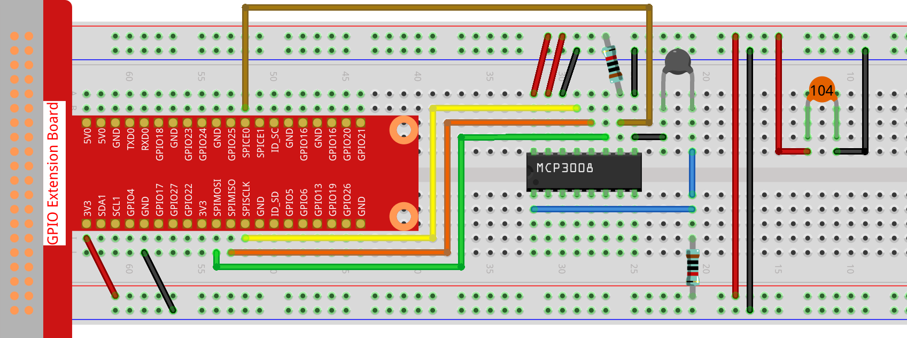

.. note::

    Ciao, benvenuto nella Community Facebook di appassionati di SunFounder Raspberry Pi & Arduino & ESP32! Approfondisci Raspberry Pi, Arduino ed ESP32 con altri appassionati.

    **Perché unirsi?**

    - **Supporto esperto**: Risolvi problemi post-vendita e sfide tecniche con l'aiuto della nostra community e del nostro team.
    - **Impara e condividi**: Scambia suggerimenti e tutorial per migliorare le tue competenze.
    - **Anteprime esclusive**: Ottieni l'accesso anticipato agli annunci di nuovi prodotti e alle anteprime.
    - **Sconti speciali**: Goditi sconti esclusivi sui nostri prodotti più recenti.
    - **Promozioni festive e giveaway**: Partecipa a giveaway e promozioni festive.

    👉 Pronto a esplorare e creare con noi? Clicca [|link_sf_facebook|] e unisciti oggi stesso!

.. _2.2.2_js_pi5_mcp3008:

2.2.2 Termistore (MCP3008)
============================

.. note::

   .. image:: ../img/mcp3008_and_adc0834.jpg
      :width: 25%
      :align: left
    

   A seconda della versione del tuo kit, identifica se hai **ADC0834** o **MCP3008** e procedi con la sezione corrispondente.

Introduzione
------------

Proprio come la fotoresistenza può rilevare la luce, il termistore è un dispositivo elettronico sensibile alla temperatura che può essere utilizzato per realizzare funzioni di controllo della temperatura, come ad esempio un allarme termico.

Componenti richiesti
------------------------------

In questo progetto, ci servono i seguenti componenti. 

.. image:: ../img/list2_2.2.2_thermistor.png

È sicuramente conveniente acquistare un kit completo, ecco il link: 

.. list-table::
    :widths: 20 20 20
    :header-rows: 1

    *   - Nome
        - ARTICOLI IN QUESTO KIT
        - LINK
    *   - Raphael Kit
        - 337
        - |link_Raphael_kit|

Puoi anche acquistarli separatamente dai link sottostanti.

.. list-table::
    :widths: 30 20
    :header-rows: 1

    *   - INTRODUZIONE COMPONENTE
        - LINK DI ACQUISTO

    *   - :ref:`cpn_gpio_extension_board`
        - |link_gpio_board_buy|
    *   - :ref:`cpn_breadboard`
        - |link_breadboard_buy|
    *   - :ref:`cpn_wires`
        - |link_wires_buy|
    *   - :ref:`cpn_resistor`
        - |link_resistor_buy|
    *   - :ref:`cpn_thermistor`
        - |link_thermistor_buy|
    *   - :ref:`cpn_mcp3008`
        - \-

Schema elettrico
-----------------

.. list-table::
    :widths: 30 30 30 30
    :header-rows: 1

    *   - Nome T-Board
        - fisico
        - WiringPi
        - BCM

    *   - SPICE0
        - pin24
        - 10
        - 8
    *   - SPIMOSI
        - pin19
        - 12
        - 10
    *   - SPIMISO
        - pin21
        - 13
        - 9
    *   - SPISCLK
        - pin23
        - 14
        - 11

.. image:: ../img/schematic_2.2.2_thermistor_mcp3008.png

Procedure sperimentali
-----------------------

**Passo 1:** Costruisci il circuito.

**Passo 2:** Vai alla cartella del codice.

.. raw:: html

   <run></run>

.. code-block:: 

    cd ~/raphael-kit/nodejs/

**Passo 3:** Esegui il codice.

.. raw:: html

   <run></run>

.. code-block:: 

    sudo node thermistor-2.js

Con l'esecuzione del codice, il termistore rileva la temperatura ambiente che verrà stampata sullo schermo una volta completato il calcolo del programma.

**Codice**

.. code-block:: js

    const mcpadc = require('mcp-spi-adc');

    // Apri il canale MCP3008 0 (CH0), ingresso analogico dal partitore di tensione del termistore
    const adc = mcpadc.openMcp3008(0, { speedHz: 1350000 }, (err) => {
      if (err) {
        console.error('Impossibile aprire il canale MCP3008:', err);
        process.exit(1);
      }

      console.log('Canale termistore MCP3008 aperto.');

      setInterval(() => {
        adc.read((err, reading) => {
          if (err) {
            console.error('Errore di lettura ADC:', err);
            return;
          }

          const adcValue = reading.value; // Float: 0.0–1.0
          const raw = Math.round(adcValue * 1023); // Valore intero a 10 bit

          const Vr = 3.3 * raw / 1023; // Conversione in tensione (supponendo Vref 3.3V)
          const R0 = 10000;            // Resistenza fissa: 10k
          const B = 3950;              // Costante B
          const Rt = R0 * Vr / (3.3 - Vr); // Resistenza del termistore

          const tempK = 1 / ((Math.log(Rt / R0) / B) + (1 / (273.15 + 25))); // Kelvin
          const tempC = tempK - 273.15; // Celsius
          const tempF = tempC * 1.8 + 32; // Fahrenheit

          console.log(`Celsius: ${tempC.toFixed(2)} °C  |  Fahrenheit: ${tempF.toFixed(2)} °F`);
        });
      }, 1000);
    });

**Spiegazione del codice**

.. code-block:: js

    setInterval(() => {
      adc.read((err, reading) => {
        ...
      });
    }, 1000);

Imposta un ciclo per leggere dal canale MCP3008 ogni 1000 millisecondi (1 secondo). La funzione `read` restituisce un valore analogico compreso tra 0,0 e 1,0.

.. code-block:: js

    const raw = Math.round(reading.value * 1023);

Converte il valore ADC normalizzato in un valore intero grezzo a 10 bit (intervallo 0–1023).

.. code-block:: js

    const Vr = 3.3 * raw / 1023;

Calcola la tensione sul termistore (``Vr``) utilizzando la lettura ADC. Si presume che la tensione di riferimento dell'MCP3008 sia 3,3V.

.. code-block:: js

    const Rt = R0 * Vr / (3.3 - Vr);

Utilizza la formula del partitore di tensione per calcolare la resistenza del termistore ``Rt``, dove ``R0`` è una resistenza fissa (10kΩ) in serie.

.. code-block:: js

    const tempK = 1 / ((Math.log(Rt / R0) / B) + (1 / (273.15 + 25)));

Applica l'**equazione del parametro B** (una forma semplificata dell'equazione di Steinhart-Hart) per stimare la temperatura in Kelvin.

.. code-block:: js

    const tempC = tempK - 273.15;
    const tempF = tempC * 1.8 + 32;

Queste righe convertono la temperatura da Kelvin a Celsius e poi in Fahrenheit.

.. code-block:: js

    console.log(`Celsius: ${tempC.toFixed(2)} °C  |  Fahrenheit: ${tempF.toFixed(2)} °F`);

Stampa su console sia la temperatura in Celsius che in Fahrenheit con due cifre decimali di precisione.
