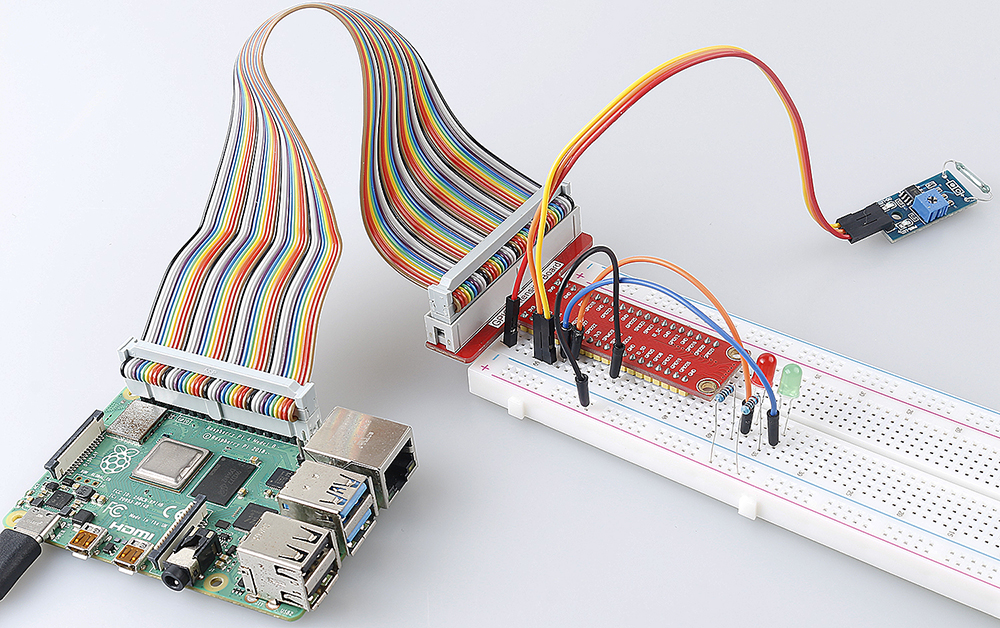

.. _2.2.4_js:

2.2.4 Reed-Schalter-Modul
=========================

Einführung
----------

In diesem Projekt werden wir uns mit dem Reed-Schalter befassen, einem elektrischen Schalter, der durch ein angelegtes Magnetfeld betätigt wird.

.. image:: ../img/2.2.4reed_switch.png
    :width: 300
    :align: center

Benötigte Komponenten
---------------------

Für dieses Projekt benötigen wir die folgenden Komponenten.

.. image:: ../img/2.2.4component.png
    :width: 700
    :align: center

Es ist sicherlich praktisch, ein komplettes Kit zu kaufen. Hier ist der Link:

.. list-table::
    :widths: 20 20 20
    :header-rows: 1

    *   - Name
        - ARTIKEL IN DIESEM KIT
        - LINK
    *   - Raphael Kit
        - 337
        - |link_Raphael_kit|

Sie können diese auch einzeln über die untenstehenden Links kaufen.

.. list-table::
    :widths: 30 20
    :header-rows: 1

    *   - KOMPONENTENBESCHREIBUNG
        - KAUF-LINK

    *   - :ref:`cpn_gpio_board`
        - |link_gpio_board_buy|
    *   - :ref:`cpn_breadboard`
        - |link_breadboard_buy|
    *   - :ref:`cpn_wires`
        - |link_wires_buy|
    *   - :ref:`cpn_resistor`
        - |link_resistor_buy|
    *   - :ref:`cpn_led`
        - |link_led_buy|
    *   - :ref:`cpn_reed_switch`
        - |link_reed_switch_buy|

Schaltplan
----------

============ ======== ======== ===
T-Board Name physical wiringPi BCM
GPIO17       Pin 11   0        17
GPIO27       Pin 13   2        27
GPIO22       Pin 15   3        22
============ ======== ======== ===

.. image:: ../img/reed_schematic.png
    :width: 400
    :align: center

.. image:: ../img/reed_schematic2.png
    :width: 400
    :align: center

Experimentelle Verfahren
-----------------------------

**Schritt 1:** Schalten Sie den Stromkreis.

.. image:: ../img/2.2.4fritzing.png
    :width: 700
    :align: center

**Schritt 2:** Navigieren Sie zu dem Ordner mit dem Code.

.. raw:: html

   <run></run>

.. code-block::

    cd ~/raphael-kit/nodejs/

**Schritt 3:** Starten Sie den Code.

.. raw:: html

   <run></run>

.. code-block::

    sudo node reed_switch_module.js

Die grüne LED leuchtet beim Start des Codes. Wenn ein Magnet in die Nähe des Reed-Schalter-Moduls gebracht wird, leuchtet die rote LED auf; entfernt man den Magneten, leuchtet die grüne LED wieder auf.

**Code**

.. code-block:: js

    const Gpio = require('pigpio').Gpio; 

    const led1 = new Gpio(22, {mode: Gpio.OUTPUT});
    const led2 = new Gpio(27, {mode: Gpio.OUTPUT});

    const reedSwitch = new Gpio(17, {
        mode: Gpio.INPUT,
        pullUpDown: Gpio.PUD_DOWN,     
        edge: Gpio.EITHER_EDGE        
    });

    reedSwitch.on('interrupt', (level) => {  
        led1.digitalWrite(level);   
        led2.digitalWrite(!level);       
    });

**Code-Erklärung**

.. code-block:: js

    const Gpio = require('pigpio').Gpio; 

    const reedSwitch = new Gpio(17, {
        mode: Gpio.INPUT,
        pullUpDown: Gpio.PUD_DOWN,     
        edge: Gpio.EITHER_EDGE        
    });

Importieren Sie das pigpio-Modul, erstellen Sie ein ReedPin-Objekt zur Steuerung des IO-Ports, setzen Sie es auf den Eingabemodus, ziehen Sie es herunter (anfänglich auf niedrigem Pegel) und setzen Sie einen Interrupt.

.. code-block:: js

    const led1 = new Gpio(22, {mode: Gpio.OUTPUT});
    const led2 = new Gpio(27, {mode: Gpio.OUTPUT});

Erstellen Sie zwei Objekte led1 und led2 zur Steuerung der IO-Ports Gpio22 und Gpio27 und setzen Sie diese auf den Ausgabemodus.

.. code-block:: js

    reedSwitch.on('interrupt', (level) => {  
        led1.digitalWrite(level);   
        led2.digitalWrite(!level);       
    });

Wenn der Interrupt ausgelöst wird, schreiben Sie dasselbe Level zu led1 und das entgegengesetzte Level zu led2.

Phänomen-Bild
----------------

    