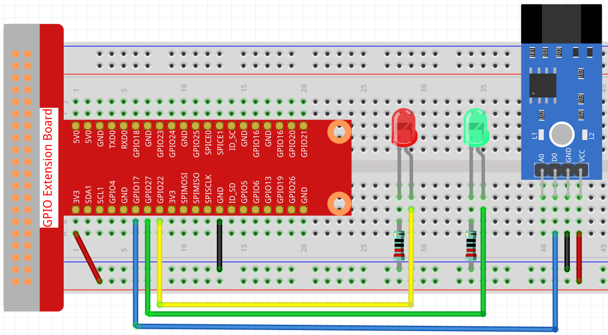
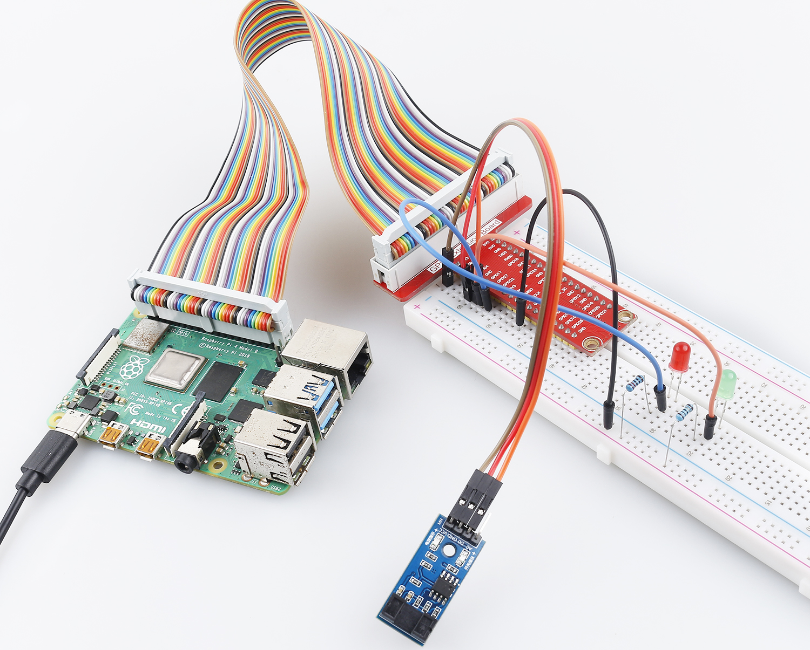

.. note::

    Hallo und willkommen in der SunFounder Raspberry Pi & Arduino & ESP32 Enthusiasten-Gemeinschaft auf Facebook! Tauchen Sie tiefer ein in die Welt von Raspberry Pi, Arduino und ESP32 mit anderen Enthusiasten.

    **Warum beitreten?**

    - **Expertenunterstützung**: Lösen Sie Nachverkaufsprobleme und technische Herausforderungen mit Hilfe unserer Gemeinschaft und unseres Teams.
    - **Lernen & Teilen**: Tauschen Sie Tipps und Anleitungen aus, um Ihre Fähigkeiten zu verbessern.
    - **Exklusive Vorschauen**: Erhalten Sie frühzeitigen Zugang zu neuen Produktankündigungen und exklusiven Einblicken.
    - **Spezialrabatte**: Genießen Sie exklusive Rabatte auf unsere neuesten Produkte.
    - **Festliche Aktionen und Gewinnspiele**: Nehmen Sie an Gewinnspielen und Feiertagsaktionen teil.

    👉 Sind Sie bereit, mit uns zu erkunden und zu erschaffen? Klicken Sie auf [|link_sf_facebook|] und treten Sie heute bei!

.. _2.2.6_js:

2.2.6 Geschwindigkeitssensor-Modul
==================================

Einführung
-------------

In diesem Projekt werden wir die Verwendung des Geschwindigkeitssensor-Moduls erlernen. Ein Geschwindigkeitssensor-Modul ist eine Art von Tachometer, der dazu verwendet wird, die Geschwindigkeit eines rotierenden Objekts, wie eines Motors, zu messen.

Benötigte Komponenten
------------------------------

Für dieses Projekt benötigen wir folgende Komponenten.

.. image:: ../img/2.2.6component.png
    :width: 700
    :align: center

Es ist definitiv praktisch, ein ganzes Set zu kaufen. Hier ist der Link:

.. list-table::
    :widths: 20 20 20
    :header-rows: 1

    *   - Name	
        - ARTIKEL IN DIESEM KIT
        - LINK
    *   - Raphael Kit
        - 337
        - |link_Raphael_kit|

Sie können diese auch einzeln über die untenstehenden Links kaufen.

.. list-table::
    :widths: 30 20
    :header-rows: 1

    *   - KOMPONENTENBESCHREIBUNG
        - KAUF-LINK

    *   - :ref:`cpn_gpio_board`
        - |link_gpio_board_buy|
    *   - :ref:`cpn_breadboard`
        - |link_breadboard_buy|
    *   - :ref:`cpn_wires`
        - |link_wires_buy|
    *   - :ref:`cpn_resistor`
        - |link_resistor_buy|
    *   - :ref:`cpn_led`
        - |link_led_buy|
    *   - :ref:`cpn_speed_sensor`
        - \-

Schaltplan
----------------------

.. image:: ../img/2.2.6circuit.png
    :width: 400
    :align: center

Experimentelle Verfahren
--------------------------------

**Schritt 1:** Bauen Sie den Schaltkreis.

**Schritt 2:** Wechseln Sie in den Ordner mit dem Code.

.. raw:: html

   <run></run>

.. code-block::

    cd ~/raphael-kit/nodejs/

**Schritt 3:** Führen Sie den Code aus.

.. raw:: html

   <run></run>

.. code-block::

    sudo node speed_sensor_module.js

Nachdem der Code ausgeführt wurde, leuchtet die grüne LED auf. Wenn Sie ein Hindernis in den Spalt des Geschwindigkeitssensor-Moduls stellen, wird "Licht blockiert" auf dem Bildschirm angezeigt und die rote LED leuchtet auf. Entfernen Sie das Hindernis, und die grüne LED leuchtet wieder auf.

**Code**

.. code-block:: js

    const Gpio = require('pigpio').Gpio;

    const Rpin = new Gpio(22, { mode: Gpio.OUTPUT });
    const Gpin = new Gpio(27, { mode: Gpio.OUTPUT });

    const speedPin = new Gpio(17, {
        mode: Gpio.INPUT,
        pullUpDown: Gpio.PUD_DOWN,     
        edge: Gpio.EITHER_EDGE        
    });

    speedPin.on('interrupt', (level) => {
        if (level) {
            console.log("Light was blocked");
        }
        Rpin.digitalWrite(level);
        Gpin.digitalWrite(!level);
    });

    process.on('SIGINT', function () {
        Rpin.digitalWrite(0);
        Gpin.digitalWrite(0);
        process.exit();
    });

**Code-Erklärung**

Der Code dieses Beispiels ist fast identisch mit :ref:`2.1.5_js`, daher ist eine Wiederholung nicht notwendig.

Phänomen-Bild
----------------------

