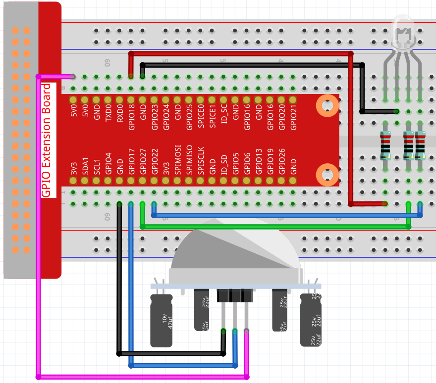

.. note::

    Hola, ¡bienvenido a la comunidad de entusiastas de SunFounder Raspberry Pi, Arduino y ESP32 en Facebook! Profundiza en Raspberry Pi, Arduino y ESP32 con otros entusiastas.

    **¿Por qué unirse?**

    - **Soporte Experto**: Resuelve problemas postventa y desafíos técnicos con la ayuda de nuestra comunidad y equipo.
    - **Aprende y Comparte**: Intercambia consejos y tutoriales para mejorar tus habilidades.
    - **Previsualizaciones Exclusivas**: Obtén acceso anticipado a nuevos anuncios de productos y adelantos.
    - **Descuentos Especiales**: Disfruta de descuentos exclusivos en nuestros productos más nuevos.
    - **Promociones y Sorteos Festivos**: Participa en sorteos y promociones de vacaciones.

    👉 ¿Listo para explorar y crear con nosotros? ¡Haz clic en [|link_sf_facebook|] y únete hoy!

.. _2.2.7_js:

2.2.7 PIR
=============

Introducción
---------------

En este proyecto, crearemos un dispositivo utilizando sensores piroeléctricos infrarrojos 
del cuerpo humano. Cuando alguien se acerque al LED, el LED se encenderá automáticamente. 
Si no, la luz se apagará. Este sensor de movimiento infrarrojo es un tipo de sensor que puede 
detectar el infrarrojo emitido por humanos y animales.

Componentes Necesarios
----------------------

En este proyecto, necesitamos los siguientes componentes. 

.. image:: ../img/list_2.2.4_pir2.png

Es definitivamente conveniente comprar un kit completo, aquí está el enlace: 

.. list-table::
    :widths: 20 20 20
    :header-rows: 1

    *   - Nombre	
        - ELEMENTOS EN ESTE KIT
        - ENLACE
    *   - Kit Raphael
        - 337
        - |link_Raphael_kit|

También puedes comprarlos por separado en los enlaces a continuación.

.. list-table::
    :widths: 30 20
    :header-rows: 1

    *   - INTRODUCCIÓN AL COMPONENTE
        - ENLACE DE COMPRA

    *   - :ref:`cpn_gpio_extension_board`
        - |link_gpio_board_buy|
    *   - :ref:`cpn_breadboard`
        - |link_breadboard_buy|
    *   - :ref:`cpn_wires`
        - |link_wires_buy|
    *   - :ref:`cpn_resistor`
        - |link_resistor_buy|
    *   - :ref:`cpn_rgb_led`
        - |link_rgb_led_buy|
    *   - :ref:`cpn_pir`
        - \-

Diagrama Esquemático
------------------------

.. image:: ../img/image327.png

Procedimientos Experimentales
--------------------------------

**Paso 1:** Construir el circuito.

**Paso 2:** Ir a la carpeta del código.

.. raw:: html

   <run></run>

.. code-block::

    cd ~/raphael-kit/nodejs/

**Paso 3:** Ejecutar el código.

.. raw:: html

   <run></run>

.. code-block::

    sudo node pir.js

Después de ejecutar el código, el PIR detectará los alrededores y hará que el LED 
RGB brille en amarillo si detecta que alguien pasa caminando. Hay dos potenciómetros 
en el módulo PIR: uno es para ajustar la sensibilidad y el otro para ajustar la distancia 
de detección. Para que el módulo PIR funcione mejor, es necesario ajustar estos dos potenciómetros.

**Código**

.. code-block:: js

    const Gpio = require('pigpio').Gpio;

    const pirPin = new Gpio(17, {
        mode: Gpio.INPUT,
        pullUpDown: Gpio.PUD_DOWN,
        edge: Gpio.EITHER_EDGE
    })    // the pir connect to pin17

    const redPin = new Gpio(18, { mode: Gpio.OUTPUT, })
    const greenPin = new Gpio(27, { mode: Gpio.OUTPUT, })
    const bluePin = new Gpio(22, { mode: Gpio.OUTPUT, })
    //'Red':18, 'Green':27, 'Blue':22

    var p_R, p_G, p_B

    // Set all led as pwm channel and frequece to 2KHz
    p_R = redPin.pwmFrequency(2000)
    p_G = greenPin.pwmFrequency(2000)
    p_B = bluePin.pwmFrequency(2000)

    // Set all begin with value 0
    p_R.pwmWrite(0)
    p_G.pwmWrite(0)
    p_B.pwmWrite(0)

    // Define a MAP function for mapping values.  Like from 0~255 to 0~100
    function MAP(x, in_min, in_max, out_min, out_max) {
        return (x - in_min) * (out_max - out_min) / (in_max - in_min) + out_min
    }

    // Define a function to set up colors
    function setColor(color) {
        // configures the three LEDs' luminance with the inputted color value .
        // Devide colors from 'color' veriable
        R_val = (color & 0xFF0000) >> 16
        G_val = (color & 0x00FF00) >> 8
        B_val = (color & 0x0000FF) >> 0
        // Map color value from 0~255 to 0~100
        R_val = MAP(R_val, 0, 255, 0, 100)
        G_val = MAP(G_val, 0, 255, 0, 100)
        B_val = MAP(B_val, 0, 255, 0, 100)

        //Assign the mapped duty cycle value to the corresponding PWM channel to change the luminance.
        p_R.pwmWrite(R_val)
        p_G.pwmWrite(G_val)
        p_B.pwmWrite(B_val)
        //print ("color_msg: R_val = %s, G_val = %s, B_val = %s"%(R_val, G_val, B_val))
    }

    pirPin.on('interrupt', (level) => {
        if (level) {
            setColor(0xFFFF00)
        }else{
            setColor(0x0000FF)
        }
    });

    process.on('SIGINT', function () {
        p_R.pwmWrite(0)
        p_G.pwmWrite(0)
        p_B.pwmWrite(0)
        process.exit();
    })

**Explicación del Código**

El código de este ejemplo es una combinación de :ref:`2.1.1_js` y :ref:`1.1.2_js`, no es necesario entrar en detalles.

Imagen del Fenómeno
-----------------------

.. image:: ../img/image215.jpeg
    
