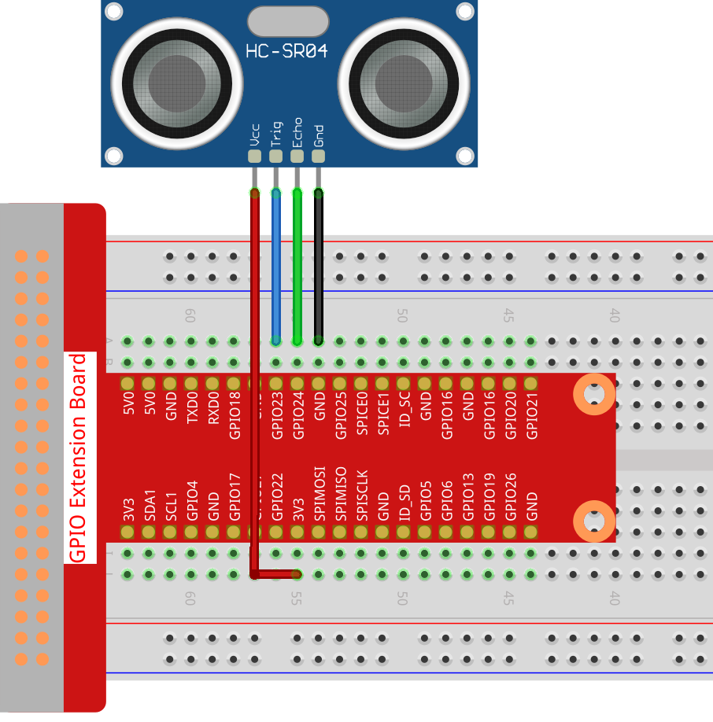

.. note::

    Ciao, benvenuto nella SunFounder Raspberry Pi & Arduino & ESP32 Enthusiasts Community su Facebook! Approfondisci Raspberry Pi, Arduino ed ESP32 insieme ad altri appassionati.

    **Perché unirti a noi?**

    - **Supporto esperto**: Risolvi i problemi post-vendita e le sfide tecniche con l'aiuto della nostra comunità e del nostro team.
    - **Impara e Condividi**: Scambia suggerimenti e tutorial per migliorare le tue competenze.
    - **Anteprime esclusive**: Ottieni accesso anticipato a nuovi annunci di prodotti e anteprime esclusive.
    - **Sconti speciali**: Approfitta di sconti esclusivi sui nostri prodotti più recenti.
    - **Promozioni festive e omaggi**: Partecipa a omaggi e promozioni durante le festività.

    👉 Pronto per esplorare e creare con noi? Clicca su [|link_sf_facebook|] e unisciti oggi stesso!

.. _2.2.8_js:

2.2.8 Modulo Sensore Ultrasonico
====================================

Introduzione
----------------

Il sensore ultrasonico utilizza gli ultrasuoni per rilevare con precisione gli 
oggetti e misurare le distanze. Emette onde ultrasoniche e le converte in segnali 
elettronici.

Componenti necessari
----------------------

In questo progetto, abbiamo bisogno dei seguenti componenti.

.. image:: ../img/list_2.2.5.png

È sicuramente conveniente acquistare un kit completo, ecco il link:

.. list-table::
    :widths: 20 20 20
    :header-rows: 1

    *   - Nome
        - ELEMENTI IN QUESTO KIT
        - LINK
    *   - Kit Raphael
        - 337
        - |link_Raphael_kit|

Puoi anche acquistarli separatamente dai link qui sotto.

.. list-table::
    :widths: 30 20
    :header-rows: 1

    *   - INTRODUZIONE AI COMPONENTI
        - LINK DI ACQUISTO

    *   - :ref:`cpn_gpio_extension_board`
        - |link_gpio_board_buy|
    *   - :ref:`cpn_breadboard`
        - |link_breadboard_buy|
    *   - :ref:`cpn_wires`
        - |link_wires_buy|
    *   - :ref:`cpn_ultrasonic_sensor`
        - |link_ultrasonic_buy|

Schema elettrico
---------------------

.. image:: ../img/image329.png

Procedure sperimentali
------------------------

**Passo 1:** Costruisci il circuito.

**Passo 2:** Vai alla cartella del codice.

.. raw:: html

   <run></run>

.. code-block::

    cd ~/raphael-kit/nodejs/

**Passo 3:** Esegui il codice.

.. raw:: html

   <run></run>

.. code-block::

    sudo node ultrasonic_sensor.js

Con l'esecuzione del codice, il modulo sensore ultrasonico rileva la distanza tra 
l'ostacolo davanti e il modulo stesso, quindi il valore della distanza verrà 
stampato sullo schermo.

**Codice**

.. code-block:: js

    const Gpio = require('pigpio').Gpio;

    // The number of microseconds it takes sound to travel 1cm at 20 degrees celcius
    const MICROSECDONDS_PER_CM = 1e6/34321;

    const trigger = new Gpio(23, {mode: Gpio.OUTPUT});
    const echo = new Gpio(24, {mode: Gpio.INPUT, alert: true});

    trigger.digitalWrite(0); // Make sure trigger is low

    const watchHCSR04 = () => {
      let startTick;

      echo.on('alert', (level, tick) => {
        if (level === 1) {
          startTick = tick;
        } else {
          const endTick = tick;
          const diff = (endTick >> 0) - (startTick >> 0); // Unsigned 32 bit arithmetic
          console.log(diff / 2 / MICROSECDONDS_PER_CM);
        }
      });
    };

    watchHCSR04();

    // Trigger a distance measurement once per second
    setInterval(() => {
      trigger.trigger(10, 1); // Set trigger high for 10 microseconds
    }, 1000);

**Spiegazione del codice**

La funzione ``trigger`` può essere utilizzata per generare un impulso su un 
GPIO e gli ``alert`` possono essere utilizzati per determinare il tempo di 
cambio stato di un GPIO con precisione di pochi microsecondi.

Queste due caratteristiche possono essere combinate per misurare la distanza 
utilizzando un sensore ultrasonico HC-SR04.

.. code-block:: js

    setInterval(() => {
      trigger.trigger(10, 1); // Set trigger high for 10 microseconds
    }, 1000);

Questo invia periodicamente un impulso ultrasonico di 10 microsecondi.

.. code-block:: js

  const watchHCSR04 = () => {

    echo.on('alert', (level, tick) => {
        if (level === 1) {
          startTick = tick;
        } else {
          const endTick = tick;
          const diff = (endTick >> 0) - (startTick >> 0); // Aritmetica su 32 bit senza segno
          console.log(diff / 2 / MICROSECDONDS_PER_CM);
        }    
    });
  };

Questa funzione imposta un allarme che registra il tempo tra l'invio dell'impulso 
(quando il livello è 1) e la ricezione dell'eco (quando il livello è 0). Moltiplicando 
la differenza di tempo per la velocità del suono (e dividendo per 2), si ottiene la 
distanza dall'ostacolo.

.. https://github.com/fivdi/pigpio

Immagine del fenomeno
--------------------------

.. image:: ../img/image221.jpeg