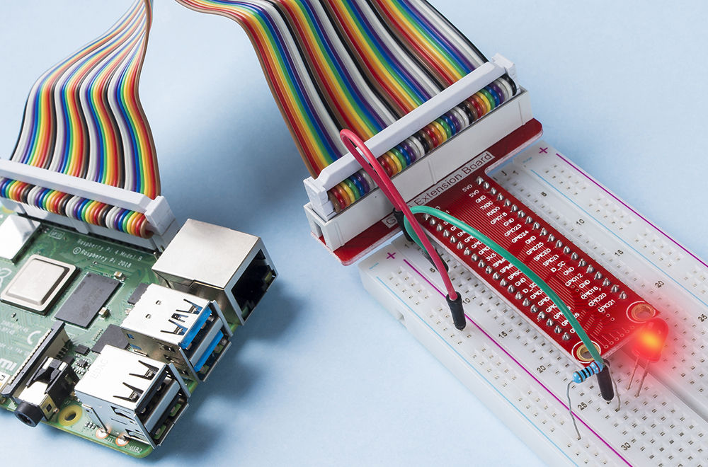

.. note::

    Hola, ¡bienvenido a la Comunidad de Entusiastas de SunFounder Raspberry Pi, Arduino y ESP32 en Facebook! Sumérgete en el mundo de Raspberry Pi, Arduino y ESP32 con otros entusiastas.

    **¿Por qué unirse?**

    - **Soporte experto**: Resuelve problemas post-venta y desafíos técnicos con la ayuda de nuestra comunidad y equipo.
    - **Aprender y compartir**: Intercambia consejos y tutoriales para mejorar tus habilidades.
    - **Avances exclusivos**: Obtén acceso anticipado a nuevos anuncios de productos y adelantos.
    - **Descuentos especiales**: Disfruta de descuentos exclusivos en nuestros productos más recientes.
    - **Promociones festivas y sorteos**: Participa en sorteos y promociones de temporada.

    👉 ¿Listo para explorar y crear con nosotros? Haz clic en [|link_sf_facebook|] y únete hoy mismo!

.. _1.1.1_py:

1.1.1 LED Parpadeante
=========================

Introducción
-----------------

En este proyecto, aprenderemos cómo hacer que un LED parpadee mediante programación. 
A través de tus configuraciones, tu LED puede producir una serie de fenómenos interesantes. 
Ahora, vamos a ello.

Componentes Necesarios
------------------------------

En este proyecto, necesitamos los siguientes componentes. 

.. image:: ../img/blinking_led_list.png
    :width: 800
    :align: center

Es definitivamente conveniente comprar un kit completo, aquí está el enlace: 

.. list-table::
    :widths: 20 20 20
    :header-rows: 1

    *   - Nombre	
        - ARTÍCULOS EN ESTE KIT
        - ENLACE
    *   - Raphael Kit
        - 337
        - |link_Raphael_kit|

También puedes comprarlos por separado en los siguientes enlaces.

.. list-table::
    :widths: 30 20
    :header-rows: 1

    *   - INTRODUCCIÓN DE COMPONENTES
        - ENLACE DE COMPRA

    *   - :ref:`cpn_gpio_board`
        - |link_gpio_board_buy|
    *   - :ref:`cpn_breadboard`
        - |link_breadboard_buy|
    *   - :ref:`cpn_wires`
        - |link_wires_buy|
    *   - :ref:`cpn_resistor`
        - |link_resistor_buy|
    *   - :ref:`cpn_led`
        - |link_led_buy|

Diagrama Esquemático
---------------------------

En este experimento, conecta una resistencia de 220Ω al ánodo (el pin largo del LED), 
luego la resistencia a 3.3 V, y conecta el cátodo (el pin corto) del LED al GPIO17 del Raspberry Pi. Por lo tanto, para encender un LED, necesitamos hacer que el GPIO17 esté en nivel bajo (0V). Podemos obtener este fenómeno mediante programación.

.. note::

    **Pin11** se refiere al pin 11 del Raspberry Pi de izquierda a derecha, y sus números 
    de pin correspondientes en **wiringPi** y **BCM** se muestran en la siguiente tabla.

En el contenido relacionado con el lenguaje C, hacemos que el GPIO0 sea equivalente a 0 
en wiringPi. Entre el contenido relacionado con el lenguaje Python, BCM 17 es 17 en la 
columna BCM de la siguiente tabla. Al mismo tiempo, son los mismos que el pin 11 en el 
Raspberry Pi, Pin 11.

============== ======== ======== ===
Nombre T-Board físico   wiringPi BCM
GPIO17         Pin 11   0        17
============== ======== ======== ===

.. image:: ../img/image48.png
    :width: 800
    :align: center

Procedimientos Experimentales
---------------------------------

**Paso 1:** Construir el circuito.

.. image:: ../img/image49.png
    :width: 800
    :align: center

**Paso 2:** Ve a la carpeta del código y ejecútalo.

1. Si usas una pantalla, se recomienda seguir los siguientes pasos.

Encuentra 1.1.1_BlinkingLed.py y haz doble clic para abrirlo. Ahora estás en el archivo.

Haz clic en **Run** -> **Run Module** en la ventana y aparecerá el siguiente contenido.

Para detener la ejecución, simplemente haz clic en el botón X en la parte superior derecha 
para cerrarlo y luego volverás al código. Si modificas el código, antes de hacer clic en 
**Run Module (F5)** necesitas guardarlo primero. Luego puedes ver los resultados.

2. Si inicias sesión en el Raspberry Pi de forma remota, escribe el siguiente comando:

.. raw:: html

   <run></run>

.. code-block::

   cd ~/raphael-kit/python

.. note::
    Cambia el directorio a la ruta del código en este experimento mediante ``cd``.

**Paso 3:** Ejecuta el código

.. raw:: html

   <run></run>

.. code-block::

   sudo python3 1.1.1_BlinkingLed.py

.. note::
    Aquí sudo - superuser do, y python significa ejecutar el archivo con Python.

Después de ejecutar el código, verás el LED parpadeando.

**Paso 4:** Si deseas editar el archivo de código 1.1.1_BlinkingLed.py,
presiona ``Ctrl + C`` para detener la ejecución del código. Luego escribe el siguiente 
comando para abrir 1.1.1_BlinkingLed.py:

.. raw:: html

   <run></run>

.. code-block::

   nano 1.1.1_BlinkingLed.py

.. note::
    nano es una herramienta de editor de texto. El comando se utiliza para abrir el
    archivo de código 1.1.1_BlinkingLed.py con esta herramienta.

Presiona ``Ctrl+X`` para salir. Si has modificado el código, habrá un
mensaje preguntando si deseas guardar los cambios o no. Escribe ``Y`` (guardar)
o ``N`` (no guardar).

Luego presiona ``Enter`` para salir. Escribe nano 1.1.1_BlinkingLed.py nuevamente para
ver el efecto después del cambio.

**Código**

El siguiente es el código del programa:

.. note::

   Puedes **Modificar/Restablecer/Copiar/Ejecutar/Detener** el código a continuación. Pero antes de eso, necesitas ir a la ruta del código fuente como ``raphael-kit/python``. Después de modificar el código, puedes ejecutarlo directamente para ver el efecto.

.. raw:: html

    <run></run>

.. code-block:: python

   #!/usr/bin/env python3
   import RPi.GPIO as GPIO
   import time
   LedPin = 17
   def setup():
      # Set the GPIO modes to BCM Numbering
      GPIO.setmode(GPIO.BCM)
      # Set LedPin's mode to output,and initial level to High(3.3v)
      GPIO.setup(LedPin, GPIO.OUT, initial=GPIO.HIGH)
   # Define a main function for main process
   def main():
      while True:
         print ('...LED ON')
         # Turn on LED
         GPIO.output(LedPin, GPIO.LOW)
         time.sleep(0.5)
         print ('LED OFF...')
         # Turn off LED
         GPIO.output(LedPin, GPIO.HIGH)
         time.sleep(0.5)
   # Define a destroy function for clean up everything after the script finished
   def destroy():
      # Turn off LED
      GPIO.output(LedPin, GPIO.HIGH)
      # Release resource
      GPIO.cleanup()                   
   # If run this script directly, do:
   if __name__ == '__main__':
      setup()
      try:
         main()
      # When 'Ctrl+C' is pressed, the program destroy() will be  executed.
      except KeyboardInterrupt:
         destroy()

**Explicación del Código**

.. code-block:: python

   #!/usr/bin/env python3

Cuando el sistema detecta esto, buscará la ruta de instalación de
python en la configuración de env, luego llamará al intérprete
correspondiente para completar la operación. Esto previene que el usuario
no tenga instalado python en la ruta predeterminada ``/usr/bin``.

.. code-block:: python

   import RPi.GPIO as GPIO

De esta manera, se importa la biblioteca RPi.GPIO, luego se define una
variable, GPIO para reemplazar RPI.GPIO en el código siguiente.

.. code-block:: python

   import time

Importa el paquete time, para la función de retraso de tiempo en el
programa siguiente.

.. code-block:: python

   LedPin = 17

El LED está conectado al GPIO17 de la placa de extensión en forma de T,
es decir, BCM 17.

.. code-block:: python

   def setup():
      GPIO.setmode(GPIO.BCM)
      GPIO.setup(LedPin, GPIO.OUT, initial=GPIO.HIGH)

Establece el modo del pin LedPin a salida y el nivel inicial a Alto(3.3v).

Hay dos formas de numerar los pines IO en una Raspberry Pi dentro de
RPi.GPIO: números BOARD y números BCM. En nuestros proyectos, usamos los
números BCM. Necesitas configurar cada canal que estás utilizando como
entrada o salida.

.. code-block:: python

   GPIO.output(LedPin, GPIO.LOW)

Establece el GPIO17(BCM17) a 0V (nivel bajo). Dado que el cátodo del LED
está conectado al GPIO17, el LED se encenderá.

.. code-block:: python

   time.sleep(0.5)

Retraso de 0.5 segundos. Aquí, la declaración es una función de retraso en el lenguaje C, la unidad es segundo.

.. code-block:: python

   def destroy():
      GPIO.cleanup()  

Define una función de destrucción para limpiar todo después de que el
script termine.

.. code-block:: python

   if __name__ == '__main__':
      setup()
      try:
         main()
      # When 'Ctrl+C' is pressed, the program destroy() will be  executed.
      except KeyboardInterrupt:
         destroy()

Esta es la estructura general de ejecución del código. Cuando el
programa comienza a ejecutarse, inicializa el pin ejecutando
setup(), y luego ejecuta el código en la función main() para
establecer el pin en niveles alto y bajo. Cuando se presiona ``Ctrl+C``,
el programa destroy() será ejecutado.

Imagen del Fenómeno
------------------------

