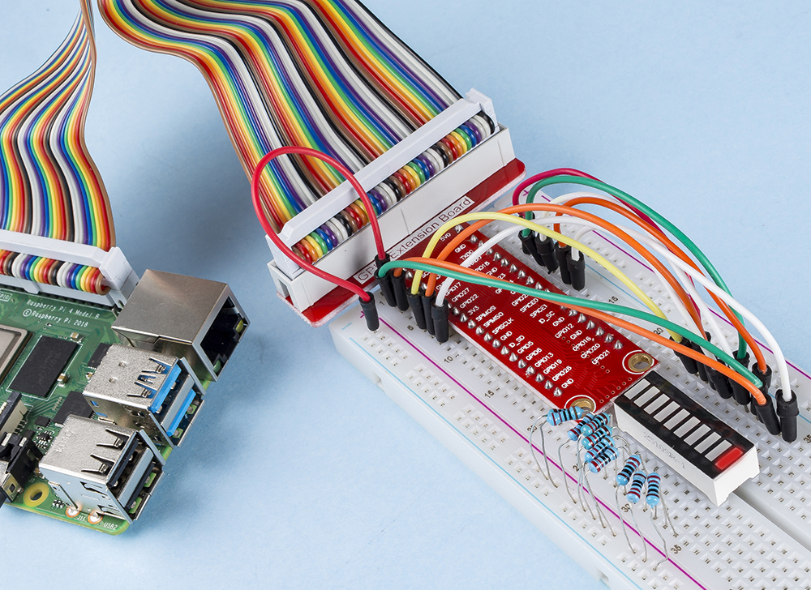

.. _1.1.3_py:

1.1.3 LEDバーグラフ
===================

はじめに
-------------

本プロジェクトでは、LEDバーグラフ上の複数のLEDを順次点灯させます。

必要な部品
------------------------------

本プロジェクトには、以下の部品が必要です。

.. image:: ../img/list_led_bar.png

以下のリンクから一式を購入すると非常に便利です：

.. list-table::
    :widths: 20 20 20
    :header-rows: 1

    *   - 名前
        - このキットのアイテム
        - リンク
    *   - Raphael Kit
        - 337
        - |link_Raphael_kit|

個々の部品も以下のリンクから別途購入可能です。

.. list-table::
    :widths: 30 20
    :header-rows: 1

    *   - コンポーネントの紹介
        - 購入リンク
    *   - :ref:`GPIO拡張ボード`
        - |link_gpio_board_buy|
    *   - :ref:`ブレッドボード`
        - |link_breadboard_buy|
    *   - :ref:`ジャンパーワイヤー`
        - |link_wires_buy|
    *   - :ref:`抵抗器`
        - |link_resistor_buy|
    *   - :ref:`LEDバーグラフ`
        - \-

回路図
-------------------------

============ ======== ======== ===
T-Board Name physical wiringPi BCM
GPIO17       Pin 11   0        17
GPIO18       Pin 12   1        18
GPIO27       Pin 13   2        27
GPIO22       Pin 15   3        22
GPIO23       Pin 16   4        23
GPIO24       Pin 18   5        24
GPIO25       Pin 22   6        25
SDA1         Pin 3    8        2
SCL1         Pin 5    9        3
SPICE0       Pin 24   10       8
============ ======== ======== ===

.. image:: ../img/schematic_led_bar.png

実験手順
------------------------------

**ステップ1**: 回路を組み立てます。

.. note::

    接続の方向に注意してください。逆に接続すると点灯しない可能性があります。

.. image:: ../img/image66.png

**ステップ2**: コードが保存されているフォルダに移動します。

.. raw:: html

   <run></run>

.. code-block::

    cd ~/raphael-kit/python/

**ステップ3**: 実行ファイルを起動します。

.. raw:: html

   <run></run>

.. code-block::

    sudo python3 1.1.3_LedBarGraph.py

コードが正常に実行されると、LEDバーグラフ上のLEDが順次点灯および消灯します。

**コード**

.. note::

    下記のコードは **修正/リセット/コピー/実行/停止** が可能ですが、それに先立って、ソースコードの保存先である ``raphael-kit/python`` に移動する必要があります。コードの変更後、その効果を直接確認できます。

.. raw:: html

    <run></run>

.. code-block:: python

    import RPi.GPIO as GPIO
    import time

    ledPins = [11, 12, 13, 15, 16, 18, 22, 3, 5, 24]

    def oddLedBarGraph():
        for i in range(5):
            j = i*2
            GPIO.output(ledPins[j],GPIO.LOW)
            time.sleep(0.3)
            GPIO.output(ledPins[j],GPIO.HIGH)

    def evenLedBarGraph():
        for i in range(5):
            j = i*2+1
            GPIO.output(ledPins[j],GPIO.LOW)
            time.sleep(0.3)
            GPIO.output(ledPins[j],GPIO.HIGH)

    def allLedBarGraph():
        for i in ledPins:
            GPIO.output(i,GPIO.LOW)
            time.sleep(0.3)
            GPIO.output(i,GPIO.HIGH)

    def setup():
        GPIO.setwarnings(False)
        GPIO.setmode(GPIO.BOARD)        # Numbers GPIOs by physical location
        for i in ledPins:
            GPIO.setup(i, GPIO.OUT)   # Set all ledPins' mode is output
            GPIO.output(i, GPIO.HIGH) # Set all ledPins to high(+3.3V) to off led

    def loop():
        while True:
            oddLedBarGraph()
            time.sleep(0.3)
            evenLedBarGraph()
            time.sleep(0.3)
            allLedBarGraph()
            time.sleep(0.3)

    def destroy():
        for pin in ledPins:
            GPIO.output(pin, GPIO.HIGH)      # turn off all leds
        GPIO.cleanup()                       # Release resource

    if __name__ == '__main__':     # Program start from here
        setup()
        try:
            loop()
        except KeyboardInterrupt:  # When 'Ctrl+C' is pressed, the program destroy() will be  executed.
            destroy()

**コード説明**

ledPins = [11, 12, 13, 15, 16, 18, 22, 3, 5, 24]
LEDバーグラフに対応するピン番号（11, 12, 13, 15, 16, 18, 22, 3, 5, 24）を配列に割り当て、LEDを制御します。

.. code-block:: python

    def oddLedBarGraph():
        for i in range(5):
            j = i*2
            GPIO.output(ledPins[j],GPIO.LOW)
            time.sleep(0.3)
            GPIO.output(ledPins[j],GPIO.HIGH)

LEDバーグラフの奇数位のLEDを順番に点灯させます。

.. code-block:: python

    def evenLedBarGraph():
        for i in range(5):
            j = i*2+1
            GPIO.output(ledPins[j],GPIO.LOW)
            time.sleep(0.3)
            GPIO.output(ledPins[j],GPIO.HIGH)

LEDバーグラフの偶数位のLEDを順番に点灯させます。

.. code-block:: python

    def allLedBarGraph():
        for i in ledPins:
            GPIO.output(i,GPIO.LOW)
            time.sleep(0.3)
            GPIO.output(i,GPIO.HIGH)

LEDバーグラフ全体を順番に点灯させます。

現象の画像
------------------------

