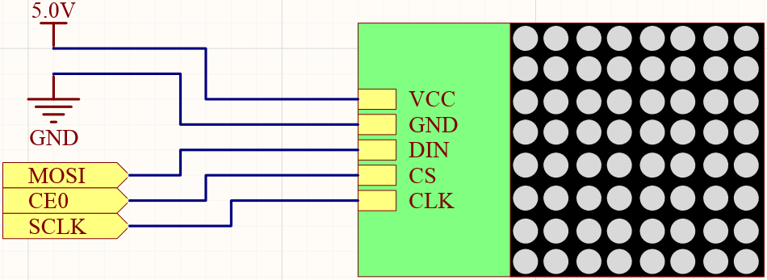
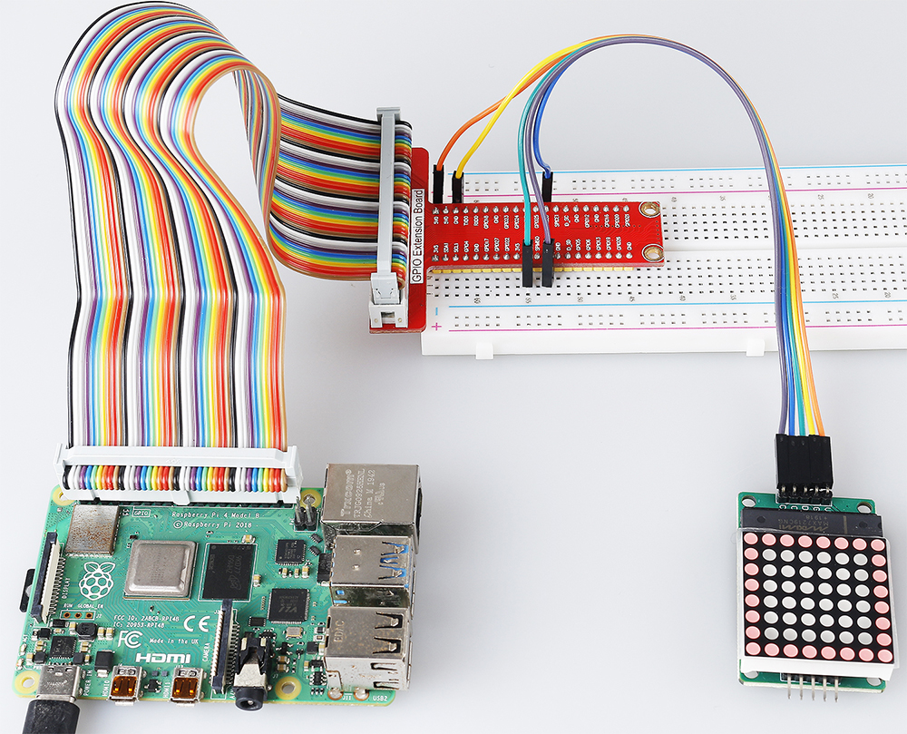

.. _1.1.6_py:

1.1.6 LEDドットマトリックス
===========================

はじめに
--------------------

LEDドットマトリックスとは、その名の通り、LEDで構成されたマトリックスです。
LEDの点灯と消灯により、さまざまな文字やパターンが形成されます。

必要な部品
------------------------------

このプロジェクトでは、以下のコンポーネントが必要です。

.. image:: ../img/list_dot.png

全体のキットを購入する方が確実に便利です。リンクは以下です：

.. list-table::
    :widths: 20 20 20
    :header-rows: 1

    *   - 名前
        - このキットのアイテム
        - リンク
    *   - Raphael Kit
        - 337
        - |link_Raphael_kit|

個々のパーツも下記のリンクから別々に購入することができます。

.. list-table::
    :widths: 30 20
    :header-rows: 1

    *   - コンポーネントの紹介
        - 購入リンク
    *   - :ref:`GPIO拡張ボード`
        - |link_gpio_board_buy|
    *   - :ref:`ブレッドボード`
        - |link_breadboard_buy|
    *   - :ref:`ジャンパーワイヤー`
        - |link_wires_buy|
    *   - :ref:`LEDマトリクスモジュール`
        - |link_led_matrix_buy|

回路図
-----------------------

============ ======== ======== ====
T-Board Name physical wiringPi BCM
SPIMOSI      Pin 19   12       MOSI
SPICE0       Pin 24   10       CE0
SPISCLK      Pin 23   14       SCLK
============ ======== ======== ====

実験手順
----------------------------

**ステップ 1:** 回路を組む。

.. image:: ../img/1.1.6fritzing.png

.. note::

    実験を開始する前にSPIを有効にしてください。詳細は :ref:`SPI設定` を参照してください。また、 :ref:`Luma.LED_Matrix` モジュールも必要です。

**ステップ 2:** ディレクトリを変更する。

.. raw:: html

   <run></run>

.. code-block::

    cd ~/raphael-kit/python/

**ステップ 3:** 実行する。

.. raw:: html

   <run></run>

.. code-block::

    sudo python3 1.1.6_LedMatrix.py

コードを実行すると、LEDマトリックスは2秒間四角形を表示した後、テキスト「A」を2秒間表示し、最後に「Hello, Nice to meet you!」というテキストをスクロール表示します。

**コード**

.. note::

    下のコードには、 **修正/リセット/コピー/実行/停止** の操作が可能です。ただし、それ以前に ``raphael-kit/python`` のようなソースコードのパスに移動する必要があります。コードを修正した後、直接実行して効果を確認できます。

.. raw:: html

    <run></run>

.. code-block:: python

   from luma.core.interface.serial import spi, noop
   from luma.core.render import canvas
   from luma.core.virtual import viewport
   from luma.led_matrix.device import max7219
   from luma.core.legacy import text
   from luma.core.legacy.font import proportional, CP437_FONT, LCD_FONT
   import time

   serial = spi(port=0, device=0, gpio=noop())
   device = max7219(serial, rotate=1)
   virtual = viewport(device, width=200, height=400)

   def displayRectangle():
      with canvas(device) as draw:
         draw.rectangle(device.bounding_box, outline="white", fill="black")

   def displayLetter():
      with canvas(device) as draw:
         text(draw, (0, 0), "A", fill="white", font=proportional(CP437_FONT))

   def scrollToDisplayText():
      with canvas(virtual) as draw:
         text(draw, (0, 0), "Hello, Nice to meet you!", fill="white", font=proportional(CP437_FONT))

      for offset in range(150):
         virtual.set_position((offset,0))
         time.sleep(0.1)

   def main():
      while True:
         displayRectangle()
         time.sleep(2)
         displayLetter()
         time.sleep(2)
         scrollToDisplayText()

   def destroy():
      pass

   if __name__ == '__main__':
      try:
         main()
      except KeyboardInterrupt:
         destroy()

**コードの説明**

.. code-block:: python

    from luma.core.interface.serial import spi, noop
    from luma.core.render import canvas
    from luma.core.virtual import viewport
    from luma.led_matrix.device import max7219
    from luma.core.legacy import text
    from luma.core.legacy.font import proportional, CP437_FONT, LCD_FONT
    import time

関連するライブラリをインポートします。``luma.core`` はPython 3のPillow互換キャンバスを提供するコンポーネントライブラリであり、Raspberry Piやその他のシングルボードコンピューターでの小型ディスプレイをサポートするその他の描画機能やテキストレンダリング機能も含まれています。
詳細は `https://luma-core.readthedocs.io/en/latest/intro.html <https://luma-core.readthedocs.io/en/latest/intro.html>`_ で学べます。

.. code-block:: python

    serial = spi(port=0, device=0, gpio=noop())
    device = max7219(serial, rotate=1)

``luma.led_matrix.device.max7219`` クラスを初期化します。

.. note::

    LEDマトリックスの表示方向を変更したい場合、rotateの値を変更して調整できます。0は回転なし、1は時計回りに90°、2は180°、3は時計回りに270°を意味します。

.. code-block:: python

    def displayRectangle():
        with canvas(device) as draw:
            draw.rectangle(device.bounding_box, outline="white", fill="black")

LEDマトリックスのエッジ領域に空の長方形を表示し、 ``fill`` の値を ``white`` に設定することで、塗りつぶしの長方形を表示できます。

.. code-block:: python

    def displayLetter():
        with canvas(device) as draw:
            text(draw, (0, 0), "A", fill="white", font=proportional(CP437_FONT))

LEDマトリックスの（0、0）座標に「A」と表示します。ここで ``CP437_FONT`` は8*8ドットマトリックス画面に適したフォントです。

.. code-block:: python

    virtual = viewport(device, width=200, height=400)

シングルの8x8 LEDマトリックスでテキストラインを表示する方法はありません。テキストをスクロール表示するために ``luma.core.virtual.viewport`` メソッドを使用する必要があります。

.. code-block:: python

    def scrollToDisplayText():
        with canvas(virtual) as draw:
            text(draw, (0, 0), "Hello, Nice to meet you!", fill="white", font=proportional(CP437_FONT))

        for offset in range(150):
            virtual.set_position((offset,0))
            time.sleep(0.1)

``scrollToDisplayText()`` は「Hello, Nice to meet you!」というテキストをLEDマトリックス上でスクロール表示します。

最初に、 ``canvas()`` 関数に仮想ウィンドウを引数として渡し、現在の表示ウィンドウとして使用します。その後、 ``text()`` 関数で「Hello, Nice to meet you!」をLEDマトリックスに表示します。

forループを使用して、X方向に仮想ウィンドウを移動させ、「Hello, Nice to meet you!」というテキストがスクロール表示されるようにします。

現象の画像
-----------------------

