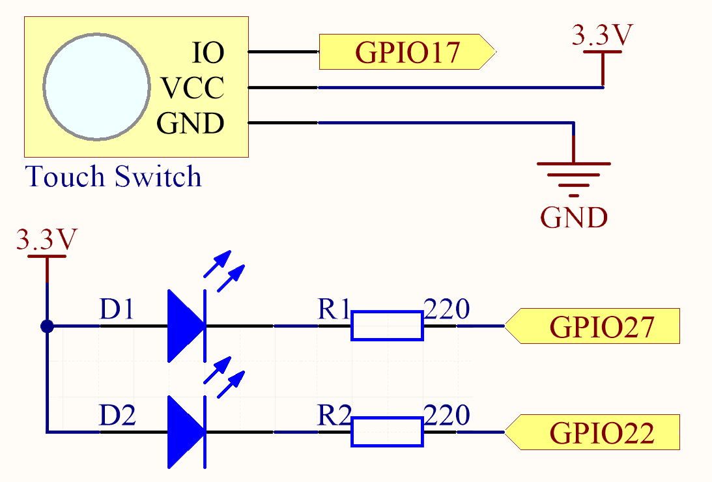
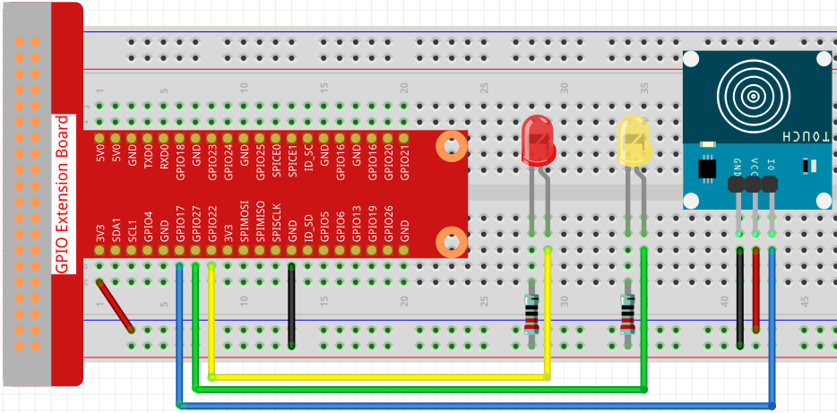
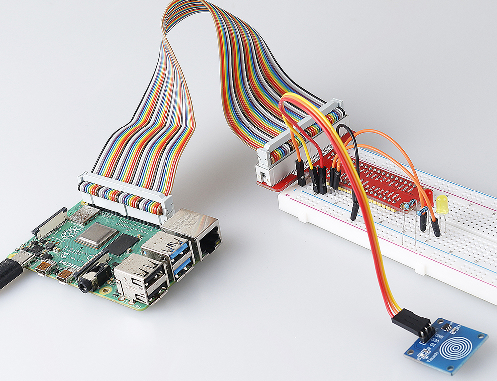

.. note::

    Ciao, benvenuto nella SunFounder Raspberry Pi & Arduino & ESP32 Enthusiasts Community su Facebook! Approfondisci le tue conoscenze su Raspberry Pi, Arduino ed ESP32 insieme ad altri appassionati.

    **Perché unirti a noi?**

    - **Supporto esperto**: Risolvi i problemi post-vendita e le sfide tecniche con l'aiuto della nostra comunità e del nostro team.
    - **Impara e condividi**: Scambia suggerimenti e tutorial per migliorare le tue competenze.
    - **Anteprime esclusive**: Ottieni accesso anticipato agli annunci di nuovi prodotti e anteprime speciali.
    - **Sconti esclusivi**: Approfitta di sconti riservati sui nostri prodotti più recenti.
    - **Promozioni festive e concorsi**: Partecipa a concorsi e promozioni durante le festività.

    👉 Sei pronto a esplorare e creare con noi? Clicca su [|link_sf_facebook|] e unisciti oggi stesso!

.. _2.1.3_py:

2.1.3 Modulo Interruttore a Tocco
====================================

Introduzione
-------------------

In questo progetto, imparerai a conoscere il modulo interruttore a tocco. Può sostituire 
i tipi tradizionali di interruttore con questi vantaggi: operazione conveniente, sensazione 
di tocco delicata, controllo preciso e minore usura meccanica.

Componenti Necessari
------------------------------

In questo progetto, abbiamo bisogno dei seguenti componenti. 

.. image:: ../img/2.1.3component.png
    :width: 700
    :align: center

È sicuramente comodo acquistare un kit completo, ecco il link: 

.. list-table::
    :widths: 20 20 20
    :header-rows: 1

    *   - Nome	
        - ARTICOLI IN QUESTO KIT
        - LINK
    *   - Kit Raphael
        - 337
        - |link_Raphael_kit|

Puoi anche acquistarli separatamente dai link qui sotto.

.. list-table::
    :widths: 30 20
    :header-rows: 1

    *   - INTRODUZIONE AI COMPONENTI
        - LINK PER L'ACQUISTO

    *   - :ref:`cpn_gpio_extension_board`
        - |link_gpio_board_buy|
    *   - :ref:`cpn_breadboard`
        - |link_breadboard_buy|
    *   - :ref:`cpn_wires`
        - |link_wires_buy|
    *   - :ref:`cpn_resistor`
        - |link_resistor_buy|
    *   - :ref:`cpn_led`
        - |link_led_buy|
    *   - :ref:`cpn_touch_switch`
        - |link_touch_buy|

Schema Elettrico
-------------------

Procedure Sperimentali
------------------------------

**Passo 1:** Costruisci il circuito.

**Passo 2:** Cambia directory.

.. raw:: html

   <run></run>

.. code-block::

    cd ~/raphael-kit/python/

**Passo 3:** Esegui il codice.

.. raw:: html

   <run></run>

.. code-block::

    sudo python3 2.1.3_TouchSwitch.py

Mentre il codice è in esecuzione, il LED rosso si accende; quando tocchi il modulo interruttore a tocco, il LED giallo si accende.

**Codice**

.. note::

    Puoi **Modificare/Reimpostare/Copiare/Eseguire/Interrompere** il codice qui sotto. Ma prima devi accedere al percorso del codice come ``raphael-kit/python``. Dopo aver modificato il codice, puoi eseguirlo direttamente per vedere l'effetto.

.. raw:: html

    <run></run>

.. code-block:: python

    #!/usr/bin/env python3

    import RPi.GPIO as GPIO
    import time

    # Imposta il #17 come pin interruttore a tocco, #22 come pin led1, #27 come pin led2
    touchPin = 17
    led1Pin = 22
    led2Pin = 27

    # Definisci una funzione di setup per alcune impostazioni iniziali
    def setup():
        # Imposta la modalità GPIO su BCM
        GPIO.setmode(GPIO.BCM)
        # Imposta touchPin come input
        # Imposta ledPin come output, 
        # e il livello iniziale su Alto (3.3v)
        GPIO.setup(touchPin, GPIO.IN)
        GPIO.setup(led1Pin, GPIO.OUT, initial=GPIO.HIGH)
        GPIO.setup(led2Pin, GPIO.OUT, initial=GPIO.HIGH)

    # Definisci una funzione main per il processo principale
    def main():
        while True:
            # interruttore a tocco alto, led1 acceso
            if GPIO.input(touchPin) == 1:
                print ('You touch it!')
                GPIO.output(led1Pin, GPIO.LOW)
                GPIO.output(led2Pin, GPIO.HIGH)

            # interruttore a tocco basso, led2 acceso
            if GPIO.input(touchPin) == 0:
                GPIO.output(led2Pin, GPIO.LOW)
                GPIO.output(led1Pin, GPIO.HIGH)

            time.sleep(0.5)
    # Definisci una funzione destroy per pulire tutto dopo
    # la fine dello script 
    def destroy():
        # Spegni il LED
        GPIO.output(led1Pin, GPIO.HIGH)
        GPIO.output(led2Pin, GPIO.HIGH)
        # Rilascia le risorse
        GPIO.cleanup()                     

    # Se esegui questo script direttamente, fai:
    if __name__ == '__main__':
        setup()
        try:
            main()
        # Quando viene premuto 'Ctrl+C', il programma 
        # destroy() verrà eseguito.
        except KeyboardInterrupt:
            destroy()	

**Spiegazione del Codice**

.. code-block:: python
    
    touchPin = 17
    led1Pin = 22
    led2Pin = 27

``touchPin``, ``led1Pin`` e ``led2Pin`` sono collegati rispettivamente a GPIO17, GPIO22 e GPIO27,
ossia BCM17, BCM22 e BCM27.

.. code-block:: python

    GPIO.setmode(GPIO.BCM)
	GPIO.setup(touchPin, GPIO.IN)
	GPIO.setup(led1Pin, GPIO.OUT, initial=GPIO.HIGH)
	GPIO.setup(led2Pin, GPIO.OUT, initial=GPIO.HIGH)

Imposta la modalità GPIO su BCM Numbering. Imposta ``led1Pin`` e ``led2Pin`` su modalità output 
e imposta il loro livello iniziale su Alto (3.3v).

.. code-block:: python

    # interruttore a tocco alto, led1 acceso
    if GPIO.input(touchPin) == 1:
        print ('You touch it!')
        GPIO.output(led1Pin, GPIO.LOW)
        GPIO.output(led2Pin, GPIO.HIGH)

    # interruttore a tocco basso, led2 acceso
    if GPIO.input(touchPin) == 0:
        GPIO.output(led2Pin, GPIO.LOW)
        GPIO.output(led1Pin, GPIO.HIGH)

Quando tocchi il modulo interruttore a tocco, ``touchPin`` sarà alto, led1 si accenderà e stamperà \"Hai toccato!\". Quando ``touchPin`` è basso, led2 si accenderà.

**Immagine del Fenomeno**
-------------------------------

