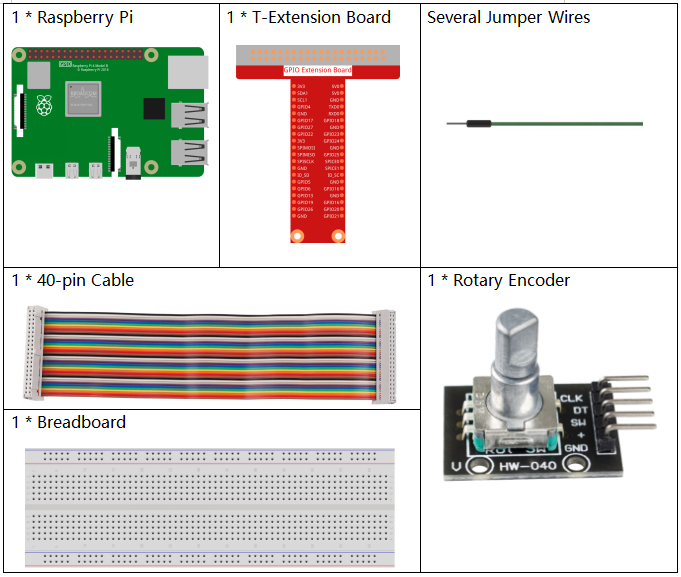
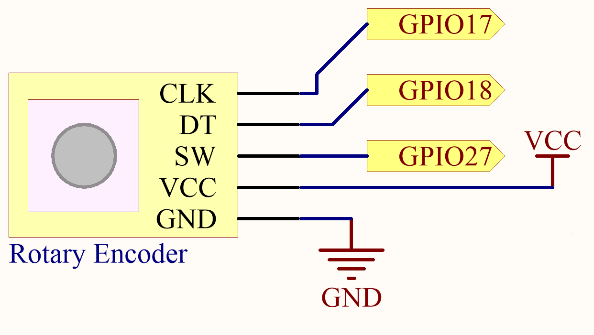
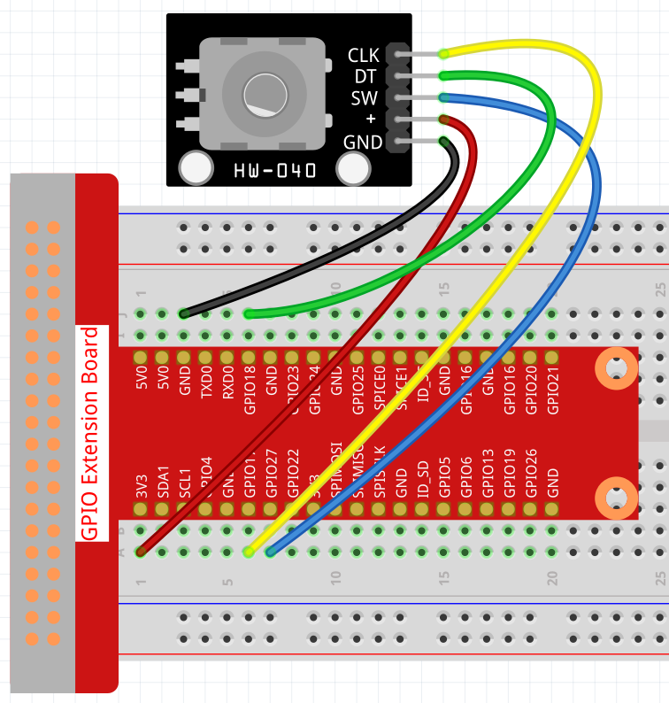
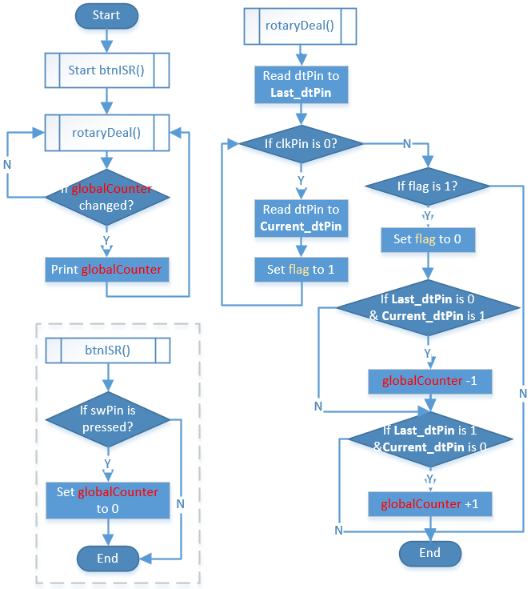
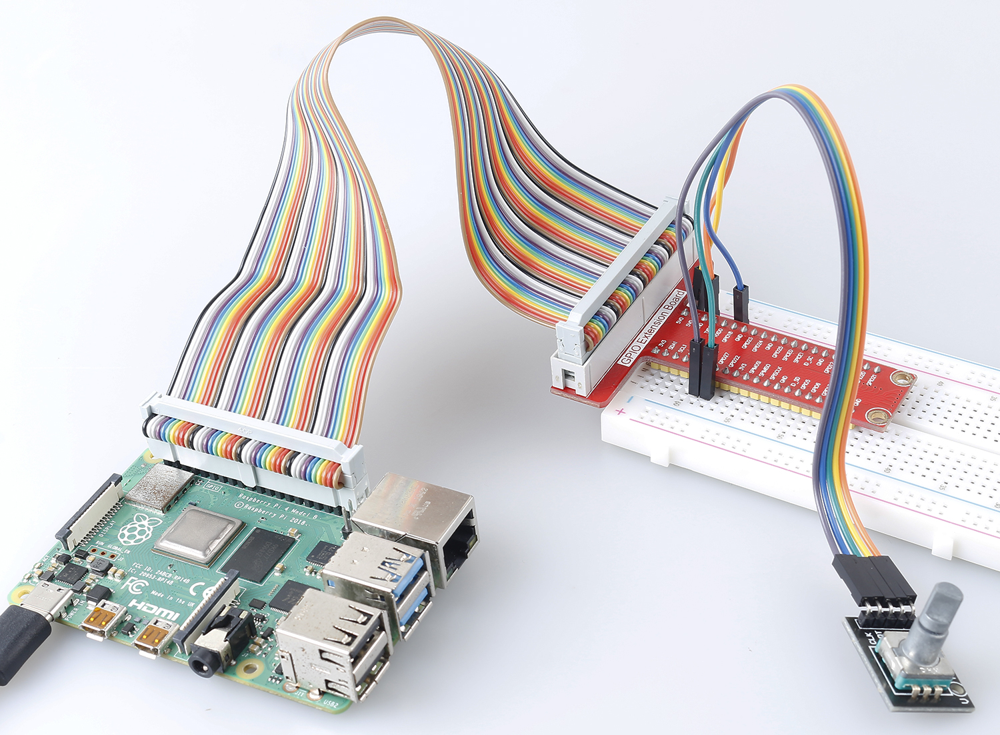

.. note::

    ¡Hola! Bienvenido a la comunidad de entusiastas de SunFounder Raspberry Pi, Arduino y ESP32 en Facebook. Profundiza en Raspberry Pi, Arduino y ESP32 con otros entusiastas.

    **¿Por qué unirse?**

    - **Soporte experto**: Resuelve problemas postventa y desafíos técnicos con la ayuda de nuestra comunidad y equipo.
    - **Aprender y compartir**: Intercambia consejos y tutoriales para mejorar tus habilidades.
    - **Avances exclusivos**: Accede anticipadamente a nuevos anuncios de productos y adelantos exclusivos.
    - **Descuentos especiales**: Disfruta de descuentos exclusivos en nuestros productos más recientes.
    - **Promociones y sorteos festivos**: Participa en sorteos y promociones de temporada.

    👉 ¿Listo para explorar y crear con nosotros? Haz clic en [|link_sf_facebook|] y únete hoy mismo.

.. _2.1.6_py:

2.1.6 Módulo de Codificador Rotativo
=======================================

Introducción
----------------

En este proyecto, aprenderás sobre el Codificador Rotativo. Un codificador rotativo es
un interruptor electrónico con un conjunto de pulsos regulares en una secuencia de tiempo estricta.
Cuando se usa con IC, puede lograr incrementos, decrementos, cambios de página y otras operaciones 
como el desplazamiento del mouse, la selección de menús, y más.

Componentes Necesarios
--------------------------

En este proyecto, necesitamos los siguientes componentes. 

Es definitivamente conveniente comprar un kit completo, aquí está el enlace: 

.. list-table::
    :widths: 20 20 20
    :header-rows: 1

    *   - Nombre	
        - ELEMENTOS EN ESTE KIT
        - ENLACE
    *   - Kit Raphael
        - 337
        - |link_Raphael_kit|

También puedes comprarlos por separado en los enlaces a continuación.

.. list-table::
    :widths: 30 20
    :header-rows: 1

    *   - INTRODUCCIÓN DE COMPONENTES
        - ENLACE DE COMPRA

    *   - :ref:`cpn_gpio_board`
        - |link_gpio_board_buy|
    *   - :ref:`cpn_breadboard`
        - |link_breadboard_buy|
    *   - :ref:`cpn_wires`
        - |link_wires_buy|
    *   - :ref:`cpn_rotary_encoder`
        - |link_rotary_encoder_buy|

Diagrama Esquemático
--------------------

Procedimientos Experimentales
--------------------------------

**Paso 1:** Construir el circuito.

En este ejemplo, podemos conectar el pin del Codificador Rotativo directamente a la
Raspberry Pi usando una placa de pruebas y un cable de 40 pines. Conecta el GND del Codificador Rotativo
a GND, 「+」a 3.3V, SW a GPIO digital 27, DT a GPIO digital 18, y CLK a GPIO digital 17.

**Paso 2:** Abrir el archivo de código.

.. raw:: html

   <run></run>

.. code-block::

    cd ~/raphael-kit/python/

**Paso 3:** Ejecutar.

.. raw:: html

   <run></run>

.. code-block::

    sudo python3 2.1.6_RotaryEncoder.py

Verás el conteo en la terminal. Cuando giras el codificador rotativo en el sentido de las agujas del reloj, el conteo aumenta; cuando lo giras en sentido contrario a las agujas del reloj, el conteo disminuye. Si presionas el interruptor en el codificador rotativo, las lecturas volverán a cero.

**Código**

.. note::

    Puedes **Modificar/Restablecer/Copiar/Ejecutar/Detener** el código a continuación. Pero antes de eso, necesitas ir a la ruta del código fuente como ``raphael-kit/python``. Después de modificar el código, puedes ejecutarlo directamente para ver el efecto.

.. raw:: html

    <run></run>

.. code-block:: python

   #!/usr/bin/env python3
   import RPi.GPIO as GPIO
   import time

   clkPin = 17    # Pin CLK
   dtPin = 18    # Pin DT
   swPin = 27    # Pin del botón

   globalCounter = 0

   flag = 0
   Last_dt_Status = 0
   Current_dt_Status = 0

   def setup():
      GPIO.setmode(GPIO.BCM)       # Numeración de GPIO por ubicación física
      GPIO.setup(clkPin, GPIO.IN)    # modo de entrada
      GPIO.setup(dtPin, GPIO.IN)
      GPIO.setup(swPin, GPIO.IN, pull_up_down=GPIO.PUD_UP)

   def rotaryDeal():
      global flag
      global Last_dt_Status
      global Current_dt_Status
      global globalCounter
      Last_dt_Status = GPIO.input(dtPin)
      while(not GPIO.input(clkPin)):
         Current_dt_Status = GPIO.input(dtPin)
         flag = 1
      if flag == 1:
         flag = 0
         if (Last_dt_Status == 0) and (Current_dt_Status == 1):
            globalCounter = globalCounter - 1
         if (Last_dt_Status == 1) and (Current_dt_Status == 0):
            globalCounter = globalCounter + 1

   def swISR(channel):
      global globalCounter
      globalCounter = 0

   def loop():
      global globalCounter
      tmp = 0  # Temporal del codificador

      GPIO.add_event_detect(swPin, GPIO.FALLING, callback=swISR)
      while True:
         rotaryDeal()
         if tmp != globalCounter:
            print ('globalCounter = %d' % globalCounter)
            tmp = globalCounter

   def destroy():
      GPIO.cleanup()             # Liberar recursos

   if __name__ == '__main__':     # El programa comienza aquí
      setup()
      try:
         loop()
      except KeyboardInterrupt:  # Cuando se presiona 'Ctrl+C', se ejecutará la función destroy()
         destroy()

**Análisis del Código**

* Leer el valor de dtPin cuando clkPin está bajo.
* Cuando clkPin está alto, si dtPin pasa de bajo a alto, el contador disminuye, de lo contrario, el contador aumenta.
* swPin emitirá un nivel bajo cuando se presione el eje.

A partir de esto, el flujo del programa se muestra a continuación:

Foto del Fenómeno
-----------------

