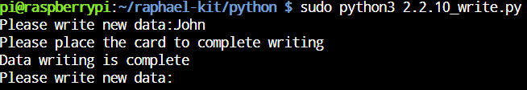

.. _2.2.10_py:

2.2.10 MFRC522 RFIDモジュール
==============================

はじめに
---------

RFID（Radio Frequency Identification）とは、オブジェクト（またはタグ）と読み取り装置（またはリーダー）との間で無線通信を行い、オブジェクトを自動的に追跡・識別する技術を指します。

この技術は、小売業の供給チェーン、軍事的な供給チェーン、自動決済、荷物追跡、書類追跡、医薬品管理など、多岐にわたる用途で利用されています。

本プロジェクトでは、RFIDを使って読み取りと書き込みを行います。

必要な部品
-----------------------

本プロジェクトには、以下の部品が必要です。

.. image:: ../img/list_2.2.7.png

一式をまとめて購入すると便利です。購入リンクは以下です。

.. list-table::
    :widths: 20 20 20
    :header-rows: 1

    *   - 名前
        - このキットのアイテム
        - リンク
    *   - Raphael Kit
        - 337
        - |link_Raphael_kit|

個別に購入することもできます。下記のリンクからどうぞ。

.. list-table::
    :widths: 30 20
    :header-rows: 1

    *   - コンポーネントの紹介
        - 購入リンク

    *   - :ref:`GPIO拡張ボード`
        - |link_gpio_board_buy|
    *   - :ref:`ブレッドボード`
        - |link_breadboard_buy|
    *   - :ref:`ジャンパーワイヤー`
        - |link_wires_buy|
    *   - :ref:`MFRC522 モジュール`
        - |link_mfrc522_rfid_buy|

回路図
-----------------

.. image:: ../img/image331.png

実験手順
-----------------------

**ステップ1:** 回路を組み立てる。

.. image:: ../img/image232.png

**ステップ2:** :ref:`SpidevとMFRC522` ライブラリをインストールする。

**ステップ3:** SPIをセットアップする（詳細は :ref:`SPI設定` を参照。すでにSPIを設定している場合はこのステップはスキップしてください。）

**ステップ4:** コードのフォルダに移動する。

.. raw:: html

   <run></run>

.. code-block::

    cd ~/raphael-kit/python

**ステップ5:** ``2.2.10_write.py`` を実行した後、メッセージを書き込み、 ``Enter`` キーを押して確認。次に、MFRC522モジュールにカードをかざし、「データ書き込み完了」と表示されたらカードを取り外すか、別のカードにメッセージを書き込むために ``Ctrl+C`` で終了する。

.. raw:: html

    <run></run>

.. code-block::

    sudo python3 2.2.10_write.py

**ステップ6:** ``2.2.10_read.py`` を実行して、書き込んだタグまたはカードの情報を読み取る。

.. raw:: html

    <run></run>

.. code-block::

    sudo python3 2.2.10_read.py

コード説明
-----------------------

.. code-block:: python

    reader = SimpleMFRC522()

``SimpleMFRC522()`` クラスをインスタンス化。

.. code-block:: python

    reader.read()

この関数はカードデータを読み取るために使用されます。読み取りが成功すると、IDとテキストが返されます。

.. code-block:: python

    reader.write(text)

この関数はカードに情報を書き込むために使用されます。 ``Enter`` キーを押して書き込みを完了します。 ``text`` はカードに書き込む情報です。

現象の画像
-------------

.. image:: ../img/image233.jpeg

