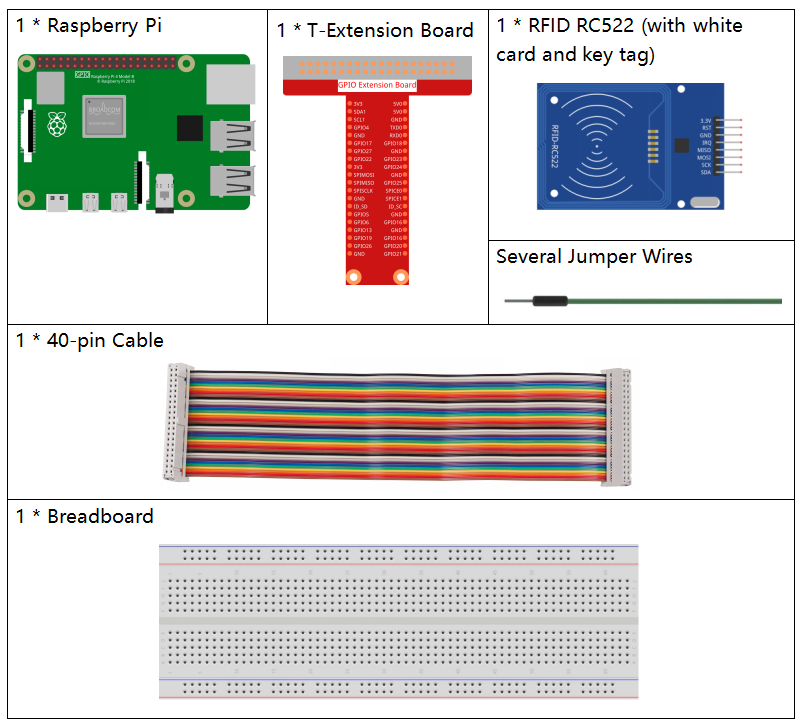
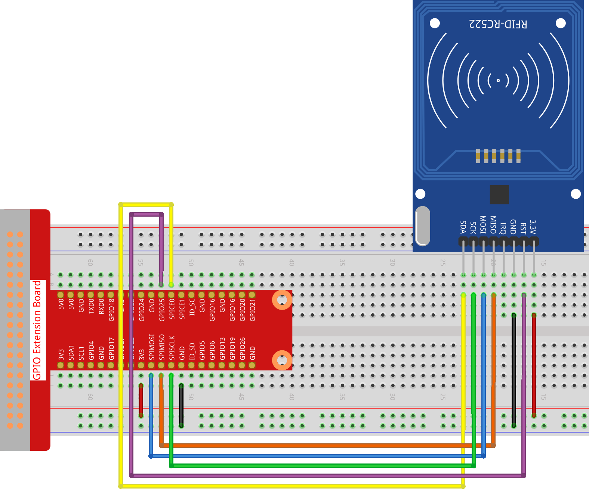
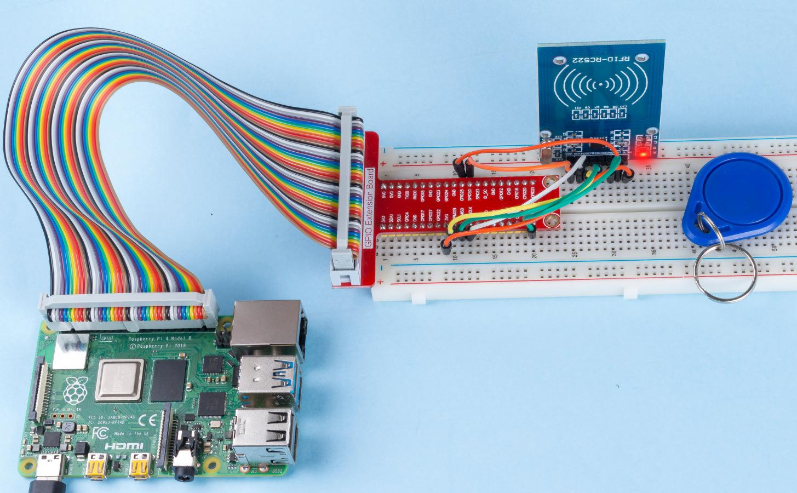

 
.. note::

    Bonjour et bienvenue dans la Communauté Facebook des passionnés de Raspberry Pi, Arduino et ESP32 de SunFounder ! Plongez plus profondément dans l'univers des Raspberry Pi, Arduino et ESP32 avec d'autres passionnés.

    **Pourquoi rejoindre ?**

    - **Support d'experts** : Résolvez les problèmes après-vente et les défis techniques avec l'aide de notre communauté et de notre équipe.
    - **Apprendre et partager** : Échangez des astuces et des tutoriels pour améliorer vos compétences.
    - **Aperçus exclusifs** : Accédez en avant-première aux annonces de nouveaux produits et aux aperçus.
    - **Réductions spéciales** : Profitez de réductions exclusives sur nos produits les plus récents.
    - **Promotions festives et cadeaux** : Participez à des cadeaux et des promotions de vacances.

    👉 Prêt à explorer et à créer avec nous ? Cliquez [|link_sf_facebook|] et rejoignez-nous aujourd'hui !

.. _2.2.10_py:

2.2.10 Module RFID MFRC522
=============================

Introduction
---------------

L'identification par radiofréquence (RFID) désigne les technologies utilisant la 
communication sans fil entre un objet (ou étiquette) et un dispositif d'interrogation 
(ou lecteur) pour suivre et identifier automatiquement ces objets.

Parmi les applications les plus courantes de cette technologie, on trouve les chaînes 
d'approvisionnement au détail, les chaînes d'approvisionnement militaires, les méthodes 
de paiement automatisées, le suivi et la gestion des bagages, le suivi des documents et la 
gestion pharmaceutique, pour n'en citer que quelques-unes.

Dans ce projet, nous allons utiliser la RFID pour la lecture et l'écriture.

Composants Nécessaires
------------------------

Pour ce projet, nous avons besoin des composants suivants :

Il est très pratique d'acheter un kit complet, voici le lien :

.. list-table::
    :widths: 20 20 20
    :header-rows: 1

    *   - Nom
        - ÉLÉMENTS DANS CE KIT
        - LIEN
    *   - Kit Raphael
        - 337
        - |link_Raphael_kit|

Vous pouvez également les acheter séparément via les liens ci-dessous.

.. list-table::
    :widths: 30 20
    :header-rows: 1

    *   - INTRODUCTION DES COMPOSANTS
        - LIEN D'ACHAT

    *   - :ref:`cpn_gpio_extension_board`
        - |link_gpio_board_buy|
    *   - :ref:`cpn_breadboard`
        - |link_breadboard_buy|
    *   - :ref:`cpn_wires`
        - |link_wires_buy|
    *   - :ref:`cpn_mfrc522`
        - |link_mfrc522_rfid_buy|

Schéma Électrique
--------------------

.. image:: ../img/image331.png

Procédures Expérimentales
----------------------------

**Étape 1 :** Construire le circuit.

**Étape 2 :** Configurer SPI (voir :ref:`spi_configuration` pour plus de détails. Si SPI est déjà configuré, passez cette étape.)

**Étape 3 :** Aller dans le dossier du code.

.. raw:: html

   <run></run>

.. code-block::

    cd ~/raphael-kit/python

**Étape 4 :** Exécutez ``2.2.10_write.py``.

.. raw:: html

    <run></run>

.. code-block::

    sudo python3 2.2.10_write.py

**Étape 5 :** Après avoir exécuté le programme, entrez le texte que vous souhaitez écrire (jusqu'à 16 caractères), par exemple "welcome", puis appuyez sur Entrée pour confirmer. Ensuite, le message "Les données ont été écrites sur la carte" s'affichera. Enfin, appuyez sur ``Ctrl+C`` pour arrêter l'exécution du code.

.. code-block::

    Veuillez placer votre carte RFID sur le lecteur...
    Appuyez sur Ctrl-C pour arrêter.
    Carte RFID détectée!
    UID de la carte: 9BF6210B
    Veuillez entrer les données à écrire sur la carte (jusqu'à 16 caractères): welcome
    Authentification du bloc 8 réussie
    4 backdata &0x0F == 0x0A 10
    Données écrites
    Les données ont été écrites sur la carte
    Lecture des données du bloc 8:
    Secteur 8 [119, 101, 108, 99, 111, 109, 101, 0, 0, 0, 0, 0, 0, 0, 0, 0]

**Étape 6 :** Exécutez maintenant ``2.2.10_read.py`` pour lire les informations du tag ou de la carte que vous avez écrites.

.. raw:: html

    <run></run>

.. code-block::

    sudo python3 2.2.10_read.py

**Étape 7 :** Après l'exécution, vous obtiendrez les informations suivantes.

.. code-block::

    Veuillez placer votre carte RFID sur le lecteur...
    Appuyez sur Ctrl-C pour arrêter.
    Carte RFID détectée!
    UID de la carte: 9BF6210B
    Authentification du bloc 8 réussie
    Secteur 8 [119, 101, 108, 99, 111, 109, 101, 0, 0, 0, 0, 0, 0, 0, 0, 0]
    MFRC522_Read type de retour: <class 'int'>, Données: [119, 101, 108, 99, 111, 109, 101, 0, 0, 0, 0, 0, 0, 0, 0, 0]
    Secteur 8 [119, 101, 108, 99, 111, 109, 101, 0, 0, 0, 0, 0, 0, 0, 0, 0]
    Données lues: welcome

Analyse du code pour ``2.2.10_write.py``
---------------------------------------------

Ce script Python écrit des données fournies par l'utilisateur sur une carte RFID en utilisant le lecteur RFID MFRC522. Le script vérifie continuellement la présence d'une carte, invite l'utilisateur à entrer des données à écrire, et confirme le succès des opérations d'écriture et de lecture.

#. Importations

   * ``MFRC522`` : Importe les fonctions et classes nécessaires aux opérations du lecteur RFID.
   * ``signal`` et ``time`` : ``signal`` est utilisé pour gérer la terminaison contrôlée via SIGINT (Ctrl+C), et ``time`` est utilisé pour ajouter des délais dans la boucle principale.

#. Variable Globale

   * ``continue_reading`` : Contrôle la boucle principale, permettant au script de se terminer proprement lorsque défini sur ``False``.

   .. code-block:: python

        continue_reading = True

#. Gestion des Signaux :

   * Fonction ``end_read`` : Cette fonction est déclenchée lorsque ``Ctrl+C`` (SIGINT) est détecté. Elle définit ``continue_reading`` sur ``False``, permettant ainsi au script de se terminer proprement.
   * ``signal.signal(signal.SIGINT, end_read)`` : Lie le signal SIGINT (Ctrl+C) à ``end_read``, de sorte qu’en cas d'interruption, le script affiche un message et se termine proprement.

   .. code-block:: python

        signal.signal(signal.SIGINT, end_read)

#. Configuration du Lecteur RFID :

   * ``rfid_reader`` : Une instance de la classe ``MFRC522``, utilisée pour contrôler les opérations du lecteur RFID.
   * ``default_key`` : Une liste de 6 octets, typiquement ``0xFF`` pour chaque octet. C'est la clé d'authentification par défaut pour la plupart des cartes RFID.

   .. code-block:: python

        # Créer une instance de la classe MFRC522
        rfid_reader = MFRC522.MFRC522()

        # Définir la clé par défaut (6 octets, par défaut tous à 0xFF)
        default_key = [0xFF, 0xFF, 0xFF, 0xFF, 0xFF, 0xFF]

#. Instructions pour l'Utilisateur

   Le script affiche des instructions dans la console, informant l'utilisateur de placer sa carte RFID sur le lecteur et d'utiliser ``Ctrl+C`` pour quitter.

   .. code-block:: python

        print("Veuillez placer votre carte RFID sur le lecteur...")
        print("Appuyez sur Ctrl-C pour arrêter.")

#. Boucle Principale : Détection, Écriture et Lecture de Données

   * **Détection de Carte** : Le script appelle continuellement ``MFRC522_Request`` pour détecter les cartes RFID. Si une carte est détectée (``status == rfid_reader.MI_OK``), il passe à l’étape suivante.
   
   .. code-block:: python

        (status, TagType) = rfid_reader.MFRC522_Request(rfid_reader.PICC_REQIDL)

        # Si une carte est détectée
        if status == rfid_reader.MI_OK:
            print("Carte RFID détectée!")
            ...
        else:
            # Attendre un peu avant de réessayer
            time.sleep(0.5)

   * **Récupération de l’UID de la Carte** : Appelle ``MFRC522_SelectTagSN`` pour récupérer l'identifiant unique (UID) de la carte. Si elle réussit, l'UID est converti en une chaîne hexadécimale et imprimé. L’UID est nécessaire pour l'authentification.
   
   .. code-block:: python

        (status, uid) = rfid_reader.MFRC522_SelectTagSN()

        # Si nous avons l'UID, continuer
        if status == rfid_reader.MI_OK:
            # Afficher l'UID
            uid_str = ''.join(['%02X' % i for i in uid])
            print("UID de la carte: %s" % uid_str)
            ...       
        else:
            print("Impossible d'obtenir l'UID de la carte")

   * **Préparation des Données** :

     * **Demande de Saisie** : L'utilisateur est invité à entrer les données à écrire sur la carte (jusqu'à 16 caractères).
     * **Troncature des Données** : Les données sont tronquées à 16 caractères si l'utilisateur en entre plus.
     * **Conversion de Chaîne en Octets** : Les données saisies par l'utilisateur sont converties en une liste d'octets remplie à 16 octets, comme requis par le format de stockage de la carte RFID.

   .. code-block:: python

        write_data = input("Veuillez entrer les données à écrire sur la carte (jusqu'à 16 caractères) : ")
        # S'assurer que les données ne dépassent pas 16 caractères
        write_data = write_data[:16]
        # Convertir la chaîne en liste d'octets, remplir jusqu'à 16 octets
        data_to_write = [0x00]*16
        string_bytes = write_data.encode('utf-8')
        for i in range(len(string_bytes)):
            data_to_write[i] = string_bytes[i]

   * **Spécification du Numéro de Bloc** : Le script spécifie le bloc 8 pour écrire les données. Remarque : Les numéros de bloc doivent éviter les blocs de remorque de secteur, généralement le dernier bloc de chaque secteur, car ils sont utilisés pour les informations de contrôle.

   .. code-block:: python

        block_num = 8  # Par exemple, choisir le bloc 8

   * **Authentification de la Carte** : ``MFRC522_Auth`` authentifie le bloc spécifié en utilisant la clé par défaut et l'UID. Si l'authentification est réussie, le script procède à l'écriture des données. Sinon, un message d'erreur est affiché, et l'encryptage est arrêté.
   
   .. code-block:: python

        status = rfid_reader.MFRC522_Auth(rfid_reader.PICC_AUTHENT1A, block_num, default_key, uid)

        if status == rfid_reader.MI_OK:
            print("Authentification du bloc %d réussie" % block_num)
            ...
        else:
            print("Échec de l'authentification")
            rfid_reader.MFRC522_StopCrypto1()

   * **Écriture des Données sur la Carte** : ``MFRC522_Write`` écrit les données préparées sur le bloc spécifié de la carte RFID. Après l'écriture, un message confirme que les données ont été correctement écrites sur la carte.

   .. code-block:: python
                
        rfid_reader.MFRC522_Write(block_num, data_to_write)
        print("Les données ont été écrites sur la carte")

   * **Vérification des Données Écrites** : Pour vérifier l'opération d'écriture, le script relit les données du même bloc en utilisant ``MFRC522_Read``. Les données récupérées sont imprimées pour permettre à l'utilisateur de vérifier les données.

   .. code-block:: python

        print("Lecture des données du bloc %d:" % block_num)
        rfid_reader.MFRC522_Read(block_num)

   * **Arrêt de l'Encryptage** : ``MFRC522_StopCrypto1`` arrête le processus d'encryptage après les opérations. Cette étape est nécessaire pour réinitialiser l'état de communication de la carte.
   
   .. code-block:: python

        # Arrêter l'encryptage
        rfid_reader.MFRC522_StopCrypto1()

   * **Sortie de la Boucle** : Après l'écriture et la vérification des données, ``continue_reading`` est défini sur ``False`` pour sortir de la boucle et terminer le script.

                continue_reading = False

**Points Clés**

   * **Terminaison Contrôlée** : Le script capture SIGINT (Ctrl+C) pour se terminer en toute sécurité et afficher un message, permettant à toute opération en cours de se terminer avant de quitter.
   * **Interaction Utilisateur** : Invite l'utilisateur à saisir des données, permettant ainsi de personnaliser les données à chaque fois que la carte est écrite.
   * **Authentification** : S'assure que l'accès au bloc spécifié est sécurisé, gérant les échecs d'authentification de manière contrôlée.
   * **Formatage des Données** : Convertit les données en chaîne de caractères en un format de liste d'octets compatible avec la structure de stockage de la carte, avec remplissage si nécessaire.
   * **Vérification** : Relit les données de la carte pour confirmer une écriture réussie, améliorant la fiabilité.
   * **Modularité** : Le script est bien structuré avec des fonctionnalités claires pour la détection, l'écriture et la lecture, ce qui le rend plus facile à suivre et à maintenir.

Ce script est adapté aux applications nécessitant à la fois des capacités de lecture et d'écriture avec des cartes RFID, telles que le contrôle d'accès ou l'identification d'utilisateur.

Explication du code pour ``2.2.10_read.py``
-----------------------------------------------

Ce script Python utilise un **lecteur RFID (MFRC522)** pour lire les données des cartes RFID. Le script est structuré pour vérifier en continu la présence de cartes, récupérer leurs données, et gérer proprement les demandes de sortie grâce à la gestion des signaux.

#. Importations :

   * ``MFRC522`` : Ce module fournit les méthodes pour interagir avec le lecteur RFID MFRC522.
   * ``signal`` et ``time`` : Utilisés pour gérer la terminaison du script (par exemple, avec ``Ctrl+C``) et contrôler le délai de certaines opérations.

#. Variables globales :

   * ``continue_reading`` : Un indicateur booléen qui contrôle la boucle principale de lecture, permettant au script de s'arrêter proprement lorsque ``Ctrl+C`` est pressé.

   .. code-block:: python

        continue_reading = True

#. Gestion des signaux :

   * Fonction ``end_read`` : Cette fonction est déclenchée lorsque ``Ctrl+C`` (SIGINT) est détecté. Elle définit ``continue_reading`` sur ``False``, permettant ainsi au script de se terminer proprement.
   * ``signal.signal(signal.SIGINT, end_read)`` : Associe le signal SIGINT (Ctrl+C) à ``end_read``, de sorte qu’en cas d’interruption, le script affiche un message et se termine proprement.

   .. code-block:: python

        signal.signal(signal.SIGINT, end_read)

#. Configuration du lecteur RFID :

   * ``rfid_reader`` : Une instance de la classe ``MFRC522``, utilisée pour contrôler les opérations du lecteur RFID.
   * ``default_key`` : Une liste de 6 octets, généralement ``0xFF`` pour chaque octet. C'est la clé d'authentification par défaut pour la plupart des cartes RFID.
   * ``block_num`` : Spécifie le numéro de bloc à lire sur la carte RFID, ici défini sur le bloc ``8``. Le numéro de bloc doit correspondre à celui utilisé lors de l'écriture des données sur la carte.

   .. code-block:: python

        # Créer une instance de la classe MFRC522
        rfid_reader = MFRC522.MFRC522()

        # Définir la clé par défaut (6 octets, par défaut tous à 0xFF)
        default_key = [0xFF, 0xFF, 0xFF, 0xFF, 0xFF, 0xFF]

        # Définir le numéro de bloc à lire (doit correspondre au bloc utilisé lors de l'écriture)
        block_num = 8  # Par exemple, bloc 8

#. Instructions pour l'utilisateur

   Le script affiche des instructions dans la console, informant l'utilisateur de placer sa carte RFID sur le lecteur et d'utiliser ``Ctrl+C`` pour quitter.

   .. code-block:: python

        print("Veuillez placer votre carte RFID sur le lecteur...")
        print("Appuyez sur Ctrl-C pour arrêter.")

#. Boucle principale : Détection de carte RFID et lecture des données.

   * **Recherche de cartes** : La boucle principale appelle continuellement ``MFRC522_Request`` pour rechercher des cartes RFID. Si une carte est détectée, elle passe aux étapes suivantes.
   
     .. code-block:: python

        (status, TagType) = rfid_reader.MFRC522_Request(rfid_reader.PICC_REQIDL)

        if status == rfid_reader.MI_OK:
            print("Carte RFID détectée!")
            ...
        else:
            # Si aucune carte n'est détectée, attendre un court moment avant de réessayer
            time.sleep(0.5)

   * **Récupération de l'UID de la carte** : Utilise ``MFRC522_SelectTagSN`` pour récupérer l'identifiant unique (UID) de la carte. Si réussi, il convertit l'UID en une chaîne hexadécimale et l'affiche. Cet UID est nécessaire pour authentifier la carte.

     .. code-block:: python
        
        (status, uid) = rfid_reader.MFRC522_SelectTagSN()

        # Si l'UID a été récupéré avec succès, continuer
        if status == rfid_reader.MI_OK:
            # Convertir la liste UID en chaîne hexadécimale
            uid_str = ''.join(['%02X' % i for i in uid])
            print("UID de la carte : %s" % uid_str)
            ...
        else:
            print("Impossible d'obtenir l'UID de la carte")

   * **Authentification de la carte** : ``MFRC522_Auth`` authentifie l'accès au bloc spécifié en utilisant la clé par défaut et l'UID de la carte. Si l'authentification réussit, le script passe à la lecture des données du bloc.

     .. code-block:: python

        status = rfid_reader.MFRC522_Auth(rfid_reader.PICC_AUTHENT1A, block_num, default_key, uid)

        if status == rfid_reader.MI_OK:
            print("Authentification du bloc %d réussie" % block_num)
            ...
        else:
            print("Échec de l'authentification, code de statut : %s" % status)
            rfid_reader.MFRC522_StopCrypto1()
    
   * **Lecture des données** :
     
     * ``MFRC522_Read`` lit les données du bloc spécifié.
     * ``data`` : Cette variable contient les données brutes du bloc si l'opération de lecture réussit.
     * Le script convertit chaque octet de ``data`` en caractères et supprime tout octet nul de remplissage (``\x00``). Les données traitées sont ensuite affichées.
     
     .. code-block:: python

        read_status, data = rfid_reader.MFRC522_Read(block_num)
        print(f"Type de retour de MFRC522_Read : {type(read_status)}, Données : {data}")

        if read_status == rfid_reader.MI_OK and data:
            print(f"Secteur {block_num} {data}")
            # Convertir les données en chaîne et supprimer tout octet nul de remplissage
            read_data = ''.join([chr(byte) for byte in data]).rstrip('\x00')
            print("Données lues : %s" % read_data)
        else:

Image du Phénomène
----------------------

