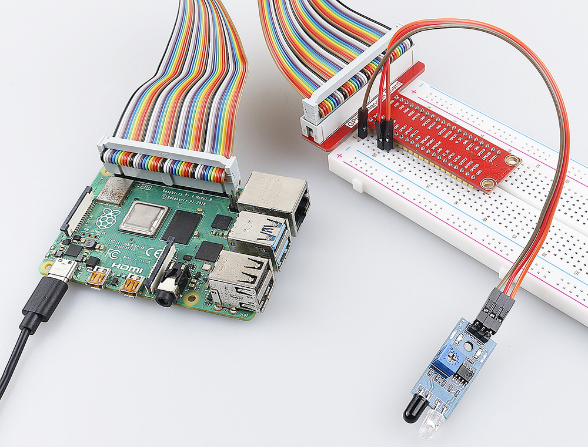

.. note::

    Hallo und willkommen in der SunFounder Raspberry Pi & Arduino & ESP32 Enthusiasten-Gemeinschaft auf Facebook! Tauchen Sie tiefer ein in die Welt von Raspberry Pi, Arduino und ESP32 mit anderen Enthusiasten.

    **Warum beitreten?**

    - **Expertenunterstützung**: Lösen Sie Nachverkaufsprobleme und technische Herausforderungen mit Hilfe unserer Gemeinschaft und unseres Teams.
    - **Lernen & Teilen**: Tauschen Sie Tipps und Anleitungen aus, um Ihre Fähigkeiten zu verbessern.
    - **Exklusive Vorschauen**: Erhalten Sie frühzeitigen Zugang zu neuen Produktankündigungen und exklusiven Einblicken.
    - **Spezialrabatte**: Genießen Sie exklusive Rabatte auf unsere neuesten Produkte.
    - **Festliche Aktionen und Gewinnspiele**: Nehmen Sie an Gewinnspielen und Feiertagsaktionen teil.

    👉 Sind Sie bereit, mit uns zu erkunden und zu erschaffen? Klicken Sie auf [|link_sf_facebook|] und treten Sie heute bei!

.. _2.2.5_py:

2.2.5 IR Hindernisvermeidungssensor
===================================

Einführung
-----------------

In diesem Projekt werden wir das IR Hindernisvermeidungsmodul kennenlernen. Dabei handelt es sich um ein Sensormodul, das dazu verwendet werden kann, Hindernisse in kurzer Entfernung zu erkennen. Es zeichnet sich durch geringe Störungen, einfache Montage und Benutzerfreundlichkeit aus. Es kann weit verbreitet in der Hindernisvermeidung von Robotern, Hindernisvermeidungswagen, Zählungen in Fertigungsstraßen usw. eingesetzt werden.

.. image:: ../img/2.2.5IR_Obstacle.png
   :width: 300
   :align: center

Benötigte Komponenten
------------------------------

Für dieses Projekt benötigen wir die folgenden Komponenten.

.. image:: ../img/2.2.5component.png
   :width: 700
   :align: center

Es ist definitiv praktisch, ein ganzes Set zu kaufen, hier ist der Link:

.. list-table::
    :widths: 20 20 20
    :header-rows: 1

    *   - Name	
        - ARTIKEL IN DIESEM KIT
        - LINK
    *   - Raphael Kit
        - 337
        - |link_Raphael_kit|

Sie können sie auch einzeln über die untenstehenden Links kaufen.

.. list-table::
    :widths: 30 20
    :header-rows: 1

    *   - KOMPONENTENBESCHREIBUNG
        - KAUF-LINK

    *   - :ref:`cpn_gpio_board`
        - |link_gpio_board_buy|
    *   - :ref:`cpn_breadboard`
        - |link_breadboard_buy|
    *   - :ref:`cpn_wires`
        - |link_wires_buy|
    *   - :ref:`cpn_infrared_avoidance`
        - |link_obstacle_avoidance_buy|

Schaltplan
---------------------

.. image:: ../img/IR_schematic.png
   :width: 500
   :align: center

Experimentelle Verfahren
----------------------------

**Schritt 1:** Schaltung aufbauen

.. image:: ../img/2.2.5fritzing.png
   :width: 700
   :align: center

**Schritt 2:** Verzeichnis wechseln.

.. raw:: html

   <run></run>

.. code-block::
   
   cd ~/raphael-kit/python

**Schritt 3:** Starten.

.. raw:: html

   <run></run>

.. code-block::

   sudo python3 2.2.5_IrObstacle.py

Nachdem der Code ausgeführt wurde und Sie Ihre Hand vor die Sonde des Moduls halten, leuchtet die Ausgabe-LED auf dem Modul und "Detected Barrier!" wird 
wiederholt auf dem Bildschirm angezeigt, bis Sie Ihre Hand entfernen.

**Code**

.. note::

   Sie können den untenstehenden Code **Ändern/Zurücksetzen/Kopieren/Starten/Stoppen**. Bevor Sie dies tun, müssen Sie jedoch zum Quellcodepfad wie ``raphael-kit/python`` gehen. Nachdem Sie den Code geändert haben, können Sie ihn direkt ausführen, um das Ergebnis zu sehen.

.. raw:: html

    <run></run>

.. code-block:: python

   #!/usr/bin/env python3
   import RPi.GPIO as GPIO
   import time

   ObstaclePin = 17

   def setup():
      GPIO.setmode(GPIO.BCM)       # Numbers GPIOs by physical location
      GPIO.setup(ObstaclePin, GPIO.IN, pull_up_down=GPIO.PUD_UP)

   def loop():
      while True:
         if (0 == GPIO.input(ObstaclePin)):
            print ("Detected Barrier!")
			   time.sleep(1)
            

   def destroy():
      GPIO.cleanup()                     # Release resource

   if __name__ == '__main__':     # Program start from here
      setup()
      try:
         loop()
      except KeyboardInterrupt:  # When 'Ctrl+C' is pressed, the child program destroy() will be  executed.
         destroy()

**Code-Erklärung**

.. code-block:: python

   def setup():
   GPIO.setmode(GPIO.BCM)       # Numbers GPIOs by physical location
   GPIO.setup(ObstaclePin, GPIO.IN, pull_up_down=GPIO.PUD_UP)

Stellen Sie den GPIO-Modus auf BCM-Nummerierung ein. Setzen Sie ``ObstaclePin`` auf den Eingabemodus und initialisieren Sie ihn auf High-Level (3,3V).

.. code-block:: python

   def loop():
      while True:
         if (0 == GPIO.input(ObstaclePin)):
            print ("Detected Barrier!")

Wenn ``ObstaclePin`` auf Low-Level ist, drucken Sie "Hindernis erkannt!". Das bedeutet, dass ein Hindernis erkannt wurde.

Phänomen-Bild
--------------------

