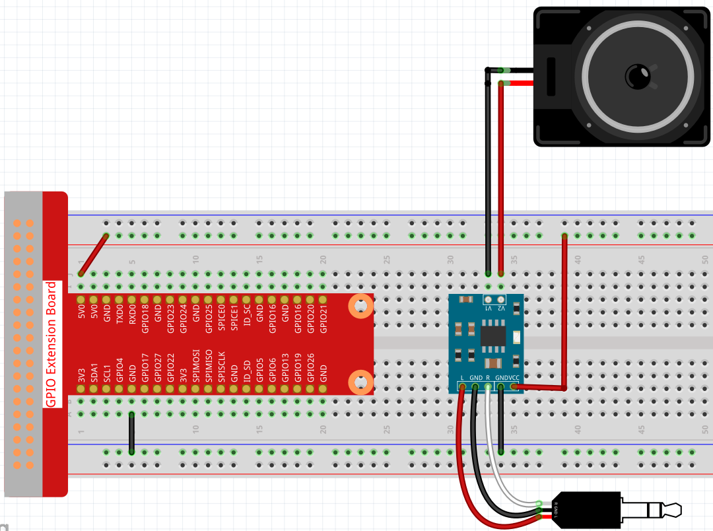
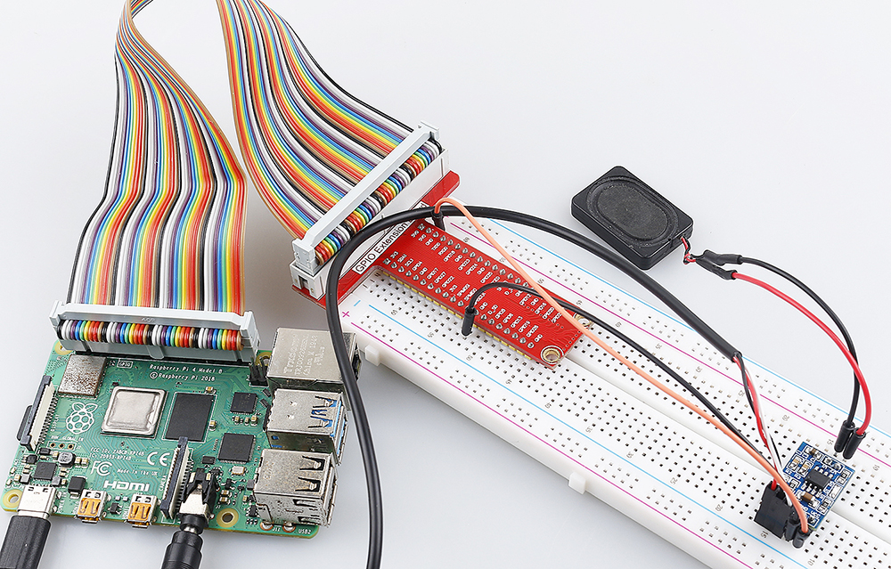

 
.. note::

    Bonjour et bienvenue dans la Communauté Facebook des passionnés de Raspberry Pi, Arduino et ESP32 de SunFounder ! Plongez plus profondément dans l'univers des Raspberry Pi, Arduino et ESP32 avec d'autres passionnés.

    **Pourquoi rejoindre ?**

    - **Support d'experts** : Résolvez les problèmes après-vente et les défis techniques avec l'aide de notre communauté et de notre équipe.
    - **Apprendre et partager** : Échangez des astuces et des tutoriels pour améliorer vos compétences.
    - **Aperçus exclusifs** : Accédez en avant-première aux annonces de nouveaux produits et aux aperçus.
    - **Réductions spéciales** : Profitez de réductions exclusives sur nos produits les plus récents.
    - **Promotions festives et cadeaux** : Participez à des cadeaux et des promotions de vacances.

    👉 Prêt à explorer et à créer avec nous ? Cliquez [|link_sf_facebook|] et rejoignez-nous aujourd'hui !

.. _3.1.3_py:

3.1.3 Module Audio
========================

Introduction
-------------------

Dans ce projet, nous allons fabriquer une stéréo DIY avec un module amplificateur audio, des haut-parleurs de 8 ohms/2W et un câble audio de 3,5 mm.

Composants Nécessaires
--------------------------------

Dans ce projet, nous avons besoin des composants suivants. 

.. image:: ../img/audio2.png
  :width: 700
  :align: center

Il est certainement pratique d'acheter un kit complet, voici le lien : 

.. list-table::
    :widths: 20 20 20
    :header-rows: 1

    *   - Nom	
        - ÉLÉMENTS DANS CE KIT
        - LIEN
    *   - Kit Raphael
        - 337
        - |link_Raphael_kit|

Vous pouvez également les acheter séparément aux liens ci-dessous.

.. list-table::
    :widths: 30 20
    :header-rows: 1

    *   - INTRODUCTION DES COMPOSANTS
        - LIEN D'ACHAT

    *   - :ref:`cpn_gpio_extension_board`
        - |link_gpio_board_buy|
    *   - :ref:`cpn_breadboard`
        - |link_breadboard_buy|
    *   - :ref:`cpn_audio_speaker`
        - \-

Procédures Expérimentales
------------------------------

**Étape 1:** Construire le circuit.

Après avoir construit le circuit selon le schéma ci-dessus, branchez le câble audio dans la prise audio 3,5 mm du Raspberry Pi.

.. image:: ../img/audio4.png
    :width: 400
    :align: center

**Étape 2:** Accédez au dossier du code.

.. raw:: html

   <run></run>

.. code-block::

    cd ~/raphael-kit/python/

**Étape 3:** Exécuter.

.. raw:: html

   <run></run>

.. code-block::

    python3 3.1.3_AudioModule.py

Après avoir exécuté le code, vous pouvez profiter de la musique.

**Code**

.. note::
    Vous pouvez **Modifier/Réinitialiser/Copier/Exécuter/Arrêter** le code ci-dessous. Mais avant cela, vous devez accéder au chemin du code source comme ``raphael-kit/python``. Après avoir modifié le code, vous pouvez l'exécuter directement pour voir l'effet.

.. raw:: html

    <run></run>

.. code-block:: python

    from pygame import mixer
    import os
    user = os.getlogin()
    user_home = os.path.expanduser(f'~{user}')

    mixer.init()
    
    def main():
        mixer.music.load(f'{user_home}/raphael-kit/music/my_music.mp3')
        mixer.music.set_volume(0.7)
        mixer.music.play()
        while True:
            pass# Don't do anything.
    
    def destroy():
        mixer.music.stop()
    
    if __name__ == '__main__':
        try:
            main()
        except KeyboardInterrupt:
            destroy()

**Explication du Code**

.. code-block:: python

    from pygame import mixer

    mixer.init()

Importer la méthode ``mixer`` de la bibliothèque ``pygame`` et initialiser la méthode.

.. code-block:: python

    mixer.music.load(f'{user_home}/raphael-kit/music/my_music.mp3')
    mixer.music.set_volume(0.7)
    mixer.music.play()

Ce code lit le fichier ``my_music.mp3`` dans le répertoire ``~/raphael-kit/music`` et règle le volume à 0,7 (la plage est de 0 à 1). 
Le Raspberry Pi commencera à jouer de l'audio lorsque ``mixer.music.play()`` sera appelé.

.. note::
    
    Vous pouvez également télécharger d'autres fichiers musicaux sur votre Raspberry Pi. Pour un tutoriel détaillé, veuillez vous référer à :ref:`filezilla`

.. code-block:: python

    mixer.music.stop()

Appeler ``mixer.music.stop()`` arrêtera la lecture de l'audio.
De plus, vous pouvez également mettre en pause avec ``mixer.music.pause()`` et continuer avec ``mixer.music.unpause()``.

**Image du Phénomène**
------------------------

