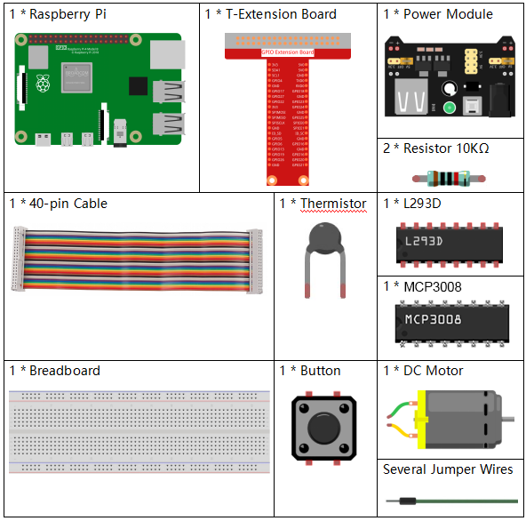
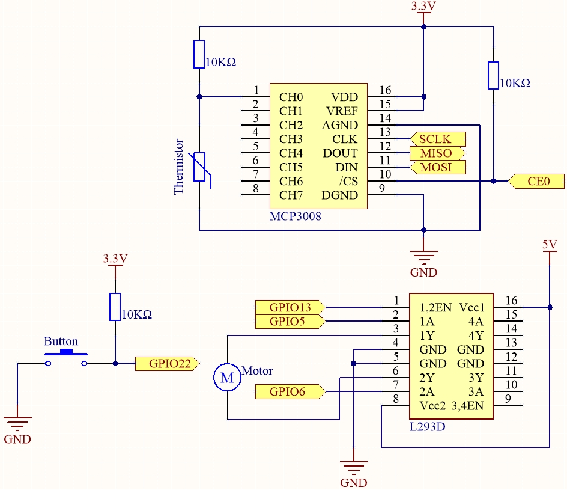
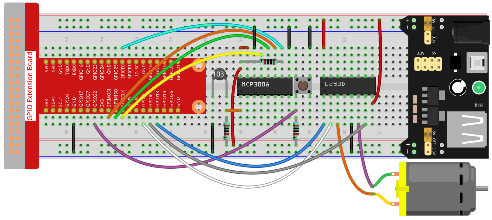
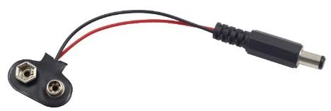

.. note::

    こんにちは、SunFounder Raspberry Pi & Arduino & ESP32 愛好者コミュニティ (Facebook) へようこそ！  
    Raspberry Pi、Arduino、ESP32 を仲間と共にさらに深く学びましょう。

    **参加する理由**

    - **専門サポート**: 購入後の問題や技術的課題をコミュニティとチームで解決  
    - **学びと共有**: ヒントやチュートリアルを交換し、スキルを向上  
    - **限定プレビュー**: 新製品発表や先行情報に早期アクセス  
    - **特別割引**: 新製品を特別価格で購入可能  
    - **イベントとプレゼント企画**: プレゼントや季節ごとのキャンペーンに参加  

    👉 一緒に探求し、創造しましょう。今すぐ [|link_sf_facebook|] をクリックして参加！

.. _4.1.10_py_mcp3008:

4.1.10 スマートファン (MCP3008)
================================

.. note::

   .. image:: ../img/mcp3008_and_adc0834.jpg
      :width: 25%
      :align: left

   キットのバージョンにより **ADC0834** または **MCP3008** が含まれています。自分のキットに対応するセクションに従ってください。

概要
----

このプロジェクトでは、モーター、ボタン、サーミスタを使用して、手動 + 自動制御が可能で風速を調整できるスマートファンを作成します。

必要な部品
----------

このプロジェクトで必要な部品は以下の通りです。

キット一式を購入するのが便利です。リンクはこちら：

.. list-table::
    :widths: 20 20 20
    :header-rows: 1

    *   - 名前
        - キット内の部品数
        - リンク
    *   - Raphael Kit
        - 337
        - |link_Raphael_kit|

個別購入する場合は以下のリンクを参照してください。

.. list-table::
    :widths: 30 20
    :header-rows: 1

    *   - 部品名
        - 購入リンク

    *   - :ref:`cpn_gpio_extension_board`
        - |link_gpio_board_buy|
    *   - :ref:`cpn_breadboard`
        - |link_breadboard_buy|
    *   - :ref:`cpn_wires`
        - |link_wires_buy|
    *   - :ref:`cpn_resistor`
        - |link_resistor_buy|
    *   - :ref:`cpn_power_module`
        - \-
    *   - :ref:`cpn_thermistor`
        - |link_thermistor_buy|
    *   - :ref:`cpn_l293d`
        - \-
    *   - :ref:`cpn_mcp3008`
        - \-
    *   - :ref:`cpn_button`
        - |link_button_buy|
    *   - :ref:`cpn_motor`
        - |link_motor_buy|

回路図
------

============ ======== ======== ===
T-Board 名   physical wiringPi BCM
SPICE0       Pin 24   10       8
SPIMOSI      Pin 19   12       10
SPIMISO      Pin 21   13       9
SPISCLK      Pin 23   14       11
GPIO22       Pin 15   3        22
GPIO5        Pin 29   21       5
GPIO6        Pin 31   22       6
GPIO13       Pin 33   23       13
============ ======== ======== ===

実験手順
--------

**ステップ 1:** 回路を組み立てます。

.. note::
    電源モジュールには付属の9V電池と9V電池スナップを使用できます。  
    電源モジュールのジャンパキャップをブレッドボードの5Vバスストリップに差し込みます。

**ステップ 2:** SPIインターフェースを設定し、 ``spidev`` ライブラリをインストールします（詳細は :ref:`spi_configuration` を参照）。すでに設定済みの場合はこのステップを省略できます。

**ステップ 3:** コードのフォルダに移動します。

.. raw:: html

   <run></run>

.. code-block:: 

    cd ~/raphael-kit/python

**ステップ 4:** 実行します。

.. raw:: html

   <run></run>

.. code-block:: 

    sudo python3 4.1.10-2_SmartFan.py

コードを実行すると、ボタンを押すことでファンが始動します。押すたびに速度が1段階ずつ変化します。  
速度段階は **0～4** の5段階です。4段階目でさらにボタンを押すと、ファンは停止（速度0）します。

温度が±2℃以上変化すると、速度は自動的に1段階上昇または下降します。

コード
------

.. raw:: html

    <run></run>

.. code-block:: python

    #!/usr/bin/env python3

    import RPi.GPIO as GPIO
    import spidev
    import time
    import math

    # Pin configuration
    BTN_PIN = 22            # Button GPIO (physical pin 15)
    MOTOR_IN1 = 5           # Motor forward
    MOTOR_IN2 = 6           # Motor backward
    MOTOR_EN = 13           # PWM enable pin

    # GPIO setup
    GPIO.setmode(GPIO.BCM)
    GPIO.setup(BTN_PIN, GPIO.IN, pull_up_down=GPIO.PUD_UP)
    GPIO.setup(MOTOR_IN1, GPIO.OUT)
    GPIO.setup(MOTOR_IN2, GPIO.OUT)
    GPIO.setup(MOTOR_EN, GPIO.OUT)

    # PWM setup for motor speed control
    pwm = GPIO.PWM(MOTOR_EN, 1000)  # 1kHz frequency
    pwm.start(0)

    # Initialize SPI for MCP3008
    spi = spidev.SpiDev()
    spi.open(0, 0)  # Bus 0, CE0
    spi.max_speed_hz = 1000000  # 1 MHz

    # Global variables
    level = 0
    currentTemp = 0
    markTemp = 0

    def read_adc(channel):
        if channel < 0 or channel > 7:
            return -1
        adc = spi.xfer2([1, (8 + channel) << 4, 0])
        value = ((adc[1] & 0x03) << 8) | adc[2]
        return value

    def temperature():
        analogVal = read_adc(0)
        Vr = 3.3 * analogVal / 1023.0
        Rt = 10000.0 * Vr / (3.3 - Vr)
        tempK = 1.0 / (((math.log(Rt / 10000.0)) / 3950.0) + (1.0 / (273.15 + 25.0)))
        Cel = tempK - 273.15
        return Cel

    def motor_run(level):
        if level == 0:
            GPIO.output(MOTOR_IN1, GPIO.LOW)
            GPIO.output(MOTOR_IN2, GPIO.LOW)
            pwm.ChangeDutyCycle(0)
            return 0
        if level >= 4:
            level = 4
        GPIO.output(MOTOR_IN1, GPIO.HIGH)
        GPIO.output(MOTOR_IN2, GPIO.LOW)
        pwm.ChangeDutyCycle(level * 25)  # Map level (1–4) to 25%–100%
        return level

    def changeLevel(channel):
        global level, currentTemp, markTemp
        print("Button pressed")
        level = (level + 1) % 5
        markTemp = currentTemp

    # Add event detection for button press
    GPIO.add_event_detect(BTN_PIN, GPIO.FALLING, callback=changeLevel, bouncetime=300)

    def main():
        global level, currentTemp, markTemp
        markTemp = temperature()
        while True:
            currentTemp = temperature()
            if level != 0:
                if currentTemp - markTemp <= -2:
                    level -= 1
                    markTemp = currentTemp
                elif currentTemp - markTemp >= 2:
                    if level < 4:
                        level += 1
                    markTemp = currentTemp
            level = motor_run(level)
            time.sleep(0.2)

    try:
        main()
    except KeyboardInterrupt:
        pass
    finally:
        pwm.stop()
        GPIO.cleanup()
        spi.close()

コード解説
----------

1. 必要なモジュールをインポート：

   - ``RPi.GPIO`` （ボタンとモーターのGPIO制御）
   - ``spidev`` （MCP3008 ADCとの通信）
   - ``time`` （待機処理）
   - ``math`` （温度計算用の対数演算）

   .. code-block:: python

       #!/usr/bin/env python3

       import RPi.GPIO as GPIO
       import spidev
       import time
       import math

2. GPIOピン設定：

   - ボタン: GPIO22（内部プルアップ付き）
   - モーター制御: GPIO5（前進）、GPIO6（後退）、GPIO13（PWMイネーブル）

   .. code-block:: python

       BTN_PIN = 22
       MOTOR_IN1 = 5
       MOTOR_IN2 = 6
       MOTOR_EN = 13

       GPIO.setmode(GPIO.BCM)
       GPIO.setup(BTN_PIN, GPIO.IN, pull_up_down=GPIO.PUD_UP)
       GPIO.setup(MOTOR_IN1, GPIO.OUT)
       GPIO.setup(MOTOR_IN2, GPIO.OUT)
       GPIO.setup(MOTOR_EN, GPIO.OUT)

       pwm = GPIO.PWM(MOTOR_EN, 1000)
       pwm.start(0)

3. SPI通信設定（MCP3008をバス0, CE0, 1MHzで接続）。

   .. code-block:: python

       spi = spidev.SpiDev()
       spi.open(0, 0)
       spi.max_speed_hz = 1000000

4. ``read_adc()`` 関数: MCP3008の指定チャネル(0～7)から10ビット値（0～1023）を読み取る。

   .. code-block:: python

       def read_adc(channel):
           if channel < 0 or channel > 7:
               return -1
           adc = spi.xfer2([1, (8 + channel) << 4, 0])
           value = ((adc[1] & 0x03) << 8) | adc[2]
           return value

5. ``temperature()`` 関数:  

   - アナログ電圧を抵抗値に変換  
   - Steinhart–Hart式で摂氏温度に変換

   .. code-block:: python

       def temperature():
           analogVal = read_adc(0)
           Vr = 3.3 * analogVal / 1023.0
           Rt = 10000.0 * Vr / (3.3 - Vr)
           tempK = 1.0 / (((math.log(Rt / 10000.0)) / 3950.0) + (1.0 / (273.15 + 25.0)))
           Cel = tempK - 273.15
           return Cel

6. ``motor_run()`` 関数:  

   - レベル0で停止  
   - レベル1～4でPWM 25%～100%に対応させ速度調整

   .. code-block:: python

       def motor_run(level):
           if level == 0:
               GPIO.output(MOTOR_IN1, GPIO.LOW)
               GPIO.output(MOTOR_IN2, GPIO.LOW)
               pwm.ChangeDutyCycle(0)
               return 0
           if level >= 4:
               level = 4
           GPIO.output(MOTOR_IN1, GPIO.HIGH)
           GPIO.output(MOTOR_IN2, GPIO.LOW)
           pwm.ChangeDutyCycle(level * 25)
           return level

7. ``changeLevel()`` コールバック:  

   - ボタンを押すたびに速度レベルを1段階変更（0～4をループ）  
   - 基準温度を現在温度に更新

   .. code-block:: python

       def changeLevel(channel):
           global level, currentTemp, markTemp
           print("Button pressed")
           level = (level + 1) % 5
           markTemp = currentTemp

       GPIO.add_event_detect(BTN_PIN, GPIO.FALLING, callback=changeLevel, bouncetime=300)

8. ``main()`` ループ:  

   - 温度変化が±2℃を超えたら速度を自動調整  
   - 0.2秒ごとにモーター速度を更新

   .. code-block:: python

       def main():
           global level, currentTemp, markTemp
           markTemp = temperature()
           while True:
               currentTemp = temperature()
               if level != 0:
                   if currentTemp - markTemp <= -2:
                       level -= 1
                       markTemp = currentTemp
                   elif currentTemp - markTemp >= 2:
                       if level < 4:
                           level += 1
                       markTemp = currentTemp
               level = motor_run(level)
               time.sleep(0.2)

9. Ctrl+Cで停止した場合のクリーンアップ:  

   - モーター停止、GPIO解放、SPI終了

   .. code-block:: python

       try:
           main()
       except KeyboardInterrupt:
           pass
       finally:
           pwm.stop()
           GPIO.cleanup()
           spi.close()
