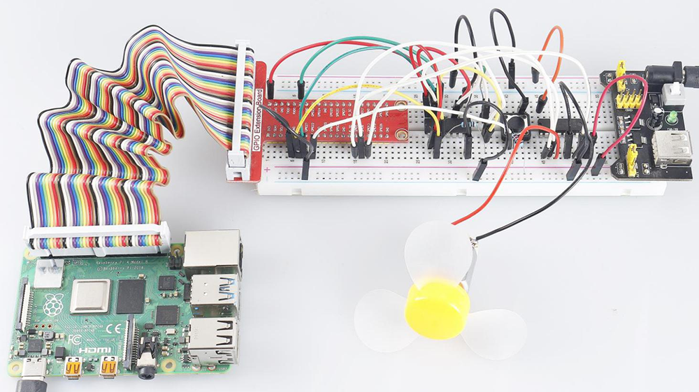

.. note::

    Ciao, benvenuto nella SunFounder Raspberry Pi & Arduino & ESP32 Enthusiasts Community su Facebook! Approfondisci le tue conoscenze su Raspberry Pi, Arduino ed ESP32 insieme ad altri appassionati.

    **Perché unirti a noi?**

    - **Supporto esperto**: Risolvi problemi post-vendita e sfide tecniche con l'aiuto della nostra comunità e del nostro team.
    - **Impara e condividi**: Scambia consigli e tutorial per migliorare le tue competenze.
    - **Anteprime esclusive**: Ottieni accesso anticipato a nuovi annunci di prodotti e anteprime speciali.
    - **Sconti speciali**: Approfitta di sconti esclusivi sui nostri prodotti più recenti.
    - **Promozioni festive e omaggi**: Partecipa a concorsi e promozioni durante le festività.

    👉 Pronto a esplorare e creare con noi? Clicca su [|link_sf_facebook|] e unisciti oggi stesso!

.. _4.1.10_py:

4.1.10 Ventilatore Intelligente
======================================

Introduzione
--------------------

In questo progetto, utilizzeremo motori, pulsanti e termistori per creare un 
ventilatore intelligente manuale + automatico, con velocità del vento regolabile.

Componenti necessari
------------------------------

In questo progetto, avremo bisogno dei seguenti componenti.

.. image:: ../img/list_Smart_Fan.png
    :align: center

È sicuramente conveniente acquistare un kit completo, ecco il link: 

.. list-table::
    :widths: 20 20 20
    :header-rows: 1

    *   - Nome	
        - ELEMENTI IN QUESTO KIT
        - LINK
    *   - Kit Raphael
        - 337
        - |link_Raphael_kit|

Puoi anche acquistarli separatamente dai link sottostanti.

.. list-table::
    :widths: 30 20
    :header-rows: 1

    *   - INTRODUZIONE AI COMPONENTI
        - LINK PER L'ACQUISTO

    *   - :ref:`cpn_gpio_extension_board`
        - |link_gpio_board_buy|
    *   - :ref:`cpn_breadboard`
        - |link_breadboard_buy|
    *   - :ref:`cpn_wires`
        - |link_wires_buy|
    *   - :ref:`cpn_resistor`
        - |link_resistor_buy|
    *   - :ref:`cpn_power_module`
        - \-
    *   - :ref:`cpn_thermistor`
        - |link_thermistor_buy|
    *   - :ref:`cpn_l293d`
        - \-
    *   - :ref:`cpn_adc0834`
        - \-
    *   - :ref:`cpn_button`
        - |link_button_buy|
    *   - :ref:`cpn_motor`
        - |link_motor_buy|

Schema elettrico
------------------------

============ ======== ======== ===
T-Board Name physical wiringPi BCM
GPIO17       Pin 11   0        17
GPIO18       Pin 12   1        18
GPIO27       Pin 13   2        27
GPIO22       Pin 15   3        22
GPIO5        Pin 29   21       5
GPIO6        Pin 31   22       6
GPIO13       Pin 33   23       13
============ ======== ======== ===

.. image:: ../img/Schematic_three_one4.png
   :align: center

Procedure sperimentali
-----------------------------

**Passo 1:** Costruisci il circuito.

.. image:: ../img/image245.png

.. note::
    Il modulo di alimentazione può utilizzare una batteria da 9V con la 
    clip per batteria da 9V inclusa nel kit. Inserisci il ponticello del 
    modulo di alimentazione nelle strisce di alimentazione da 5V della breadboard.

.. image:: ../img/image118.jpeg
   :align: center

**Passo 2**: Accedi alla cartella del codice.

.. raw:: html

   <run></run>

.. code-block:: 

    cd ~/raphael-kit/python

**Passo 3**: Esegui.

.. raw:: html

   <run></run>

.. code-block:: 

    sudo python3 4.1.10_SmartFan.py

Una volta eseguito il codice, avvia il ventilatore premendo il pulsante. Ogni volta che premi, il livello della velocità aumenta o diminuisce di 1. Ci sono **5** livelli di velocità: **0~4**. Quando viene impostato al livello 4\ :sup:`th` e premi nuovamente il pulsante, il ventilatore si ferma con una velocità del vento di **0**.

Quando la temperatura aumenta o diminuisce di oltre 2℃, la velocità 
aumenta o diminuisce automaticamente di 1 livello.

Codice
--------

.. note::
    Puoi **Modificare/Resettare/Copiare/Eseguire/Fermare** il codice qui sotto. Ma prima di farlo, devi accedere al percorso del codice sorgente come ``raphael-kit/python``. Dopo aver modificato il codice, puoi eseguirlo direttamente per vedere l'effetto.

.. raw:: html

    <run></run>

.. code-block:: python

    import RPi.GPIO as GPIO
    import time
    import ADC0834
    import math

    # Configurazione dei pin
    MotorPin1   = 5
    MotorPin2   = 6
    MotorEnable = 13
    BtnPin  = 22

    def setup():
        global p_M1,p_M2
        ADC0834.setup()
        GPIO.setmode(GPIO.BCM)
        GPIO.setup(MotorPin1, GPIO.OUT)
        GPIO.setup(MotorPin2, GPIO.OUT)
        p_M1=GPIO.PWM(MotorPin1,2000)
        p_M2=GPIO.PWM(MotorPin2,2000)
        p_M1.start(0)
        p_M2.start(0)
        GPIO.setup(MotorEnable, GPIO.OUT, initial=GPIO.LOW)
        GPIO.setup(BtnPin, GPIO.IN)

    def temperature():
        analogVal = ADC0834.getResult()
        Vr = 5 * float(analogVal) / 255
        Rt = 10000 * Vr / (5 - Vr)
        temp = 1/(((math.log(Rt / 10000)) / 3950) + (1 / (273.15+25)))
        Cel = temp - 273.15
        Fah = Cel * 1.8 + 32
        return Cel

    def motor(level):
        if level == 0:
            GPIO.output(MotorEnable, GPIO.LOW)
            return 0
        if level>=4:
            level = 4
        GPIO.output(MotorEnable, GPIO.HIGH)
        p_M1.ChangeDutyCycle(level*25)
        return level

    def main():
        lastState=0
        level=0
        markTemp = temperature()
        while True:
            currentState =GPIO.input(BtnPin)
            currentTemp=temperature()
            if currentState == 1 and lastState == 0:
                level=(level+1)%5
                markTemp = currentTemp
                time.sleep(0.5)
            lastState=currentState
            if level!=0:
                if currentTemp-markTemp <= -2:
                    level = level -1
                    markTemp=currentTemp            
                if currentTemp-markTemp >= 2:
                    level = level +1
                    markTemp=currentTemp             
            level = motor(level)
            

    def destroy():
        GPIO.output(MotorEnable, GPIO.LOW)
        p_M1.stop()
        p_M2.stop()
        GPIO.cleanup()    

    if __name__ == '__main__':
        setup()
        try:
            main()
        except KeyboardInterrupt:
            destroy()

Spiegazione del Codice
------------------------------

.. code-block:: python

    def temperature():
        analogVal = ADC0834.getResult()
        Vr = 5 * float(analogVal) / 255
        Rt = 10000 * Vr / (5 - Vr)
        temp = 1/(((math.log(Rt / 10000)) / 3950) + (1 / (273.15+25)))
        Cel = temp - 273.15
        Fah = Cel * 1.8 + 32
        return Cel

``temperature()`` funziona convertendo i valori del termistore letti da **ADC0834** 
in valori di temperatura. Consulta :ref:`2.2.2_py` per ulteriori dettagli.

.. code-block:: python

    def motor(level):
        if level == 0:
            GPIO.output(MotorEnable, GPIO.LOW)
            return 0
        if level>=4:
            level = 4
        GPIO.output(MotorEnable, GPIO.HIGH)
        p_M1.ChangeDutyCycle(level*25)
        return level

Questa funzione controlla la velocità di rotazione del motore. L'intervallo di 
**level** è **0-4** (level **0** ferma il motore). Ogni aumento di livello 
rappresenta un cambiamento del **25%** nella velocità del vento.

.. code-block:: python

    def main():
        lastState=0
        level=0
        markTemp = temperature()
        while True:
            currentState =GPIO.input(BtnPin)
            currentTemp=temperature()
            if currentState == 1 and lastState == 0:
                level=(level+1)%5
                markTemp = currentTemp
                time.sleep(0.5)
            lastState=currentState
            if level!=0:
                if currentTemp-markTemp <= -2:
                    level = level -1
                    markTemp=currentTemp            
                if currentTemp-markTemp >= 2:
                    level = level +1
                    markTemp=currentTemp             
            level = motor(level)

La funzione **main()** contiene l'intero processo del programma come mostrato:

1) Leggi costantemente lo stato del pulsante e la temperatura corrente.

2) Ogni pressione del pulsante aumenta il livello di **+1** e contemporaneamente viene aggiornata la temperatura. Il **livello** varia da **1 a 4**.

3) Quando il ventilatore è in funzione (livello **diverso da 0**), la temperatura viene monitorata. Un cambiamento di **2℃\ +** provoca l'aumento o la diminuzione del livello.

4) Il motore cambia la velocità di rotazione in base al **livello**.

Immagine del fenomeno
---------------------------

