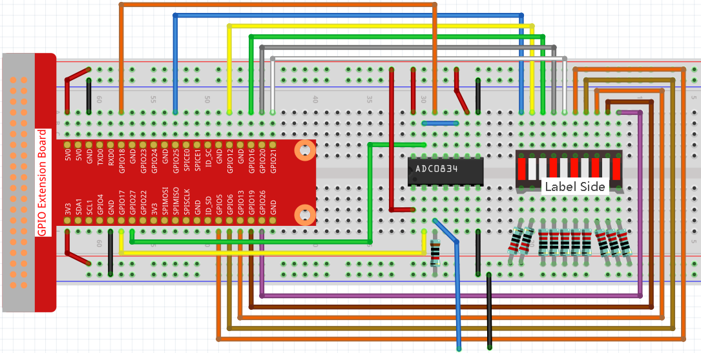

.. _4.1.11_py:

4.1.11 バッテリーインジケータ
===================================

はじめに
--------------

このプロジェクトでは、LEDバーグラフ上でバッテリーレベルを視覚的に表示できるバッテリーインジケータ装置を作成します。

必要な部品
------------------------------

このプロジェクトで必要な部品は以下の通りです。

.. image:: ../img/list_Battery_Indicator.png
    :align: center

一式を購入するのが確実に便利です。以下がリンクです：

.. list-table::
    :widths: 20 20 20
    :header-rows: 1

    *   - 名前
        - このキットのアイテム
        - リンク
    *   - Raphael Kit
        - 337
        - |link_Raphael_kit|

以下のリンクから個別に購入することも可能です。

.. list-table::
    :widths: 30 20
    :header-rows: 1

    *   - コンポーネントの紹介
        - 購入リンク

    *   - :ref:`cpn_gpio_board`
        - |link_gpio_board_buy|
    *   - :ref:`cpn_breadboard`
        - |link_breadboard_buy|
    *   - :ref:`cpn_wires`
        - |link_wires_buy|
    *   - :ref:`cpn_resistor`
        - |link_resistor_buy|
    *   - :ref:`cpn_bar_graph`
        - \-
    *   - :ref:`cpn_adc0834`
        - \-

回路図
-------------------

============ ======== ======== ===
T-Board Name physical wiringPi BCM
GPIO17       Pin 11   0        17
GPIO18       Pin 12   1        18
GPIO27       Pin 13   2        27
GPIO25       Pin 22   6        25
GPIO12       Pin 32   26       12
GPIO16       Pin 36   27       16
GPIO20       Pin 38   28       20
GPIO21       Pin 40   29       21
GPIO5        Pin 29   21       5
GPIO6        Pin 31   22       6
GPIO13       Pin 33   23       13
GPIO19       Pin 35   24       19
GPIO26       Pin 37   25       26
============ ======== ======== ===

.. image:: ../img/Schematic_three_one5.png
   :align: center

実験手順
-------------------------

**ステップ1:** 回路を作成します。

**ステップ2:** コードのフォルダに移動します。

.. raw:: html

   <run></run>

.. code-block::

    cd ~/raphael-kit/python/

**ステップ3:** 実行ファイルを実行します。

.. raw:: html

   <run></run>

.. code-block::

    sudo python3 4.1.11_BatteryIndicator.py

プログラムが実行された後、ADC0834の3番ピンとGNDにそれぞれ引き出し線を取り付け、それらをバッテリーの両極にそれぞれ導きます。すると、LEDバーグラフ上の対応するLEDが点灯して、電源レベル（測定範囲：0-5V）が表示されます。

**コード**

.. note::
    下のコードを **修正/リセット/コピー/実行/停止** することができます。しかし、それをする前に、ソースコードのパス ``raphael-kit/python`` に移動する必要があります。コードを修正した後、その効果を直接確認するために実行できます。

.. raw:: html

    <run></run>

.. code-block:: python

    import RPi.GPIO as GPIO
    import ADC0834
    import time

    ledPins = [25, 12, 16, 20, 21, 5, 6, 13, 19, 26]

    def setup():
        GPIO.setmode(GPIO.BCM)
        ADC0834.setup()
        for i in ledPins:
            GPIO.setup(i, GPIO.OUT)
            GPIO.output(i, GPIO.HIGH)

    def LedBarGraph(value):
        for i in ledPins:
            GPIO.output(i,GPIO.HIGH)
        for i in range(value):
            GPIO.output(ledPins[i],GPIO.LOW)

    def destroy():
        GPIO.cleanup()

    def loop():
        while True:
            analogVal = ADC0834.getResult()
            LedBarGraph(int(analogVal/25))

    if __name__ == '__main__':
        setup()
        try:
            loop()
        except KeyboardInterrupt: # When 'Ctrl+C' is pressed, the program destroy() will be executed.
            destroy()

**コード説明**

.. code-block:: python

    def LedBarGraph(value):
        for i in ledPins:
            GPIO.output(i,GPIO.HIGH)
        for i in range(value):
            GPIO.output(ledPins[i],GPIO.LOW)

この関数はLEDバーグラフの **10** 個のLEDのオン/オフを制御するためのものです。最初にこれらの **10** 個のLEDに高レベルを与えて、 **off** にします。その後、受け取ったアナログ値の変更によって点灯するLEDの数を決定します。

.. code-block:: python

    def loop():
        while True:
            analogVal = ADC0834.getResult()
            LedBarGraph(int(analogVal/25))

analogValは変動する電圧値(**0-5V**)で値(**0-255**)を生成します。例えば、バッテリー上で3Vが検出された場合、ボルトメーターに対応する値 **152** が表示されます。

LEDバーグラフ上の **10** 個のLEDは、 **analogVal** の読み取り値を表示するために使用されます。255/10=25なので、アナログ値が **25** ずつ増加するごとに、さらに1つのLEDがオンになります。例えば、“analogVal=150（約3V）の場合、6つのLEDが点灯します。”

現象の画像
------------------------------

.. image:: ../img/image249.jpeg
   :align: center
