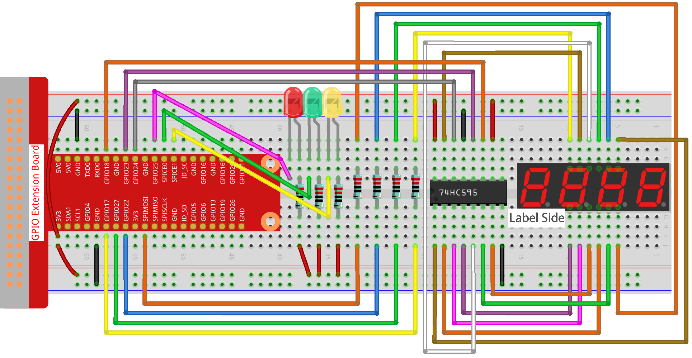

.. nota::

    ¡Hola, bienvenido a la Comunidad de Entusiastas de SunFounder Raspberry Pi & Arduino & ESP32 en Facebook! Sumérgete más en Raspberry Pi, Arduino y ESP32 con otros entusiastas.

    **¿Por qué unirse?**

    - **Soporte Experto**: Resuelve problemas post-venta y desafíos técnicos con la ayuda de nuestra comunidad y equipo.
    - **Aprende y Comparte**: Intercambia consejos y tutoriales para mejorar tus habilidades.
    - **Vistas Exclusivas**: Obtén acceso anticipado a nuevos anuncios de productos y adelantos.
    - **Descuentos Especiales**: Disfruta de descuentos exclusivos en nuestros productos más nuevos.
    - **Promociones Festivas y Sorteos**: Participa en sorteos y promociones de temporada.

    👉 ¿Listo para explorar y crear con nosotros? Haz clic en [|link_sf_facebook|] y únete hoy mismo.

.. _4.1.12_py:

4.1.12 Semáforo
========================

Introducción
------------------

En este proyecto, utilizaremos luces LED de tres colores para simular el 
cambio de los semáforos y una pantalla de 7 segmentos de cuatro dígitos 
para mostrar la temporización de cada estado del semáforo.

Componentes Necesarios
------------------------------

En este proyecto, necesitamos los siguientes componentes.

.. image:: ../img/list_Traffic_Light.png
    :align: center

Es definitivamente conveniente comprar un kit completo, aquí está el enlace: 

.. list-table::
    :widths: 20 20 20
    :header-rows: 1

    *   - Nombre	
        - ARTÍCULOS EN ESTE KIT
        - ENLACE
    *   - Kit Raphael
        - 337
        - |link_Raphael_kit|

También puedes comprarlos por separado desde los enlaces a continuación.

.. list-table::
    :widths: 30 20
    :header-rows: 1

    *   - INTRODUCCIÓN DEL COMPONENTE
        - ENLACE DE COMPRA

    *   - :ref:`cpn_gpio_extension_board`
        - |link_gpio_board_buy|
    *   - :ref:`cpn_breadboard`
        - |link_breadboard_buy|
    *   - :ref:`cpn_wires`
        - |link_wires_buy|
    *   - :ref:`cpn_resistor`
        - |link_resistor_buy|
    *   - :ref:`cpn_led`
        - |link_led_buy|
    *   - :ref:`cpn_4_digit`
        - \-
    *   - :ref:`cpn_74hc595`
        - |link_74hc595_buy|

Diagrama Esquemático
--------------------------

============== ========== ======== ===
Nombre T-Board Pin físico WiringPi BCM
GPIO17         Pin 11     0        17
GPIO27         Pin 13     2        27
GPIO22         Pin 15     3        22
SPIMOSI        Pin 19     12       10
GPIO18         Pin 12     1        18
GPIO23         Pin 16     4        23
GPIO24         Pin 18     5        24
GPIO25         Pin 22     6        25
SPICE0         Pin 24     10       8
SPICE1         Pin 26     11       7
============== ========== ======== ===

.. image:: ../img/Schematic_three_one7.png
   :align: center

Procedimientos Experimentales
-----------------------------------

**Paso 1:** Montar el circuito.

**Paso 2:** Cambiar de directorio.

.. raw:: html

   <run></run>

.. code-block::

    cd ~/raphael-kit/python/

**Paso 3:** Ejecutar.

.. raw:: html

   <run></run>

.. code-block::

    sudo python3 4.1.12_TrafficLight.py

Cuando el código se ejecuta, los LEDs simularán el cambio de color de los semáforos. 
Primero, el LED rojo se enciende durante 60 segundos, luego el LED verde se enciende 
durante 30 segundos; a continuación, el LED amarillo se enciende durante 5 segundos. 
Después de eso, el LED rojo se enciende nuevamente durante 60 segundos. De esta manera, 
esta serie de acciones se ejecutará repetidamente. Mientras tanto, la pantalla de 7 segmentos 
de cuatro dígitos muestra el tiempo de cuenta regresiva continuamente.

Código
----------

.. nota::
    Puedes **Modificar/Restablecer/Copiar/Ejecutar/Detener** el código a continuación. Pero antes de eso, necesitas ir a la ruta del código fuente como ``raphael-kit/python``. Después de modificar el código, puedes ejecutarlo directamente para ver el efecto.

.. raw:: html

    <run></run>

.. code-block:: python

    #!/usr/bin/env python3

    import RPi.GPIO as GPIO
    import time
    import threading

    #define the pins connect to 74HC595
    SDI   = 24      #serial data input(DS)
    RCLK  = 23     #memory clock input(STCP)
    SRCLK = 18      #shift register clock input(SHCP)
    number = (0xc0,0xf9,0xa4,0xb0,0x99,0x92,0x82,0xf8,0x80,0x90)

    placePin = (10,22,27,17)
    ledPin =(25,8,7)

    greenLight = 30
    yellowLight = 5
    redLight = 60
    lightColor=("Red","Green","Yellow")

    colorState=0
    counter = 60
    timer1 = 0

    def setup():
        GPIO.setmode(GPIO.BCM)
        GPIO.setup(SDI, GPIO.OUT)
        GPIO.setup(RCLK, GPIO.OUT)
        GPIO.setup(SRCLK, GPIO.OUT)
        for pin in placePin:
            GPIO.setup(pin,GPIO.OUT)
        for pin in ledPin:
            GPIO.setup(pin,GPIO.OUT)
        global timer1
        timer1 = threading.Timer(1.0,timer)
        timer1.start()

    def clearDisplay():
        for i in range(8):
            GPIO.output(SDI, 1)
            GPIO.output(SRCLK, GPIO.HIGH)
            GPIO.output(SRCLK, GPIO.LOW)
        GPIO.output(RCLK, GPIO.HIGH)
        GPIO.output(RCLK, GPIO.LOW)

    def hc595_shift(data):
        for i in range(8):
            GPIO.output(SDI, 0x80 & (data << i))
            GPIO.output(SRCLK, GPIO.HIGH)
            GPIO.output(SRCLK, GPIO.LOW)
        GPIO.output(RCLK, GPIO.HIGH)
        GPIO.output(RCLK, GPIO.LOW)

    def pickDigit(digit):
        for i in placePin:
            GPIO.output(i,GPIO.LOW)
        GPIO.output(placePin[digit], GPIO.HIGH)

    def timer():        #timer function
        global counter
        global colorState
        global timer1
        timer1 = threading.Timer(1.0,timer)
        timer1.start()
        counter-=1
        if (counter is 0):
            if(colorState is 0):
                counter= greenLight
            if(colorState is 1):
                counter=yellowLight
            if (colorState is 2):
                counter=redLight
            colorState=(colorState+1)%3
        print ("counter : %d    color: %s "%(counter,lightColor[colorState]))

    def lightup():
        global colorState
        for i in range(0,3):
            GPIO.output(ledPin[i], GPIO.HIGH)
        GPIO.output(ledPin[colorState], GPIO.LOW)

    def display():
        global counter

        a = counter % 10000//1000 + counter % 1000//100
        b = counter % 10000//1000 + counter % 1000//100 + counter % 100//10
        c = counter % 10000//1000 + counter % 1000//100 + counter % 100//10 + counter % 10

        if (counter % 10000//1000 == 0):
            clearDisplay()
        else:
            clearDisplay()
            pickDigit(3)
            hc595_shift(number[counter % 10000//1000])

        if (a == 0):
            clearDisplay()
        else:
            clearDisplay()
            pickDigit(2)
            hc595_shift(number[counter % 1000//100])

        if (b == 0):
            clearDisplay()
        else:
            clearDisplay()
            pickDigit(1)
            hc595_shift(number[counter % 100//10])

        if(c == 0):
            clearDisplay()
        else:
            clearDisplay()
            pickDigit(0)
            hc595_shift(number[counter % 10])

    def loop():
        while True:
            display()
            lightup()

    def destroy():   # When "Ctrl+C" is pressed, the function is executed.
        global timer1
        GPIO.cleanup()
        timer1.cancel()      #cancel the timer

    if __name__ == '__main__': # Program starting from here
        setup()
        try:
            loop()
        except KeyboardInterrupt:
            destroy()

Explicación del Código
-------------------------

.. code-block:: python

    SDI   = 24      #serial data input(DS)
    RCLK  = 23     #memory clock input(STCP)
    SRCLK = 18      #shift register clock input(SHCP)
    number = (0xc0,0xf9,0xa4,0xb0,0x99,0x92,0x82,0xf8,0x80,0x90)
    placePin = (10,22,27,17)   

    def clearDisplay():
    def hc595_shift(data): 
    def pickDigit(digit):
    def display():

Estos códigos se utilizan para realizar la función de visualización de 
números en una pantalla de 4 dígitos y 7 segmentos. Para más detalles, 
consulta el capítulo 1.1.5 del documento. Aquí, usamos los códigos para 
mostrar la cuenta regresiva del tiempo del semáforo.

.. code-block:: python

    ledPin =(25,8,7) 
    colorState=0
        
    def lightup():
        global colorState
        for i in range(0,3):
            GPIO.output(ledPin[i], GPIO.HIGH)
        GPIO.output(ledPin[colorState], GPIO.LOW)

Estos códigos se utilizan para encender y apagar los LEDs.

.. code-block:: python

    greenLight = 30
    yellowLight = 5
    redLight = 60
    lightColor=("Red","Green","Yellow")

    colorState=0
    counter = 60      
    timer1 = 0         

    def timer():        #timer function
        global counter
        global colorState
        global timer1
        timer1 = threading.Timer(1.0,timer)  
        timer1.start()     
        counter-=1                          
        if (counter is 0):
            if(colorState is 0):
                counter= greenLight
            if(colorState is 1):
                counter=yellowLight
            if (colorState is 2):
                counter=redLight
            colorState=(colorState+1)%3
        print ("counter : %d    color: %s "%(counter,lightColor[colorState]))

Los códigos se utilizan para encender y apagar el temporizador. 
Consulta el capítulo 1.1.5 para más detalles. Aquí, cuando el temporizador llega a cero, 
colorState cambiará para así cambiar el LED, y al temporizador se le asignará un nuevo valor.
.. code-block:: python

    def setup():
        # ... 
        global timer1
        timer1 = threading.Timer(1.0,timer)   
        timer1.start()  

    def loop():
        while True:
            display()
            lightup()
            
    def destroy():   # When "Ctrl+C" is pressed, the function is executed. 
        global timer1
        GPIO.cleanup()      
        timer1.cancel()      #cancel the timer

    if __name__ == '__main__': # Program starting from here 
        setup() 
        try:
            loop()  
        except KeyboardInterrupt:  
            destroy()  

En la función ``setup()`` se inicia el temporizador. En la función ``loop()``, 
se utiliza un **while True**: llama a las funciones relativas de la pantalla de 
4 dígitos y 7 segmentos y los LEDs de forma circular.

Imagen del Fenómeno
------------------------

.. image:: ../img/IMG_8319.jpg
   :align: center
