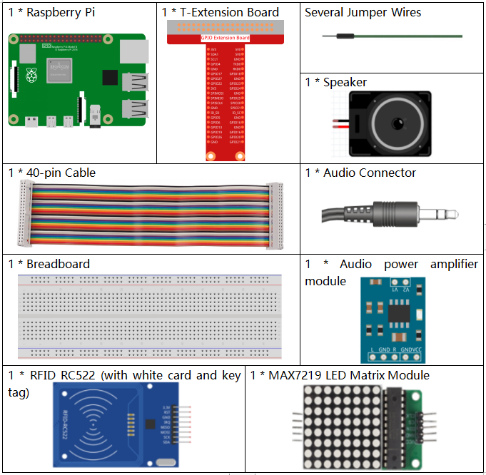
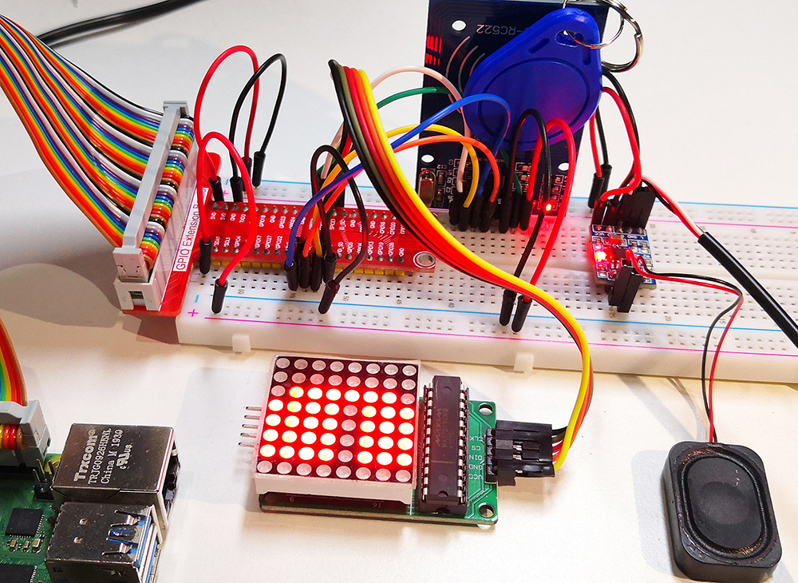

 
.. note::

    Bonjour et bienvenue dans la Communauté Facebook des passionnés de Raspberry Pi, Arduino et ESP32 de SunFounder ! Plongez plus profondément dans l'univers des Raspberry Pi, Arduino et ESP32 avec d'autres passionnés.

    **Pourquoi rejoindre ?**

    - **Support d'experts** : Résolvez les problèmes après-vente et les défis techniques avec l'aide de notre communauté et de notre équipe.
    - **Apprendre et partager** : Échangez des astuces et des tutoriels pour améliorer vos compétences.
    - **Aperçus exclusifs** : Accédez en avant-première aux annonces de nouveaux produits et aux aperçus.
    - **Réductions spéciales** : Profitez de réductions exclusives sur nos produits les plus récents.
    - **Promotions festives et cadeaux** : Participez à des cadeaux et des promotions de vacances.

    👉 Prêt à explorer et à créer avec nous ? Cliquez [|link_sf_facebook|] et rejoignez-nous aujourd'hui !

.. _4.1.19_py:

4.1.19 Système de Présence
================================

Introduction
---------------

Créons un simple système de présence. Lorsque nous scannons la carte, le Raspberry Pi enregistrera nos informations et générera un fichier csv.

Composants Requis
-------------------------------

Pour ce projet, nous avons besoin des composants suivants.

Il est certainement pratique d'acheter un kit complet, voici le lien : 

.. list-table::
    :widths: 20 20 20
    :header-rows: 1

    *   - Nom	
        - ÉLÉMENTS DANS CE KIT
        - LIEN
    *   - Kit Raphael
        - 337
        - |link_Raphael_kit|

Vous pouvez également les acheter séparément à partir des liens ci-dessous.

.. list-table::
    :widths: 30 20
    :header-rows: 1

    *   - INTRODUCTION DU COMPOSANT
        - LIEN D'ACHAT

    *   - :ref:`cpn_gpio_extension_board`
        - |link_gpio_board_buy|
    *   - :ref:`cpn_breadboard`
        - |link_breadboard_buy|
    *   - :ref:`cpn_wires`
        - |link_wires_buy|
    *   - :ref:`cpn_audio_speaker`
        - \-
    *   - :ref:`cpn_dot_matrix`
        - |link_led_matrix_buy|
    *   - :ref:`cpn_mfrc522`
        - |link_mfrc522_rfid_buy|

Schéma de Câblage
----------------------

============ ======== ======== ====
Nom T-Board  physique wiringPi BCM
GPIO25       Pin 22   6        25
SPIMOSI      Pin 19   12       MOSI
SPIMISO      Pin 19   12       MISO
SPICE0       Pin 24   10       CE0
SPICE1       Pin 26   11       CE1
SPISCLK      Pin 23   14       SCLK
============ ======== ======== ====

.. image:: ../img/4.1.20_schematic.png
   :align: center

Procédures Expérimentales
----------------------------

.. note::

    Activez le SPI avant de commencer l'expérience, consultez :ref:`SPI Configuration` pour plus de détails.
    
    Les bibliothèques :ref:`Luma.LED_Matrix` et :ref:`Spidev et MFRC522` sont également nécessaires.

Étape 1 : Construisez le circuit.

.. image:: ../img/atten1.png

Étape 2 : Exécutez le fichier ``2.2.10_write.py`` pour modifier le contenu de la carte RFID.

.. raw:: html

   <run></run>

.. code-block:: 

    cd ~/raphael-kit/python
    sudo python3 2.2.10_write.py

Étape 3 : Entrez le nom (ici nous utilisons ``John`` comme exemple) et appuyez sur ``Enter`` pour confirmer, puis placez la carte sur le module MFRC522, attendez que "Data writing is complete" apparaisse et retirez la carte, ou réécrivez le message sur une autre carte et quittez avec ``Ctrl+C``.

.. image:: ../img/write_card.png

Étape 4 : Accédez au dossier du code et exécutez-le.

.. raw:: html

   <run></run>

.. code-block::

    cd ~/raphael-kit/python
    sudo python3 4.1.19_Attendance_Machine.py

Après avoir démarré le programme, nous plaçons la carte RFID près du module RFID MFRC522, le Raspberry Pi émettra un message vocal pour vous saluer et l'affichera sur la matrice LED.

Nous pouvons également trouver un fichier ``.csv`` qui enregistre l'heure et la liste dans le même répertoire. Ouvrez-le avec la commande nano et vous verrez l'enregistrement.

.. raw:: html

   <run></run>

.. code-block::

    sudo nano attendance_sheet.2021.06.29.csv

.. image:: ../img/atten3.png
  :width: 400

**Code**

.. note::
    Vous pouvez **Modifier/Réinitialiser/Copier/Exécuter/Arrêter** le code ci-dessous. Mais avant cela, vous devez aller dans le chemin du code source comme ``raphael-kit/python``. Après avoir modifié le code, vous pouvez l'exécuter directement pour voir l'effet.

.. raw:: html

    <run></run>

.. code-block:: python

    import time
    from tts import TTS
    import RPi.GPIO as GPIO
    from mfrc522 import SimpleMFRC522
    from luma.core.interface.serial import spi, noop
    from luma.core.render import canvas
    from luma.core.virtual import viewport
    from luma.led_matrix.device import max7219
    from luma.core.legacy import text
    from luma.core.legacy.font import proportional, CP437_FONT, LCD_FONT

    serial = spi(port=0, device=1, gpio=noop())
    device = max7219(serial, rotate=1)
    virtual = viewport(device, width=200, height=400)

    reader = SimpleMFRC522()

    tts = TTS(engine="espeak")
    tts.lang('en-US')

    attendance_statistics = {}

    def get_time():
        time.time()
        year = str(time.strftime('%Y',time.localtime(time.time())))
        month = str(time.strftime('%m',time.localtime(time.time())))
        day = str(time.strftime('%d',time.localtime(time.time())))
        hour = str(time.strftime('%H',time.localtime(time.time())))
        minute = str(time.strftime('%M',time.localtime(time.time())))
        second = str(time.strftime('%S',time.localtime(time.time())))
        present_time = year + '.' + month + '.' + day + '.' + hour + '.' + minute + '.' + second
        present_date = year + '.' + month + '.' + day
        return present_date, present_time

    def main():
        while True:
            print("Reading...Please place the card...")
            id, name = reader.read()
            print(id,name)
            greeting = name.rstrip() + ", Welcome!"
            present_date, present_time = get_time()
            attendance_statistics[name.rstrip()] = present_time
            tts.say(greeting)
            with open('attendance_sheet.' + present_date + '.csv', 'w') as f:
                [f.write('{0}  {1}\n'.format(key, value)) for key, value in attendance_statistics.items()]
            with canvas(virtual) as draw:
                text(draw, (0, 0), greeting, fill="white", font=proportional(CP437_FONT))
            for offset in range(95):
                virtual.set_position((offset,0))
                time.sleep(0.1)

    def destroy():
        GPIO.cleanup()
        pass

    if __name__ == '__main__':
        try:
            main()
        except KeyboardInterrupt:
            destroy()

Explication du Code
-------------------------

Pour mieux comprendre le programme, vous devrez peut-être d'abord compléter :ref:`1.1.6 Matrice de Points LED` , :ref:`2.2.10 Module RFID MFRC522` et :ref:`3.1.4 Synthèse Vocale (TTS)`.

.. code-block:: python

    def get_time():
	    time.time()
	    year = str(time.strftime('%Y',time.localtime(time.time())))
	    month = str(time.strftime('%m',time.localtime(time.time())))
	    day = str(time.strftime('%d',time.localtime(time.time())))
	    hour = str(time.strftime('%H',time.localtime(time.time())))
	    minute = str(time.strftime('%M',time.localtime(time.time())))
	    second = str(time.strftime('%S',time.localtime(time.time())))
	    present_time = year + '.' + month + '.' + day + '.' + hour + '.' + minute + '.' + second
	    present_date = year + '.' + month + '.' + day
	    return present_date, present_time

Utilisez la fonction ``get_time()`` pour obtenir l'horodatage actuel et renvoyer deux valeurs.
Parmi eux, ``present_date`` est précis au jour de l'horodatage actuel, et ``present_time`` est précis à la seconde de l'horodatage actuel.

.. code-block:: python

    id, name = reader.read()
    greeting = name.rstrip() + ", Welcome!"
    present_date, present_time = get_time()
    attendance_statistics[name.rstrip()] = present_time

La fonction ``reader.read()`` lit les informations du nom, puis crée un message de bienvenue.
Ensuite, un dictionnaire ``attendance_statistics`` est généré, et ``name.rstrip()`` et ``present_time`` sont stockés en tant que clés et valeurs.

.. code-block:: python

    tts.say(greeting)

Annonce un message de bienvenue via le haut-parleur.

.. code-block:: python

    with open('attendance_sheet.' + present_date + '.csv', 'w') as f:
        [f.write('{0}  {1}\n'.format(key, value)) for key, value in attendance_statistics.items()]

Écrit les ``attendance_statistics`` dans le fichier .csv.

.. code-block:: python

    with canvas(virtual) as draw:
        text(draw, (0, 0), greeting, fill="white", font=proportional(CP437_FONT))
    for offset in range(95):
        virtual.set_position((offset,0))
        time.sleep(0.1)

Fait défiler pour afficher ce message de bienvenue.

**Photo du Phénomène**

