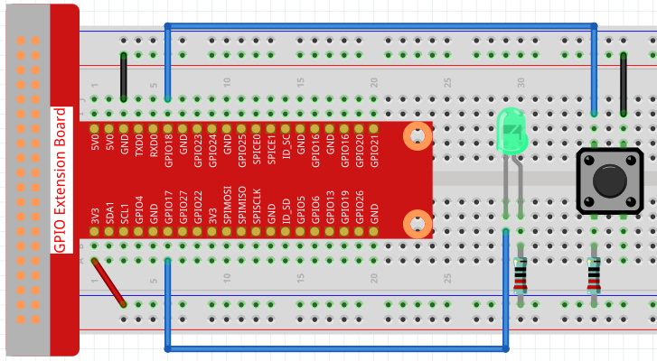
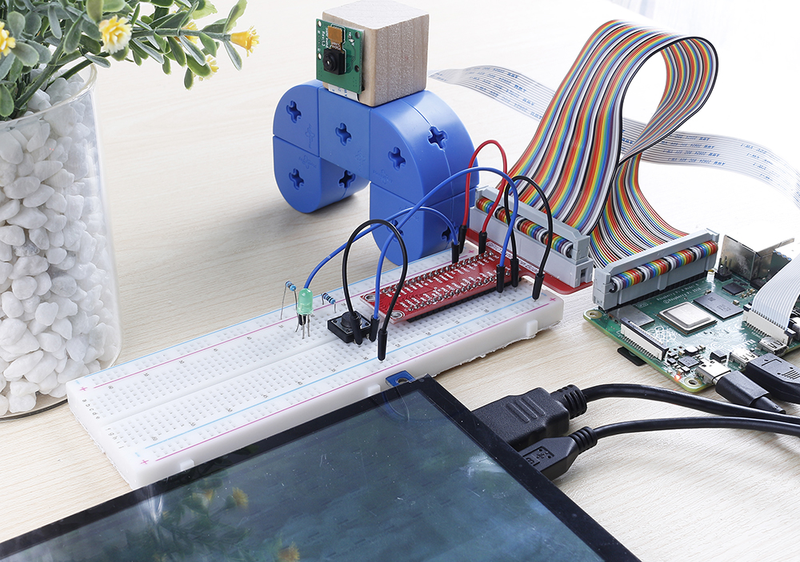

4.1.1 Camera
~~~~~~~~~~~~~~~~

Introduction
-----------------

Here we will make a camera with a shutter, when you press the button, the camera shoots while the LED flashes.

Components
----------------

.. image:: ../img/3.1.15camera_list.png
  :width: 800
  :align: center

* :ref:`GPIO Extension Board`
* :ref:`Breadboard`
* :ref:`Resistor`
* :ref:`LED`
* :ref:`Button`
* :ref:`Camera Module`

Schematic Diagram
-----------------------

============ ======== ======== ===
T-Board Name physical wiringPi BCM
GPIO17       Pin 11   0        17
GPIO18       Pin 12   1        18
============ ======== ======== ===

.. image:: ../img/camera_schematic.png
   :width: 500
   :align: center

Experimental Procedures
------------------------------

**Step 1:** Build the circuit.

**Step 2:** To connect the camera module and complete the configuration, please refer to: :ref:`Camera Module`.

**Step 3:** Go into the Raspberry Pi Desktop. You may need a screen for a better experience, refer to: `Connect your Raspberry Pi <https://projects.raspberrypi.org/en/projects/raspberry-pi-setting-up/3>`_. Or access the Raspberry Pi desktop remotely, for a detailed tutorial please refer to :ref:`Remote Desktop`.

**Step 4:** Open a Terminal and get into the folder of the code.

.. raw:: html

   <run></run>

.. code-block::

    cd ~/raphael-kit/python/

**Step 5:** Run.

.. raw:: html

   <run></run>

.. code-block::

    sudo python3 4.1.1_Camera.py

After the code runs, press the button, the Raspberry Pi will flash the LED and take a picture. The photo will be named ``my_photo.jpg`` and stored in the ``~`` directory.

.. note::

    You can also open ``4.1.1_Camera.py`` in the ``~/raphael-kit/python/`` path with a Python IDE, click Run button to run, and stop the code with Stop button.

If you want to download the photo to your PC, please refer to :ref:`Filezilla Software`.

**Code**

.. note::
    You can **Modify/Reset/Copy/Run/Stop** the code below. But before that, you need to go to  source code path like ``raphael-kit/python``. After modifying the code, you can run it directly to see the effect.

.. raw:: html

    <run></run>

.. code-block:: python

	#!/usr/bin/env python3

	from picamera import PiCamera
	import RPi.GPIO as GPIO
	import time
    import os
    user = os.getlogin()
    user_home = os.path.expanduser(f'~{user}')

	camera = PiCamera()

	LedPin = 17 # Set GPIO17 as LED pin
	BtnPin = 18 # Set GPIO18 as button pin

	status = False

	def setup():
		GPIO.setmode(GPIO.BCM)
		GPIO.setup(LedPin, GPIO.OUT, initial=GPIO.HIGH)
		GPIO.setup(BtnPin, GPIO.IN)
		camera.start_preview(alpha=200)

	def takePhotos(pin):
		global status
		status = True

	def main():
		global status
		GPIO.add_event_detect(BtnPin, GPIO.FALLING, callback=takePhotos)
		while True:
			if status:
				for i in range(5):
					GPIO.output(LedPin, GPIO.LOW)
					time.sleep(0.1)
					GPIO.output(LedPin, GPIO.HIGH)
					time.sleep(0.1)
				camera.capture(f'{user_home}/my_photo.jpg')
				print ('Take a photo!')          
				status = False
			else:
				GPIO.output(LedPin, GPIO.HIGH)
			time.sleep(1)

	def destroy():
		camera.stop_preview()
		GPIO.output(LedPin, GPIO.HIGH)
		GPIO.cleanup()

	if __name__ == '__main__':
		setup()
		try:
			main()
		except KeyboardInterrupt:
			destroy()

**Code Explanation**

.. code-block:: python

    GPIO.add_event_detect(BtnPin, GPIO.FALLING, callback=takePhotos)

Set the event of ``BtnPin``, when the button is pressed (the level signal changes from high to low) , call the function ``takePhotos()``.

.. code-block:: python

    def takePhotos(pin):
        global status
        status = True

When ``takePhotos()`` is called, modify the ``status`` to ``True``.

.. code-block:: python

    if status:
        for i in range(5):
            GPIO.output(LedPin, GPIO.LOW)
            time.sleep(0.1)
            GPIO.output(LedPin, GPIO.HIGH)
            time.sleep(0.1)
        camera.capture(f'{user_home}/my_photo.jpg')
        print ('Take a photo!')          
        status = False
    else:
        GPIO.output(LedPin, GPIO.HIGH)
    time.sleep(1)

When ``status`` is ``True``, the Raspberry Pi will flash the LED and take a picture. The photo will be named ``my_photo.jpg`` and stored in the ``~`` directory.

Phenomenon Picture
------------------------

