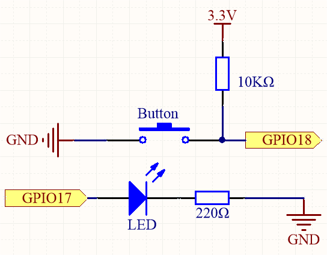

.. note::

    こんにちは、SunFounderのRaspberry Pi & Arduino & ESP32愛好家コミュニティへようこそ！Facebook上でRaspberry Pi、Arduino、ESP32についてもっと深く掘り下げ、他の愛好家と交流しましょう。

    **参加する理由は？**

    - **エキスパートサポート**：コミュニティやチームの助けを借りて、販売後の問題や技術的な課題を解決します。
    - **学び＆共有**：ヒントやチュートリアルを交換してスキルを向上させましょう。
    - **独占的なプレビュー**：新製品の発表や先行プレビューに早期アクセスしましょう。
    - **特別割引**：最新製品の独占割引をお楽しみください。
    - **祭りのプロモーションとギフト**：ギフトや祝日のプロモーションに参加しましょう。

    👉 私たちと一緒に探索し、創造する準備はできていますか？[|link_sf_facebook|]をクリックして今すぐ参加しましょう！

.. _4.1.1_py:

4.1.1 カメラ
=================

はじめに
-----------------

このセクションでは、ボタンを押すとLEDが点滅しながら写真を撮るカメラを作成します。

必要な部品
------------------------------

このプロジェクトに必要なパーツは以下の通りです。

.. image:: ../img/3.1.15camera_list.png
  :width: 800
  :align: center

一式をまとめて購入する方が便利です。リンクはこちらです：

.. list-table::
    :widths: 20 20 20
    :header-rows: 1

    *   - 名前
        - このキットのアイテム
        - リンク
    *   - Raphael Kit
        - 337
        - |link_Raphael_kit|

以下のリンクから、各パーツを個別に購入することもできます。

.. list-table::
    :widths: 30 20
    :header-rows: 1

    *   - コンポーネントの紹介
        - 購入リンク

    *   - :ref:`cpn_gpio_board`
        - |link_gpio_board_buy|
    *   - :ref:`cpn_breadboard`
        - |link_breadboard_buy|
    *   - :ref:`cpn_wires`
        - |link_wires_buy|
    *   - :ref:`cpn_resistor`
        - |link_resistor_buy|
    *   - :ref:`cpn_led`
        - |link_led_buy|
    *   - :ref:`cpn_button`
        - |link_button_buy|
    *   - :ref:`cpn_camera_module`
        - |link_camera_buy|

回路図
-----------------------

============ ======== ======== ===
T-Board Name physical wiringPi BCM
GPIO17       Pin 11   0        17
GPIO18       Pin 12   1        18
============ ======== ======== ===

実験手順
------------------------------

**ステップ1:** 回路を組み立てます。

.. image:: ../img/4.1.1_camera_circuit.png
  :width: 800
  :align: center

**ステップ2:** カメラモジュールを接続し、設定を完了してください。詳しくは :ref:`cpn_camera_module` を参照。

**ステップ3:** Raspberry Piデスクトップに入ります。より良い体験のためにスクリーンが必要かもしれません： `Raspberry Piを接続する <https://projects.raspberrypi.org/en/projects/raspberry-pi-setting-up/3>`_ を参照してください。リモートからRaspberry Piのデスクトップにアクセスすることもできます。詳しいチュートリアルは :ref:`remote_desktop` を参照してください。

**ステップ4:** ターミナルを開き、コードのディレクトリに移動します。

.. code-block::

    cd ~/raphael-kit/python/

**ステップ5:** コードを実行します。

.. code-block::

    sudo python3 4.1.1_Camera.py

コードが実行されると、次の動作が行われます：

- ライブカメラのプレビュウィンドウが開きます。
- プログラムはボタンが押されるのを待機します。
- ボタンが押されると：

  - LED が 3 回点滅します。
  - カメラが写真を撮影します。
  - LED が確認として 0.5 秒間点灯します。
  - 撮影した画像は ``/home/<username>/`` にタイムスタンプ付きのファイル名で保存されます。

- ``Ctrl+C`` を押すと、いつでもプレビューを停止し、GPIO リソースを解放して、プログラムを正常に終了できます。

.. note::

    PythonのIDEで ``~/raphael-kit/python/`` の ``4.1.1_Camera.py`` を開き、実行ボタンでコードを実行、ストップボタンでコードを停止することもできます。

PCに写真をダウンロードする方法については :ref:`Filezilla Software` をご参照ください。

**コード**

.. code-block:: python

    #!/usr/bin/env python3
    import time
    import os
    import RPi.GPIO as GPIO
    from picamera2 import Picamera2, Preview

    # ----------------------------
    # GPIO SETUP
    # ----------------------------

    BUTTON_PIN = 18  # The push button is connected to GPIO18
    LED_PIN = 17     # The LED is connected to GPIO17

    GPIO.setmode(GPIO.BCM)  # Use BCM GPIO numbering

    # The button uses a 10K pull-up resistor externally.
    # When released → HIGH, when pressed → LOW.
    GPIO.setup(BUTTON_PIN, GPIO.IN, pull_up_down=GPIO.PUD_UP)

    # LED is an output (HIGH → ON, LOW → OFF)
    GPIO.setup(LED_PIN, GPIO.OUT)
    GPIO.output(LED_PIN, GPIO.LOW)  # Ensure LED is OFF at startup

    # ----------------------------
    # USER DIRECTORY SETUP
    # ----------------------------

    # Get the current logged-in username
    user = os.getlogin()

    # Build the path to the user's home directory (ex: /home/pi)
    user_home = os.path.expanduser(f"~{user}")

    # ----------------------------
    # CAMERA SETUP
    # ----------------------------

    # Create a Picamera2 object
    camera = Picamera2()

    # Create a preview configuration:
    # main → the main camera stream
    # size → resolution 800x600
    # format → display format used by the preview window
    preview_config = camera.create_preview_configuration(
        main={"size": (800, 600), "format": "XRGB8888"}
    )

    # Apply the configuration to the camera
    camera.configure(preview_config)

    # Start the preview window using QTGL (GPU-accelerated)
    camera.start_preview(Preview.QTGL)

    # Start the camera hardware
    camera.start()

    print("Ready! Press the button to take a photo...")

    # ----------------------------
    # MAIN LOOP
    # ----------------------------
    try:
        while True:
            # Check if button is pressed (LOW means pressed)
            if GPIO.input(BUTTON_PIN) == GPIO.LOW:
                print("Button pressed! Taking photo...")

                # Flash LED 3 times to warn before taking the photo
                for _ in range(3):
                    GPIO.output(LED_PIN, GPIO.HIGH)
                    time.sleep(0.1)
                    GPIO.output(LED_PIN, GPIO.LOW)
                    time.sleep(0.1)

                # Build a unique filename using current date and time
                # Example: /home/pi/my_photo_20251201_143522.jpg
                timestamp = time.strftime("%Y%m%d_%H%M%S")
                filename = os.path.join(user_home, f"my_photo_{timestamp}.jpg")

                # Capture the image
                camera.capture_file(filename)

                print(f"Photo saved to: {filename}")

                # Turn LED ON briefly to confirm capture
                GPIO.output(LED_PIN, GPIO.HIGH)
                time.sleep(0.5)
                GPIO.output(LED_PIN, GPIO.LOW)

                # Debounce delay to prevent repeated triggers
                time.sleep(0.3)

            # Small delay to reduce CPU usage
            time.sleep(0.01)

    # ----------------------------
    # CLEAN EXIT WHEN CTRL+C IS PRESSED
    # ----------------------------
    except KeyboardInterrupt:
        print("\nCtrl+C received, exiting...")

    # ----------------------------
    # CLEANUP SECTION
    # ----------------------------
    finally:
        # Safely try to stop the camera preview
        try:
            camera.stop_preview()
        except:
            pass  # Ignore errors if preview wasn't running

        # Safely close the camera device
        try:
            camera.close()
        except:
            pass

        # Reset GPIO pins to a safe state
        GPIO.cleanup()

        print("Program exited cleanly.")

**コード説明**

#. ``BUTTON_PIN`` に接続されたボタンが押されているかどうかを確認します。

   .. code-block:: python

       if GPIO.input(BUTTON_PIN) == GPIO.LOW:

   ボタンにはプルアップ抵抗が使用されているため、通常状態は ``HIGH`` です。  
   ボタンが押されると信号が ``LOW`` になり、写真撮影プロセスが開始されます。

#. 写真を撮る前に、LED を 3 回点滅させて視覚的フィードバックを提供します。

   .. code-block:: python

       for _ in range(3):
           GPIO.output(LED_PIN, GPIO.HIGH)
           time.sleep(0.1)
           GPIO.output(LED_PIN, GPIO.LOW)
           time.sleep(0.1)

   これは Raspberry Pi が撮影準備をしていることを示します。

#. タイムスタンプを使用してユニークなファイル名を生成し、写真を撮影します。

   .. code-block:: python

       timestamp = time.strftime("%Y%m%d_%H%M%S")
       filename = os.path.join(user_home, f"my_photo_{timestamp}.jpg")
       camera.capture_file(filename)

   タイムスタンプにより、各写真のファイル名が重複しないようになります。  
   画像はユーザーのホームディレクトリに保存されます。

#. LED を 0.5 秒間点灯させ、写真が撮影されたことを知らせます。

   .. code-block:: python

       GPIO.output(LED_PIN, GPIO.HIGH)
       time.sleep(0.5)
       GPIO.output(LED_PIN, GPIO.LOW)

   この短い点灯が撮影成功を示すサインになります。

#. ボタンが一度押された際に複数回反応してしまうのを防ぐため、短い遅延を追加します。

   .. code-block:: python

       time.sleep(0.3)

   このデバウンス処理により、安定したボタン動作が保証されます。

現象の画像
------------------------

.. image:: ../img/4.1.1camera.JPG
   :align: center
