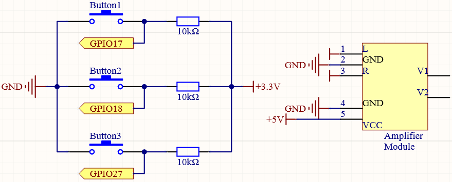
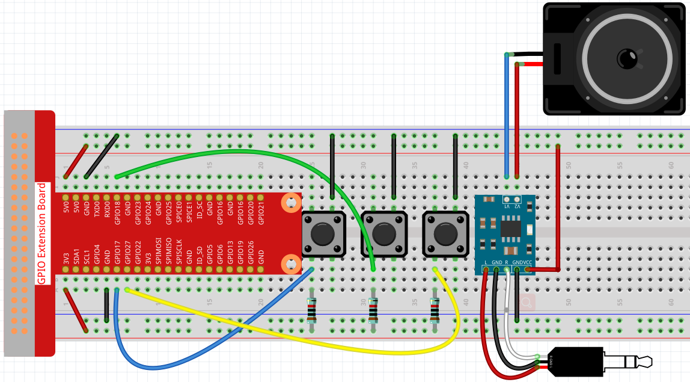
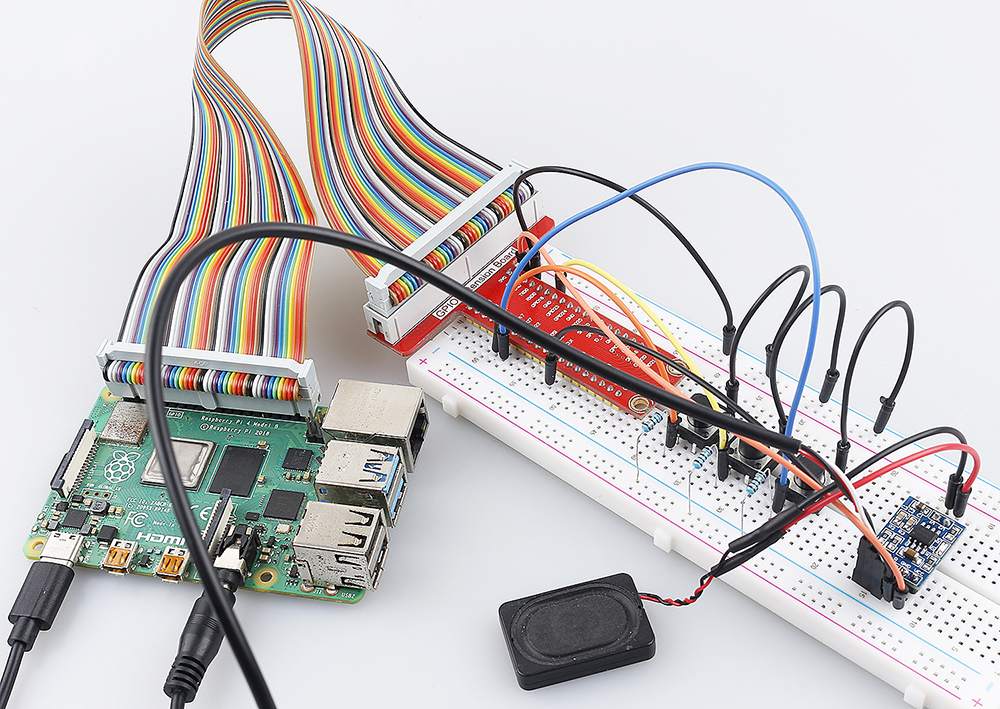

.. _4.1.2_py:

4.1.2 Music Player
~~~~~~~~~~~~~~~~~~~~~~

Introduction
-----------------

In project :ref:`3.1.3_py`, let speaker play a song. Now we add 3 buttons to control the play/pause and volume of the music.

Required Components
------------------------------

In this project, we need the following components. 

.. image:: ../img/musicplayer_list.png
  :width: 800
  :align: center

It's definitely convenient to buy a whole kit, here's the link: 

.. list-table::
    :widths: 20 20 20
    :header-rows: 1

    *   - Name	
        - ITEMS IN THIS KIT
        - LINK
    *   - Raphael Kit
        - 337
        - |link_Raphael_kit|

You can also buy them separately from the links below.

.. list-table::
    :widths: 30 20
    :header-rows: 1

    *   - COMPONENT INTRODUCTION
        - PURCHASE LINK

    *   - :ref:`gpio_extension_board`
        - |link_gpio_board_buy|
    *   - :ref:`breadboard`
        - |link_breadboard_buy|
    *   - :ref:`wires`
        - |link_wires_buy|
    *   - :ref:`resistor`
        - |link_resistor_buy|
    *   - :ref:`audio_speaker`
        - \-
    *   - :ref:`button`
        - |link_button_buy|

Schematic Diagram
-----------------------

============ ======== ======== ===
T-Board Name physical wiringPi BCM
GPIO17       Pin 11   0        17
GPIO18       Pin 12   1        18
GPIO27       Pin 13   2        27
============ ======== ======== ===

Experimental Procedures
------------------------------

**Step 1:** Build the circuit.

After building the circuit according to the above diagram, then plug the audio cable into the Raspberry Pi’s 3.5mm audio jack.

.. image:: ../img/audio4.png
    :width: 400
    :align: center

**Step 2:** Get into the folder of the code.

.. raw:: html

   <run></run>

.. code-block::

    cd ~/raphael-kit/python/

**Step 3:** Run.

.. raw:: html

   <run></run>

.. code-block::

    python3 4.1.2_MusicPlayer.py

After the code runs, Raspberry Pi will play the ``my_music.mp3`` file in the ``~/raphael-kit/music`` directory.

* Button 1 pauses/play the music.
* Button 2 decreases the volume.
* Button 3 increases the volume.

If you want to upload other music files to Raspberry Pi, you can refer to :ref:`filezilla`.

**Code**

.. note::
    You can **Modify/Reset/Copy/Run/Stop** the code below. But before that, you need to go to  source code path like ``raphael-kit/python``. After modifying the code, you can run it directly to see the effect.

.. raw:: html

    <run></run>

.. code-block:: python

    from pygame import mixer
    import RPi.GPIO as GPIO
    import time
    import os
    user = os.getlogin()
    user_home = os.path.expanduser(f'~{user}')

    BtnPin1 = 18
    BtnPin2 = 17
    BtnPin3 = 27
    volume = 0.7

    status = False
    upPressed = False
    downPressed = False
    playPressed = False

    def setup():
        mixer.init()
        GPIO.setmode(GPIO.BCM)
        GPIO.setup(BtnPin1, GPIO.IN, GPIO.PUD_UP)
        GPIO.setup(BtnPin2, GPIO.IN, GPIO.PUD_UP)
        GPIO.setup(BtnPin3, GPIO.IN, GPIO.PUD_UP)

    def clip(x,min,max):
        if x < min:
            return min
        elif x > max:
            return max
        return x

    def play(pin):
        global playPressed
        playPressed = True

    def volDown(pin):
        global downPressed
        downPressed = True

    def volUp(pin):
        global upPressed
        upPressed = True

    def main():
        global volume, status
        global downPressed, upPressed, playPressed
        mixer.music.load(f'{user_home}/raphael-kit/music/my_music.mp3')
        mixer.music.set_volume(volume)
        mixer.music.play()
        GPIO.add_event_detect(BtnPin1, GPIO.FALLING, callback=play)
        GPIO.add_event_detect(BtnPin2, GPIO.FALLING, callback=volDown)
        GPIO.add_event_detect(BtnPin3, GPIO.FALLING, callback=volUp)
        while True:
            if upPressed:
                volume = volume + 0.1
                upPressed = False
            if downPressed:
                volume = volume - 0.1
                downPressed = False
            if playPressed:
                if status:
                    mixer.music.pause()
                    status = not status
                else:
                    mixer.music.unpause()
                    status = not status
                playPressed = False
                time.sleep(0.5)
            volume = clip(volume,0.2,1)
            mixer.music.set_volume(volume)
            time.sleep(0.1)

    def destroy():
        # Release resource
        GPIO.cleanup()
        mixer.music.stop()

    # If run this script directly, do:
    if __name__ == '__main__':
        setup()
        try:
            main()
        # When 'Ctrl+C' is pressed, the program 
        # destroy() will be  executed.
        except KeyboardInterrupt:
            destroy()

**Code Explanation**

.. code-block:: python

    from pygame import mixer

    mixer.init()

Import the ``Mixer`` method in the ``pygame`` library and initialize the method.

.. code-block:: python

    BtnPin1 = 18
    BtnPin2 = 17
    BtnPin3 = 27
    volume = 0.7

Define the pin ports of the three buttons and set the initial volume to 0.7.

.. code-block:: python

    upPressed = False
    downPressed = False
    playPressed = False

``UpPressed``, ``downPressed`` and ``playPressed`` are all interrupt flags, the corresponding task will be executed When they are ``True``.

.. code-block:: python

    def clip(x,min,max):
    if x < min:
        return min
    elif x > max:
        return max
    return x

The ``clip()`` function is used to set the upper and lower limits of input parameters.

.. code-block:: python

    GPIO.add_event_detect(BtnPin1, GPIO.FALLING, callback=play)
    GPIO.add_event_detect(BtnPin2, GPIO.FALLING, callback=volDown)
    GPIO.add_event_detect(BtnPin3, GPIO.FALLING, callback=volUp)

Set the key detection events of ``BtnPin1``, ``BtnPin2`` and ``BtnPin3``.

* When ``BtnPin1`` is pressed, the interrupt function ``play()`` is executed. 
* when ``BtnPin2`` is pressed, the interrupt function ``volDown()`` is executed. 
* When ``BtnPin3`` is pressed, the interrupt function ``volUp()`` is executed.

Phenomenon Picture
------------------------

