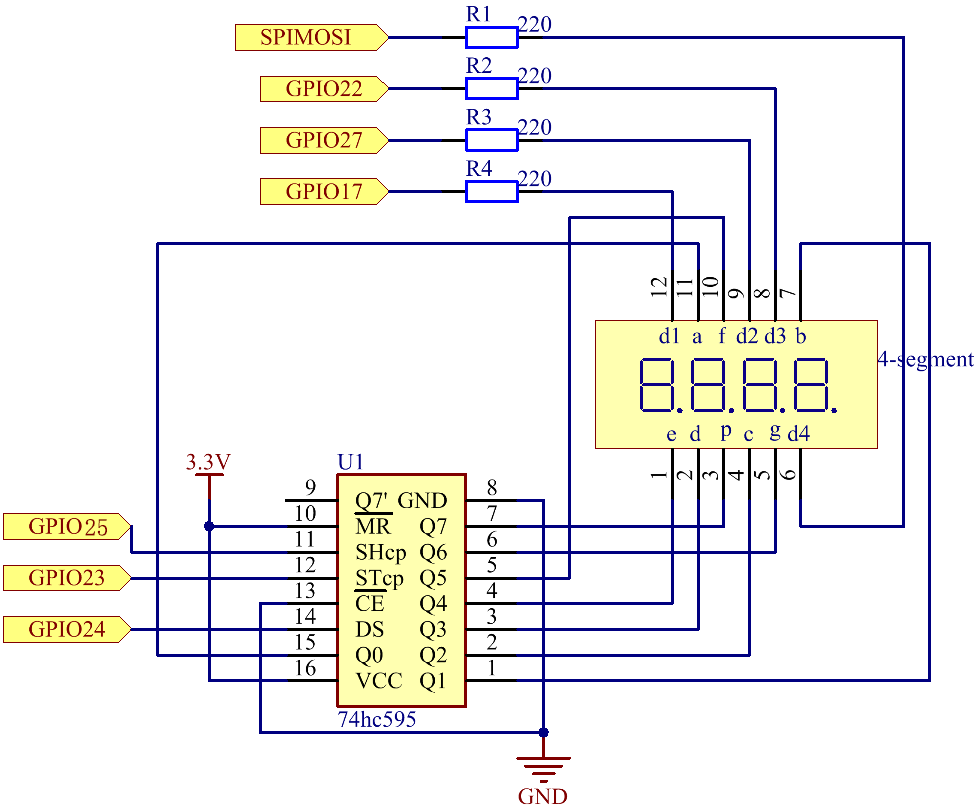

.. note::

    Hello, welcome to the SunFounder Raspberry Pi & Arduino & ESP32 Enthusiasts Community on Facebook! Dive deeper into Raspberry Pi, Arduino, and ESP32 with fellow enthusiasts.

    **Why Join?**

    - **Expert Support**: Solve post-sale issues and technical challenges with help from our community and team.
    - **Learn & Share**: Exchange tips and tutorials to enhance your skills.
    - **Exclusive Previews**: Get early access to new product announcements and sneak peeks.
    - **Special Discounts**: Enjoy exclusive discounts on our newest products.
    - **Festive Promotions and Giveaways**: Take part in giveaways and holiday promotions.

    👉 Ready to explore and create with us? Click [|link_sf_facebook|] and join today!

.. _4.1.3_py:

4.1.3 Speech Clock
=============================

Introduction
-----------------

In this project, let's make a voice clock with a speaker and a 4-digit 7-segment display. The 4-digit 7-segment display will display the time, and the speaker will broadcast the time every hour.

Required Components
------------------------------

In this project, we need the following components. 

.. image:: ../img/3.1.17components.png
  :width: 800
  :align: center

It's definitely convenient to buy a whole kit, here's the link: 

.. list-table::
    :widths: 20 20 20
    :header-rows: 1

    *   - Name	
        - ITEMS IN THIS KIT
        - LINK
    *   - Raphael Kit
        - 337
        - |link_Raphael_kit|

You can also buy them separately from the links below.

.. list-table::
    :widths: 30 20
    :header-rows: 1

    *   - COMPONENT INTRODUCTION
        - PURCHASE LINK

    *   - :ref:`cpn_gpio_board`
        - |link_gpio_board_buy|
    *   - :ref:`cpn_breadboard`
        - |link_breadboard_buy|
    *   - :ref:`cpn_wires`
        - |link_wires_buy|
    *   - :ref:`cpn_resistor`
        - |link_resistor_buy|
    *   - :ref:`cpn_audio_speaker`
        - \-
    *   - :ref:`cpn_4_digit`
        - \-
    *   - :ref:`cpn_74hc595`
        - |link_74hc595_buy|

Schematic Diagram
--------------------------

============ ======== ======== ===
T-Board Name physical wiringPi BCM
GPIO17       Pin 11   0        17
GPIO27       Pin 13   2        27
GPIO22       Pin 15   3        22
SPIMOSI      Pin 19   12       10
GPIO18       Pin 12   1        18
GPIO23       Pin 16   4        23
GPIO24       Pin 18   5        24
============ ======== ======== ===

.. image:: ../img/3.1.17_schematic.png
  :width: 400
  :align: center

Experimental Procedures
------------------------------

**Step 1:** Build the circuit.

.. image:: ../img/3.1.17fritzing.png
  :width: 900
  :align: center

Before this project, you need to make sure you complete :ref:`3.1.4_py`.

**Step 2:** Use the command ``date`` to view the local time.

.. raw:: html

   <run></run>

.. code-block:: 

    date

If the local time is different from the real time, you need to use the following command to set the time zone.

.. raw:: html

   <run></run>

.. code-block:: 

    sudo dpkg-reconfigure tzdata

Choose your time zone.

.. image:: ../img/tzdata.png

**Step 3:** Get into the folder of the code.

.. raw:: html

   <run></run>

.. code-block::

    cd ~/raphael-kit/python/

**Step 3:** Run.

.. raw:: html

   <run></run>

.. code-block::

    python3 4.1.3_SpeechClock.py

After the code runs:

- A welcome message is spoken: “Clock system started. Welcome!”
- The four-digit display shows the current time in HH:MM format.
- At the start of each hour (minute = 0), the system announces the current time once.
- The display updates continuously until ``Ctrl+C`` is pressed, after which GPIO resources are cleaned up.

**Code**

.. note::
    You can **Modify/Reset/Copy/Run/Stop** the code below. But before that, you need to go to  source code path like ``raphael-kit/python``. After modifying the code, you can run it directly to see the effect.

.. raw:: html

    <run></run>

.. code-block:: python

    import RPi.GPIO as GPIO
    from tts import TTS
    import time

    # Initialize TTS
    tts = TTS(engine="espeak")
    tts.lang('en-US')

    # GPIO pins
    SDI = 24
    RCLK = 23
    SRCLK = 25

    placePin = (10, 22, 27, 17)

    # Seven-segment encoding
    number = (0xc0, 0xf9, 0xa4, 0xb0, 0x99, 0x92, 0x82, 0xf8, 0x80, 0x90)

    def setup():
        GPIO.setmode(GPIO.BCM)
        GPIO.setup(SDI, GPIO.OUT)
        GPIO.setup(RCLK, GPIO.OUT)
        GPIO.setup(SRCLK, GPIO.OUT)
        for pin in placePin:
            GPIO.setup(pin, GPIO.OUT)

    def clearDisplay():
        for _ in range(8):
            GPIO.output(SDI, 1)
            GPIO.output(SRCLK, GPIO.HIGH)
            GPIO.output(SRCLK, GPIO.LOW)
        GPIO.output(RCLK, GPIO.HIGH)
        GPIO.output(RCLK, GPIO.LOW)

    def hc595_shift(data):
        for i in range(8):
            GPIO.output(SDI, (0x80 & (data << i)))
            GPIO.output(SRCLK, GPIO.HIGH)
            GPIO.output(SRCLK, GPIO.LOW)
        GPIO.output(RCLK, GPIO.HIGH)
        GPIO.output(RCLK, GPIO.LOW)

    def pickDigit(digit):
        # Turn all digits off
        for pin in placePin:
            GPIO.output(pin, GPIO.LOW)
        # Turn selected digit ON
        GPIO.output(placePin[digit], GPIO.HIGH)

    def loop():
        status = 0

        while True:
            now = time.localtime()
            hour = now.tm_hour
            minute = now.tm_min

            # Display minute (unit)
            clearDisplay()
            pickDigit(0)
            hc595_shift(number[minute % 10])

            # Display minute (tens)
            clearDisplay()
            pickDigit(1)
            hc595_shift(number[(minute // 10) % 10])

            # Display hour (unit)
            clearDisplay()
            pickDigit(2)
            hc595_shift(number[hour % 10])

            # Display hour (tens)
            clearDisplay()
            pickDigit(3)
            hc595_shift(number[(hour // 10) % 10])

            # Speak once every hour (at minute == 0)
            if minute == 0 and status == 0:
                tts.say(f'The time is now {hour} hours and {minute} minutes')
                time.sleep(3)   # Give time to finish speaking
                status = 1
            elif minute != 0:
                status = 0

            time.sleep(0.005)  # Prevent CPU overload

    def destroy():
        GPIO.cleanup()

    if __name__ == '__main__':
        setup()

        # ★ Welcome message at startup
        tts.say("Clock system started. Welcome!")
        time.sleep(3)

        try:
            loop()
        except KeyboardInterrupt:
            destroy()

**Code Explanation**

#. Initializes the text-to-speech engine using ``espeak`` and sets the language to English.

   .. code-block:: python

       tts = TTS(engine="espeak")
       tts.lang('en-US')

#. Defines the GPIO pins used for the shift register (74HC595) and the digit-select pins for the 4-digit display.

   .. code-block:: python

       SDI = 24
       RCLK = 23
       SRCLK = 25
       placePin = (10, 22, 27, 17)

#. Stores the segment encoding values used to display digits 0–9 on the seven-segment display.

   .. code-block:: python

       number = (0xc0, 0xf9, 0xa4, 0xb0, 0x99, 0x92, 0x82, 0xf8, 0x80, 0x90)

#. Clears the display by shifting eight “1” bits into the shift register.

   .. code-block:: python

       def clearDisplay():
           for _ in range(8):
               GPIO.output(SDI, 1)
               GPIO.output(SRCLK, GPIO.HIGH)
               GPIO.output(SRCLK, GPIO.LOW)
           GPIO.output(RCLK, GPIO.HIGH)
           GPIO.output(RCLK, GPIO.LOW)

#. Sends one byte of segment data to the 74HC595 to update the digit being displayed.

   .. code-block:: python

       def hc595_shift(data):
           for i in range(8):
               GPIO.output(SDI, (0x80 & (data << i)))
               GPIO.output(SRCLK, GPIO.HIGH)
               GPIO.output(SRCLK, GPIO.LOW)
           GPIO.output(RCLK, GPIO.HIGH)
           GPIO.output(RCLK, GPIO.LOW)

#. Selects one of the four digit positions (thousands, hundreds, tens, ones) for multiplexing.

   .. code-block:: python

       def pickDigit(digit):
           for pin in placePin:
               GPIO.output(pin, GPIO.LOW)
           GPIO.output(placePin[digit], GPIO.HIGH)

#. Reads the current time from the system clock.

   .. code-block:: python

       now = time.localtime()
       hour = now.tm_hour
       minute = now.tm_min

#. Updates each digit on the seven-segment display to show the current time in HH:MM format.

   .. code-block:: python

       hc595_shift(number[minute % 10])
       hc595_shift(number[(minute // 10) % 10])
       hc595_shift(number[hour % 10])
       hc595_shift(number[(hour // 10) % 10])

#. Speaks the current time once at the start of each hour using text-to-speech.

   .. code-block:: python

       if minute == 0 and status == 0:
           tts.say(f'The time is now {hour} hours and {minute} minutes')
           status = 1
       elif minute != 0:
           status = 0

#. Plays a welcome message when the program starts.

   .. code-block:: python

       tts.say("Clock system started. Welcome!")

#. Cleans up all GPIO pins when the user stops the program with ``Ctrl+C``.

   .. code-block:: python

       GPIO.cleanup()

Phenomenon Picture
------------------------

.. image:: ../img/4.1.3speech_clock.JPG
   :align: center
