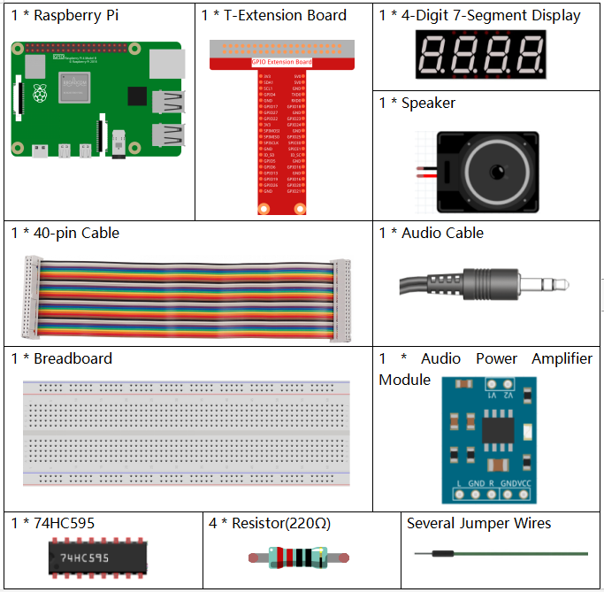
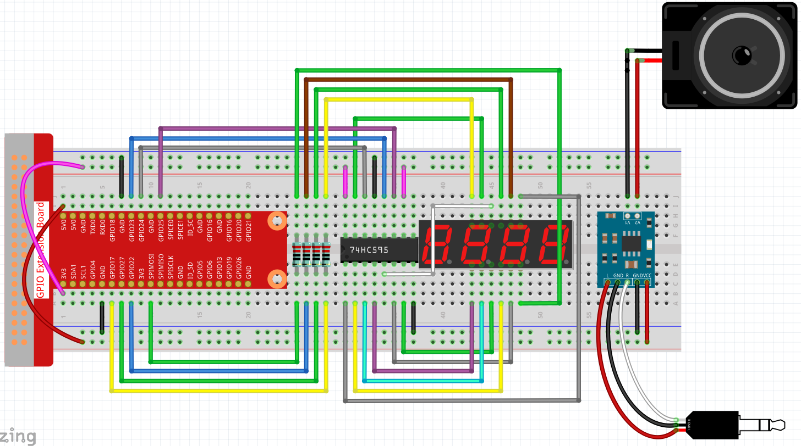
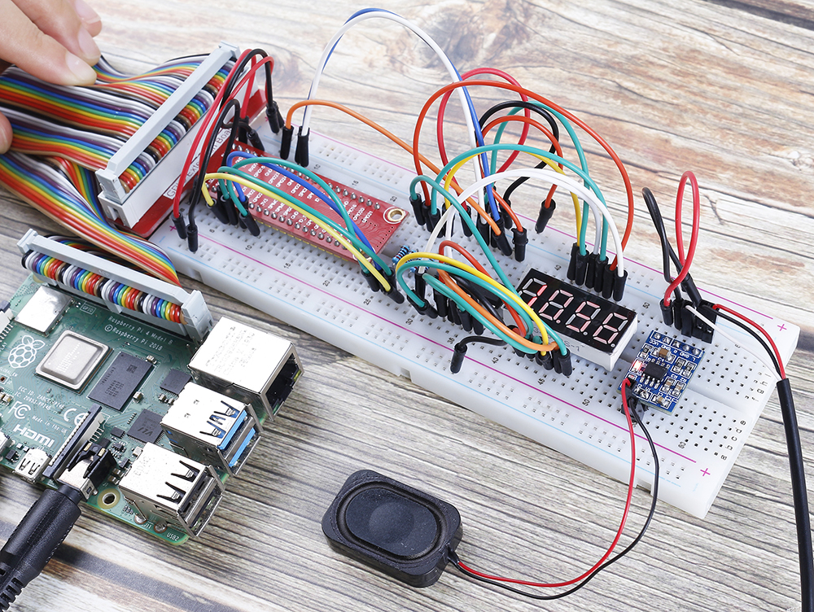

.. note::

    Hola, ¡bienvenido a la comunidad de entusiastas de SunFounder Raspberry Pi, Arduino y ESP32 en Facebook! Sumérgete más profundamente en Raspberry Pi, Arduino y ESP32 junto a otros entusiastas.

    **¿Por qué unirse?**

    - **Soporte experto**: Resuelve problemas postventa y desafíos técnicos con la ayuda de nuestra comunidad y equipo.
    - **Aprender y compartir**: Intercambia consejos y tutoriales para mejorar tus habilidades.
    - **Avances exclusivos**: Accede anticipadamente a nuevos anuncios de productos y adelantos exclusivos.
    - **Descuentos especiales**: Disfruta de descuentos exclusivos en nuestros productos más recientes.
    - **Promociones y sorteos festivos**: Participa en sorteos y promociones navideñas.

    👉 ¿Listo para explorar y crear con nosotros? Haz clic en [|link_sf_facebook|] y únete hoy mismo.

.. _4.1.3_py:

4.1.3 Reloj Parlante
=============================

Introducción
-----------------

En este proyecto, vamos a hacer un reloj parlante con un altavoz y un display de 7 segmentos de 4 dígitos. El display mostrará la hora y el altavoz anunciará la hora cada hora.

Componentes Necesarios
------------------------------

En este proyecto, necesitamos los siguientes componentes.

Es muy conveniente comprar un kit completo, aquí está el enlace:

.. list-table::
    :widths: 20 20 20
    :header-rows: 1

    *   - Nombre
        - ELEMENTOS EN ESTE KIT
        - ENLACE
    *   - Kit Raphael
        - 337
        - |link_Raphael_kit|

También puedes comprarlos por separado en los enlaces a continuación.

.. list-table::
    :widths: 30 20
    :header-rows: 1

    *   - INTRODUCCIÓN DEL COMPONENTE
        - ENLACE DE COMPRA

    *   - :ref:`cpn_gpio_extension_board`
        - |link_gpio_board_buy|
    *   - :ref:`cpn_breadboard`
        - |link_breadboard_buy|
    *   - :ref:`cpn_wires`
        - |link_wires_buy|
    *   - :ref:`cpn_resistor`
        - |link_resistor_buy|
    *   - :ref:`cpn_audio_speaker`
        - \-
    *   - :ref:`cpn_4_digit`
        - \-
    *   - :ref:`cpn_74hc595`
        - |link_74hc595_buy|

Diagrama Esquemático
--------------------------

============== =============== ======== ===
Nombre T-Board cableado físico wiringPi BCM
GPIO17         Pin 11          0        17
GPIO27         Pin 13          2        27
GPIO22         Pin 15          3        22
SPIMOSI        Pin 19          12       10
GPIO18         Pin 12          1        18
GPIO23         Pin 16          4        23
GPIO24         Pin 18          5        24
============== =============== ======== ===

.. image:: ../img/schmatic_4_digit.png

.. image:: ../img/3.1.17_schematic.png
  :width: 500
  :align: center
  
Procedimientos Experimentales
-------------------------------

**Paso 1:** Construye el circuito.

Antes de este proyecto, debes asegurarte de haber completado :ref:`3.1.4_py`.

**Paso 2:** Usa el comando ``date`` para ver la hora local.

.. raw:: html

   <run></run>

.. code-block:: 

    date

Si la hora local es diferente de la hora real, necesitas usar el siguiente comando para configurar la zona horaria.

.. raw:: html

   <run></run>

.. code-block:: 

    sudo dpkg-reconfigure tzdata

Elige tu zona horaria.

.. image:: ../img/tzdata.png

**Paso 3:** Accede a la carpeta del código.

.. raw:: html

   <run></run>

.. code-block::

    cd ~/raphael-kit/python/

**Paso 4:** Ejecuta.

.. raw:: html

   <run></run>

.. code-block::

    python3 4.1.3_SpeechClock.py

Cuando el código se ejecute, el display de 7 segmentos de 4 dígitos mostrará la hora y sonará cada hora.

**Código**

.. note::
    Puedes **Modificar/Restablecer/Copiar/Ejecutar/Detener** el código a continuación. Pero antes de eso, necesitas ir a la ruta del código fuente como ``raphael-kit/python``. Después de modificar el código, puedes ejecutarlo directamente para ver el efecto.

.. raw:: html

    <run></run>

.. code-block:: python

    import RPi.GPIO as GPIO
    from tts import TTS
    import time

    tts = TTS(engine="espeak")
    tts.lang('en-US')

    SDI = 24
    RCLK = 23
    SRCLK = 18

    placePin = (10, 22, 27, 17)
    number = (0xc0, 0xf9, 0xa4, 0xb0, 0x99, 0x92, 0x82, 0xf8, 0x80, 0x90)

    def setup():
        GPIO.setmode(GPIO.BCM)
        GPIO.setup(SDI, GPIO.OUT)
        GPIO.setup(RCLK, GPIO.OUT)
        GPIO.setup(SRCLK, GPIO.OUT)
        for i in placePin:
            GPIO.setup(i, GPIO.OUT)

    def clearDisplay():
        for i in range(8):
            GPIO.output(SDI, 1)
            GPIO.output(SRCLK, GPIO.HIGH)
            GPIO.output(SRCLK, GPIO.LOW)
        GPIO.output(RCLK, GPIO.HIGH)
        GPIO.output(RCLK, GPIO.LOW)    

    def hc595_shift(data): 
        for i in range(8):
            GPIO.output(SDI, 0x80 & (data << i))
            GPIO.output(SRCLK, GPIO.HIGH)
            GPIO.output(SRCLK, GPIO.LOW)
        GPIO.output(RCLK, GPIO.HIGH)
        GPIO.output(RCLK, GPIO.LOW)

    def pickDigit(digit):
        for i in placePin:
            GPIO.output(i,GPIO.LOW)
        GPIO.output(placePin[digit], GPIO.HIGH)

    def loop():
        status = 0                   
        while True:
            time.localtime(time.time())
            hour = int(time.strftime('%H',time.localtime(time.time())))
            minute = int(time.strftime('%M',time.localtime(time.time())))

            clearDisplay() 
            pickDigit(0)  
            hc595_shift(number[minute % 10])
            
            clearDisplay()
            pickDigit(1)
            hc595_shift(number[minute % 100//10])

            clearDisplay()
            pickDigit(2)
            hc595_shift(number[hour % 10])

            clearDisplay()
            pickDigit(3)
            hc595_shift(number[hour % 100//10])

            if minute == 0 and status == 0:
                tts.say('The time is now ' + str(hour) + ' hours and ' + str(minute) + ' minutes')
                status = 1
            elif minute != 0:
                status = 0

    def destroy():   # When "Ctrl+C" is pressed, the function is executed.
        GPIO.cleanup()

    if __name__ == '__main__':  # Program starting from here
        setup()
        try:
            loop()
        except KeyboardInterrupt:
            destroy()

**Explicación del Código**

.. code-block:: python

    time.localtime(time.time())
    hour = int(time.strftime('%H',time.localtime(time.time())))
    minute = int(time.strftime('%M',time.localtime(time.time())))

A través de la función ``time.time()``, podemos obtener la marca de tiempo de la hora actual (el número de segundos en punto flotante que han pasado desde la época de 1970), y luego usamos el método de formateo de tiempo del módulo de tiempo ``(time.localtime(time.time()))`` para procesar la marca de tiempo actual, de modo que podamos formatear la marca de tiempo como hora local.

El resultado de la entrada es:

``time.struct_time(tm_year=2021, tm_mon=5, tm_mday=28, tm_hour=13, tm_min=54, tm_sec=26, tm_wday=4, tm_yday=148, tm_isdst=0)``

Finalmente, usamos el método ``time.strftime()`` para formatear la gran cadena de información en lo que queremos. Si deseas obtener la hora actual, puedes hacerlo a través de la función ``time.strftime('%H',time.localtime(time.time()))``.

Las salidas de la cadena formateada especificada obtenida modificando el primer parámetro se enumeran a continuación.

+------+-------------------------------------------------------------+
| %y   | Representación de año de dos dígitos (00-99)                |
+------+-------------------------------------------------------------+
| %Y   | Representación de año de cuatro dígitos (000-9999)          |
+------+-------------------------------------------------------------+
| %m   | Mes (01-12)                                                 |
+------+-------------------------------------------------------------+
| %d   | Día del mes (0-31)                                          |
+------+-------------------------------------------------------------+
| %H   | Horas en un reloj de 24 horas (0-23)                        |
+------+-------------------------------------------------------------+
| %I   | Horas en un reloj de 12 horas (01-12)                       |
+------+-------------------------------------------------------------+
| %M   | Minutos (00-59)                                             |
+------+-------------------------------------------------------------+
| %S   | Segundos (00-59)                                            |
+------+-------------------------------------------------------------+
| %a   | Nombre local simplificado de la semana                      |
+------+-------------------------------------------------------------+
| %A   | Nombre completo local de la semana                          |
+------+-------------------------------------------------------------+
| %b   | Nombre local simplificado del mes                           |
+------+-------------------------------------------------------------+
| %B   | Nombre completo local del mes                               |
+------+-------------------------------------------------------------+
| %c   | Representación local correspondiente de fecha y hora        |
+------+-------------------------------------------------------------+
| %j   | Día del año (001-366)                                       |
+------+-------------------------------------------------------------+
| %p   | Equivalente local de A.M. o P.M.                            |
+------+-------------------------------------------------------------+
| %U   | Número de semanas del año (00-53) comenzando el domingo     |
+------+-------------------------------------------------------------+
| %w   | Semana (0-6), comenzando el domingo                         |
+------+-------------------------------------------------------------+
| %W   | Número de semanas del año (00-53) comenzando el lunes       |
+------+-------------------------------------------------------------+
| %x   | Representación local correspondiente de la fecha            |
+------+-------------------------------------------------------------+
| %X   | Representación local correspondiente de la hora             |
+------+-------------------------------------------------------------+
| %Z   | Nombre de la zona horaria actual                            |
+------+-------------------------------------------------------------+

.. note::
    La salida del método ``time.strftime()`` son todas variables de cadena. Antes de usarlo, recuerda hacer una conversión de tipo coercitiva.

.. code-block:: python

    clearDisplay() 
    pickDigit(0)  
    hc595_shift(number[minute % 10])
    
    clearDisplay()
    pickDigit(1)
    hc595_shift(number[minute % 100//10])

    clearDisplay()
    pickDigit(2)
    hc595_shift(number[hour % 10])

    clearDisplay()
    pickDigit(3)
    hc595_shift(number[hour % 100//10])

El dígito de las decenas de la hora se muestra en el primer display de 7 segmentos, y el dígito de las unidades se muestra en el segundo.
Luego, el dígito de las decenas de los minutos se muestra en el tercer display digital, y el dígito de las unidades se muestra en el último.

.. code-block:: python

    if minute == 0 and status == 0:
        tts.say('The time is now ' + str(hour) + ' hours and ' + str(minute) + ' minutes')
        status = 1
    elif minute != 0:
        status = 0

Cuando el número de minutos es 0 (en la hora exacta), la Raspberry Pi usará TTS para anunciar la hora.

Imagen del Fenómeno
------------------------

