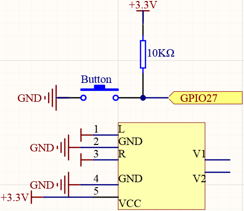
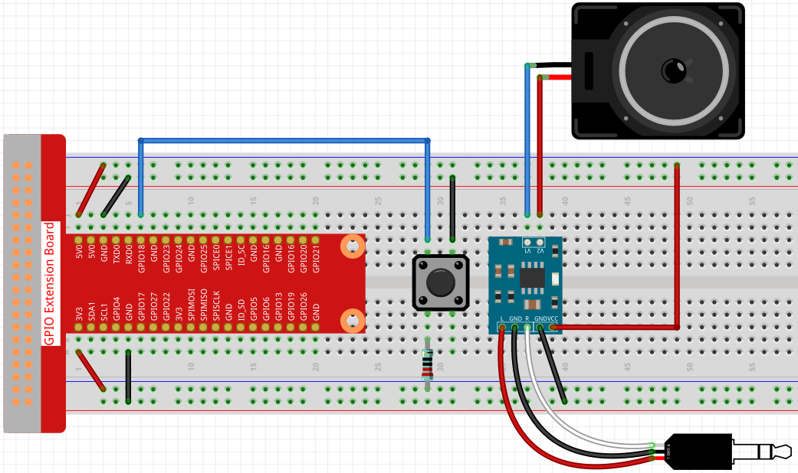
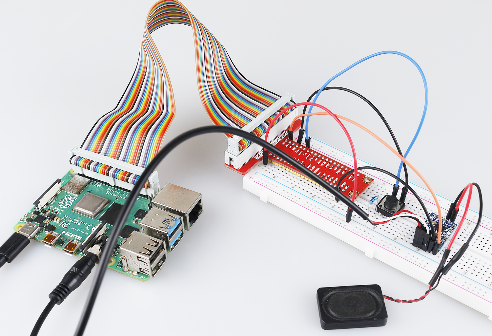

 
.. note::

    Bonjour et bienvenue dans la Communauté Facebook des passionnés de Raspberry Pi, Arduino et ESP32 de SunFounder ! Plongez plus profondément dans l'univers des Raspberry Pi, Arduino et ESP32 avec d'autres passionnés.

    **Pourquoi rejoindre ?**

    - **Support d'experts** : Résolvez les problèmes après-vente et les défis techniques avec l'aide de notre communauté et de notre équipe.
    - **Apprendre et partager** : Échangez des astuces et des tutoriels pour améliorer vos compétences.
    - **Aperçus exclusifs** : Accédez en avant-première aux annonces de nouveaux produits et aux aperçus.
    - **Réductions spéciales** : Profitez de réductions exclusives sur nos produits les plus récents.
    - **Promotions festives et cadeaux** : Participez à des cadeaux et des promotions de vacances.

    👉 Prêt à explorer et à créer avec nous ? Cliquez [|link_sf_facebook|] et rejoignez-nous aujourd'hui !

.. _4.1.5_py:

4.1.5 Sonnette Visuelle Intelligente
==========================================

Introduction
-----------------

Dans ce projet, nous allons fabriquer une sonnette visuelle intelligente DIY.

Composants Nécessaires
------------------------------

Pour ce projet, nous avons besoin des composants suivants.

.. image:: ../img/3.1.19components.png
  :width: 800
  :align: center

Il est très pratique d'acheter un kit complet, voici le lien : 

.. list-table::
    :widths: 20 20 20
    :header-rows: 1

    *   - Nom	
        - ARTICLES DANS CE KIT
        - LIEN
    *   - Kit Raphael
        - 337
        - |link_Raphael_kit|

Vous pouvez également les acheter séparément via les liens ci-dessous.

.. list-table::
    :widths: 30 20
    :header-rows: 1

    *   - INTRODUCTION DES COMPOSANTS
        - LIEN D'ACHAT

    *   - :ref:`cpn_gpio_extension_board`
        - |link_gpio_board_buy|
    *   - :ref:`cpn_breadboard`
        - |link_breadboard_buy|
    *   - :ref:`cpn_wires`
        - |link_wires_buy|
    *   - :ref:`cpn_resistor`
        - |link_resistor_buy|
    *   - :ref:`cpn_button`
        - |link_button_buy|
    *   - :ref:`cpn_audio_speaker`
        - \-
    *   - :ref:`cpn_camera_module`
        - |link_camera_buy|

Schéma de Connexion
-----------------------

============ ======== ========= ======== ===
Nom T-Board  Connexion physique wiringPi BCM
GPIO27       Pin 13    2        27
============ ======== ========= ======== ===

Procédures Expérimentales
------------------------------

**Étape 1 :** Construisez le circuit.

Avant ce projet, vous devez vous assurer d'avoir terminé :ref:`3.1.3_py` et :ref:`3.1.2_py`.

**Étape 2 :** Allez dans le dossier du code.

.. raw:: html

    <run></run>

.. code-block::

    cd ~/raphael-kit/python/

**Étape 3 :** Exécutez.

.. raw:: html

    <run></run>

.. code-block::

    python3 4.1.5_DoorBell.py

Après avoir exécuté le code, lorsque le bouton est pressé, une sonnette retentira et la caméra enregistrera une vidéo de 5 secondes, qui sera stockée sous le nom de fichier ``visitor.h264`` dans le répertoire ``~``. Si vous avez un écran, vous pouvez également voir les visiteurs en prévisualisant la vidéo en temps réel.
**Code**

.. note::
    Vous pouvez **Modifier/Réinitialiser/Copier/Exécuter/Arrêter** le code ci-dessous. Mais avant cela, vous devez aller dans le chemin du code source comme ``raphael-kit/python``. Après avoir modifié le code, vous pouvez l'exécuter directement pour voir l'effet.

.. raw:: html

    <run></run>

.. code-block:: python

    #!/usr/bin/env python3
    from picamera import PiCamera
    from pygame import mixer
    import RPi.GPIO as GPIO
    import time
    import os
    user = os.getlogin()
    user_home = os.path.expanduser(f'~{user}')

    camera = PiCamera()

    BtnPin = 18
    status = False

    def setup():
        GPIO.setmode(GPIO.BCM)
        GPIO.setup(BtnPin, GPIO.IN, GPIO.PUD_UP)
        mixer.init()

    def takePhotos(pin):
        global status
        status = True

    def main():
        global status
        GPIO.add_event_detect(BtnPin, GPIO.FALLING, callback=takePhotos)
        while True:
            if status:
                mixer.music.load(f'{user_home}/raphael-kit/music/doorbell.wav')
                mixer.music.set_volume(0.7)
                mixer.music.play()
                camera.start_preview(alpha=200)
                camera.start_recording(f'{user_home}/visitor.h264')
                print ('Have a visitor')
                time.sleep(5)
                mixer.music.stop()
                camera.stop_preview()
                camera.stop_recording()
                status = False 

    def destroy():
        GPIO.cleanup()
        mixer.music.stop()
        camera.stop_preview()
        camera.stop_recording()

    if __name__ == '__main__':
        setup()
        try:
            main()
        except KeyboardInterrupt:
            destroy()

**Explication du Code**

.. code-block:: python

    status = False

Ceci est un indicateur utilisé pour enregistrer si la sonnette est utilisée.

.. code-block:: python

    GPIO.add_event_detect(BtnPin, GPIO.FALLING, callback=takePhotos)

Configurer l'événement de ``BtnPin``, lorsque le bouton est pressé (le signal de niveau passe de haut à bas), appeler la fonction ``takePhotos()``.

.. code-block:: python

    if status:
        mixer.music.load(f'{user_home}/raphael-kit/music/doorbell.wav')
        mixer.music.set_volume(0.7)
        mixer.music.play()
        camera.start_preview(alpha=200)
        camera.start_recording(f'{user_home}/visitor.h264')
        print ('Have a visitor')
        time.sleep(5)
        mixer.music.stop()
        camera.stop_preview()
        camera.stop_recording()
        status = False 

Cinq secondes sont utilisées ici pour jouer de la musique et enregistrer des vidéos, fonctionnant ainsi comme une sonnette.

Photo du Phénomène
------------------------

